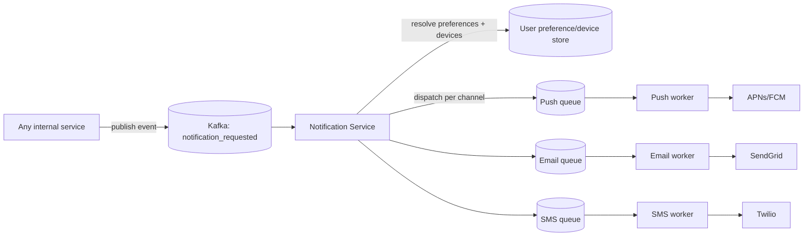

# Design a Notification System (Push + Email + SMS)

**Real prompt:** "Design a system that sends notifications to users across push (mobile), email, and SMS, triggered by other services (e.g. 'order shipped', 'someone liked your post')."

This is [[03-design-twitter]]'s fan-out problem again, but the "timeline" is replaced by third-party delivery channels you don't control — which changes almost nothing about the fan-out logic and almost everything about the failure handling.

## 1. Clarifying Questions
- Which channels — push, email, SMS, in-app? Multiple channels per notification, or pick one?
- Transactional (OTP, order confirmation) vs. marketing/bulk (weekly digest)? These have very different latency and reliability requirements — ask this early, it shapes the whole design.
- Can a user have multiple devices? Do we need to dedupe across them?
- Is exactly-once delivery required, or is "don't spam the user with 10 copies of the same alert" good enough?

## 2. Requirements
**Functional**
- Any internal service can trigger a notification via an API/event
- Deliver via the user's preferred channel(s), respecting opt-outs
- Support both single-user (transactional) and broadcast (millions of recipients) triggers

**Non-functional**
- Transactional notifications: low latency (seconds), high reliability
- Broadcast notifications: high throughput, can tolerate longer delivery windows (minutes)
- Must not overwhelm a third-party provider's rate limits (APNs, FCM, SendGrid, Twilio all throttle you)
- Must not overwhelm the *user* — notification storms are a real product failure, not just a technical one

## 3. Capacity Estimation
- 200M users, avg 5 notifications/day → 1B/day ≈ 11.5k/sec average
- Broadcast case: a single "breaking news" trigger to 50M opted-in users in a short window — this is the same **celebrity fan-out spike** from [[03-design-twitter]], just aimed outward at third-party APIs instead of an internal cache
- Point of estimation: average throughput is a non-problem; the design has to survive the **burst**, not the average

## 4. The Core Design Decision: Decoupled Fan-out with Per-Channel Adapters
| Approach | How | Pros | Cons |
|---|---|---|---|
| Synchronous send | Triggering service calls the push/email/SMS provider directly, inline | Simple | Triggering service now depends on 3 external providers' uptime and latency; a slow SMS provider blocks an order-confirmation flow |
| **Notification service + queue + adapters** | Triggering service publishes an event; a Notification Service consumes it, resolves user preferences, and dispatches to per-channel adapter workers | Triggering service stays fast and decoupled; channels scale/fail independently | More infrastructure; eventual (not immediate) delivery |

**Interview signal:** recognizing that the triggering service (e.g. Order Service) should never call APNs/Twilio directly — that's a reliability leak, coupling your core business flow's availability to a third party's. The event/queue decoupling is the same pattern as [[03-design-twitter]]'s `tweet_created` → Kafka → fan-out worker, reused here for a different trigger.

## 5. High-Level Architecture

Each channel gets its **own queue and worker pool** — this is the key structural decision. If Twilio (SMS) starts rate-limiting or timing out, push and email keep flowing unaffected. A single shared queue would let one slow channel back up all three.

## 6. Deep Dive: Handling a Flaky Third-Party Provider
- Each channel worker calls an **external** API you don't control — this is where [[Day 26 - Circuit Breaker Implementation (LLD)|Day 26]]'s pattern applies directly: if APNs starts erroring or timing out, the circuit breaker trips, stops hammering a failing provider, and lets requests fail fast (or queue for later) instead of piling up worker threads waiting on timeouts.
- Retries use exponential backoff, capped, with the retried job carrying the **same idempotency key** as the original ([[Day 24 - Idempotency Keys (LLD)|Day 24]]) — a user should never get the same push notification 4 times because the worker retried after a provider-side timeout that actually succeeded.
- Dead-letter queue for notifications that exhaust retries — not silently dropped, but held for inspection/replay, same DLQ concept from [[Day 27 - Message Queues Deep Dive (HLD)|Day 27]].

## 7. Deep Dive: Multi-Device Fan-out and Preference Resolution
- A user may have 3 registered devices (phone, tablet, web push token). The Notification Service resolves `user_id → [device tokens]` before dispatch — this lookup, and the opt-out/preference check, must happen **before** hitting the queue, not after, so muted/unsubscribed users never even generate a job.
- This preference check is the notification-system equivalent of Twitter's celebrity-threshold check: a cheap, cached lookup that must happen on the hot path of every single fan-out decision, and cannot itself become the bottleneck.

## 8. Trade-offs to Voice Explicitly
| | Transactional path | Broadcast path |
|---|---|---|
| Latency target | Seconds | Minutes acceptable |
| Failure handling | Retry aggressively, alert on failure | Best-effort, rate-limited to protect provider relationship |
| Queue priority | High priority queue/topic | Low priority, can be throttled under load |
| Delivery guarantee | At-least-once (dedup via idempotency key) | At-least-once, but duplicate tolerance is looser |

- **At-least-once, not exactly-once:** true exactly-once delivery to an external provider isn't achievable (you can't make Twilio's send atomic with your own state) — the honest answer is at-least-once delivery plus **idempotent, dedupable sends**, and you say this explicitly rather than overclaiming exactly-once.
- **Priority queues:** an OTP notification must not sit behind 2 million marketing broadcast jobs — separate queues (or a priority field consumers respect) per notification class, not one FIFO queue for everything.

## 9. Your Gaps to Close
- [ ] Practice explaining *why* the triggering service should never call a delivery provider synchronously — this is the single highest-signal design choice in this problem.
- [ ] Be ready for: "APNs is down for 20 minutes during a broadcast — what happens?" (Answer shape: circuit breaker trips for the push channel only; jobs queue or DLQ; email/SMS unaffected; once APNs recovers, backlog drains — this is a good moment to reference Day 26 by name.)
- [ ] Be ready for: "how do you avoid notification storms?" (rate-limit per-user notification frequency, batch/digest low-priority events instead of sending each individually — a product decision with a technical implementation, worth naming both sides.)

## Related
- [[03-design-twitter]] — same fan-out/decoupling pattern, different sink
- [[Day 24 - Idempotency Keys (LLD)]] — dedup on retry
- [[Day 26 - Circuit Breaker Implementation (LLD)]] — isolating a flaky third-party channel
- [[Day 27 - Message Queues Deep Dive (HLD)]] / [[Day 28 - Kafka Producer Consumer Design (LLD)]] — the event backbone
- [[Day 23 - CAP Theorem and PACELC (HLD)]] — why at-least-once + idempotency, not exactly-once, is the honest answer here

## Quiz
Write your own answer first — then expand.

> [!question]- Q1. Why should the Order Service never call the push/SMS/email provider directly when a customer's order ships?
> (think it through, then expand)

> [!success]- Answer: Q1
> Calling a third-party provider directly and synchronously ties the Order Service's own availability and latency to a system it doesn't control. If Twilio is slow or down, order confirmations start failing or timing out — a core business flow breaks because of an unrelated dependency. Publishing an event and letting a dedicated Notification Service handle dispatch (with its own retries, circuit breakers, and failure isolation) keeps the order flow fast and decoupled from delivery-channel reliability.

> [!question]- Q2. Why does each channel (push/email/SMS) need its own queue instead of one shared notification queue?
> (think it through, then expand)

> [!success]- Answer: Q2
> If all three channels share one queue, a slowdown or outage in one provider (say SMS) backs up the whole queue — push and email notifications get stuck behind SMS jobs that are timing out, even though push and email providers are healthy. Separate queues per channel mean each channel's worker pool and circuit breaker operate independently — one channel degrading doesn't degrade the others.

> [!question]- Q3. The system promises "at-least-once" delivery, not "exactly-once." Why is exactly-once not actually achievable here, and what do you do instead?
> (think it through, then expand)

> [!success]- Answer: Q3
> Exactly-once would require an atomic, all-or-nothing operation spanning your own system's state and the third-party provider's send — you can't make "mark as sent in my DB" and "Twilio actually sends the SMS" a single transaction across two independent systems, especially when the failure mode is "the request succeeded but the acknowledgment was lost." The practical answer is at-least-once delivery (retry on any doubt) combined with an idempotency key the retried job reuses, so a provider that already received the request can safely no-op a duplicate instead of double-sending.

## Next
[[05-design-job-scheduler]] — a different coordination problem: instead of "deliver this once to many recipients," it's "run this exactly once at a specific time," which needs leader election/locking instead of fan-out.
