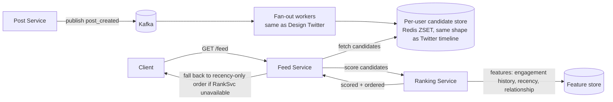

# Design a News Feed (Instagram/Facebook-style, Ranked)

**Real prompt:** "Design a home feed showing posts from people/pages a user follows, ranked by relevance rather than strict chronological order, including photo/video posts."

Almost the entire storage and fan-out skeleton is [[03-design-twitter]], unchanged. The new problem is **ranking**: "reverse-chronological merge" becomes "retrieve candidates, then score and order them" — and that single change ripples into caching, freshness, and infrastructure in ways worth being explicit about.

## 1. Clarifying Questions
- Chronological fallback needed, or purely ranked? (Assume ranked is the primary mode — that's what makes this a distinct problem from Twitter's note.)
- What signals drive ranking — engagement prediction, recency, relationship strength? (You don't need to design the ML model; you need to show where a ranking *service* plugs into the architecture.)
- Photo/video-heavy posts — does storage differ meaningfully from text? (Assume yes — most posts carry media, which changes the storage-tier conversation.)
- Can the ranked feed be slightly stale (cached for a few minutes), or must it reflect the very latest posts and signals? (Assume some staleness is acceptable — this is what makes the design tractable at all.)

## 2. Requirements
**Functional**
- Follow/unfollow, post (text + media)
- Home feed: ranked list of posts from followed accounts, refreshed as the user scrolls/returns

**Non-functional**
- Same read-heavy skew as [[03-design-twitter]] — reads vastly outnumber posts
- Ranking must not add unacceptable latency to feed load (target still sub-second)
- Feed must remain servable even if the ranking model/service is temporarily degraded (graceful fallback, not a hard dependency for basic feed loading)

## 3. Capacity Estimation
- Same shape as [[03-design-twitter]]'s numbers (hundreds of millions of DAU, tens of reads per user per day) — the read:write skew argument doesn't change, so it's not worth re-deriving from scratch; the new cost center is **ranking compute per feed load**, not raw read/write throughput.
- Media storage per post is now the dominant per-item cost (a photo/video vs. 280 characters of text) — this is where [[08-design-youtube]]'s storage-tiering thinking becomes directly relevant, not just video-specific.

## 4. The Core Design Decision: Two-Stage Retrieval-then-Ranking
| Approach | How | Pros | Cons |
|---|---|---|---|
| Rank everything from scratch per request | Pull every candidate post from every followee, score all of them live | Simple mental model | Scoring cost scales with total candidate pool — too slow at real follow-counts |
| **Candidate generation + ranking (two-stage)** | Stage 1: cheaply retrieve a bounded candidate set (e.g. last 500 posts from followees, via the same fan-out mechanism as Twitter). Stage 2: a ranking service scores and orders only that bounded set | Ranking cost is bounded regardless of total follow graph size | Two services instead of one; candidate set must be "good enough" to contain the actually-best posts |

**Interview signal:** this exact two-stage shape (cheap broad retrieval, then expensive precise ranking on a small candidate set) is the same pattern named in [[06-design-uber]]'s ETA-ranking follow-up — recognizing it as a *general* pattern, not a feed-specific trick, is the senior-level signal.

## 5. High-Level Architecture

Note the explicit fallback path — if `RankSvc` is slow or down, `FeedSvc` still has the candidate set from the cheap Stage 1 retrieval and can serve it in plain chronological order. This is a direct application of [[Day 26 - Circuit Breaker Implementation (LLD)|Day 26]]'s isolation principle: a non-critical, higher-latency dependency (ranking) degrading gracefully instead of taking down the whole feed.

## 6. Deep Dive: What Changes vs. Twitter's Fan-out, Specifically
- **Candidate store, not final store**: in Twitter's design, the per-user ZSET *is* the timeline shown to the user. Here, it's an intermediate candidate pool — the final order shown to the user is computed by the ranking stage, not by the fan-out write order. This means the ZSET can be trimmed more aggressively (you never need more candidates than the ranking stage will consider, e.g. last 500 posts) since it's no longer the source of display order.
- **Caching gets harder**: a chronological feed is trivially cacheable (it's the same list until a new post arrives). A *ranked* feed depends on both the candidate set *and* the viewer's own engagement signals, which can change between two page loads even with no new posts — so a ranked feed is typically cached for a short TTL (minutes) and recomputed periodically, not cached indefinitely and invalidated on write like the pure fan-out case.
- **The celebrity/hybrid fan-out problem is unchanged** — a page with 10M followers still can't be pushed to 10M candidate stores synchronously; Twitter's hybrid push/pull split ([[03-design-twitter|Section 4]]) applies here without modification, since it's a property of fan-out, not of what happens to the candidates afterward.

## 7. Deep Dive: Media-Heavy Storage
- Photo/video posts reuse [[08-design-youtube]]'s split directly: raw upload → object storage → (for video) async transcoding → CDN-fronted serving of the media, while the **post metadata** (caption, author, timestamp, media URL) lives in a fast metadata store separate from the media blob itself.
- The candidate store and feed response only ever carry the **metadata + a CDN URL** — never the media bytes — the same "don't put large blobs in your hot-path cache" discipline as any feed/listing design.

## 8. Trade-offs to Voice Explicitly
| | Chronological (Twitter-style) | Ranked (this design) |
|---|---|---|
| Cacheability | High — stable until new post | Lower — depends on per-viewer signals, short TTL |
| Compute per feed load | Minimal | Real cost: scoring a candidate set per request |
| Failure mode if a dependency degrades | N/A — no ranking dependency | Must degrade gracefully to chronological, not fail the whole feed |
| Explore/exploit | N/A | Worth naming: pure engagement-maximizing ranking can create filter bubbles / over-favor a few accounts — real systems inject some diversity/exploration deliberately |

## 9. Your Gaps to Close
- [ ] Practice explaining the two-stage retrieval-then-ranking pattern as a *general* technique you'd reach for again (search, recommendations, ad serving all use this shape) — not something feed-specific.
- [ ] Be ready for: "the ranking service is down — what does the user see?" (Answer shape: FeedSvc still has the candidate set from the cheap Stage 1 fetch and serves it in recency order — graceful degradation, not an outage, echoing Day 26's circuit-breaker isolation reasoning.)
- [ ] Be ready for: "why can't you just cache the final ranked feed the same way Twitter caches its timeline?" (Because ranking depends on per-viewer, possibly time-varying signals — two loads with the same candidate posts can legitimately produce different orders, so a long-lived write-invalidated cache is the wrong model here; short-TTL recomputation is the honest fit.)

## Related
- [[03-design-twitter]] — the fan-out skeleton this design reuses almost unchanged
- [[08-design-youtube]] — media storage/serving split reused for photo/video posts
- [[Day 26 - Circuit Breaker Implementation (LLD)]] — graceful degradation when ranking is unavailable
- [[06-design-uber]] — same two-stage filter-then-rank pattern, different domain

## Quiz
Write your own answer first — then expand.

> [!question]- Q1. Why does a ranking service need a bounded candidate set instead of scoring every post from every followee?
> (think it through, then expand)

> [!success]- Answer: Q1
> Scoring cost scales with however many candidates you feed into it. If you scored every post from every followee live, the cost would grow with the size of the follow graph and total post history — unbounded and increasingly slow as a user follows more accounts over time. By first cheaply retrieving a bounded candidate set (e.g. the last 500 posts via the same fan-out mechanism Twitter uses), the ranking stage's cost is capped regardless of how large the underlying follow graph or post history actually is — the two-stage split exists specifically to decouple ranking cost from retrieval scale.

> [!question]- Q2. Why is a ranked feed harder to cache than Twitter's chronological timeline, even though both start from the same kind of candidate data?
> (think it through, then expand)

> [!success]- Answer: Q2
> A chronological feed's order is fully determined by write order — it only changes when a new post arrives, so it's naturally cacheable and only needs invalidation on write, same as the fan-out-on-write timeline. A ranked feed's order depends on scoring, which factors in per-viewer signals (engagement history, relationship strength) that can shift between two page loads even with zero new posts. That means the "correct" order isn't a stable function of write events alone, so a long-lived, write-invalidated cache doesn't fit — a short-TTL cache that's periodically recomputed is the honest match for how the underlying order actually changes.

> [!question]- Q3. The ranking service goes down. What's the wrong way to handle this, and what's the right way?
> (think it through, then expand)

> [!success]- Answer: Q3
> The wrong way is to make feed loading hard-depend on the ranking service, so its outage means the whole feed fails to load — a non-critical enhancement (better ordering) taking down a critical path (seeing any feed at all). The right way is to treat ranking as an optional enhancement: the Feed Service already has the cheap Stage 1 candidate set from retrieval, so on a ranking-service failure/timeout it serves that set in a simple fallback order (e.g. recency) instead of failing the request — the same graceful-degradation principle as a circuit breaker isolating a non-essential dependency.

## Next
[[10-design-search-autocomplete]] — closes the applied-design set with a problem that's small in scope but forces a precise choice between prefix-optimized structures (trie) and the inverted-index/B-Tree structures used everywhere else in this set.
