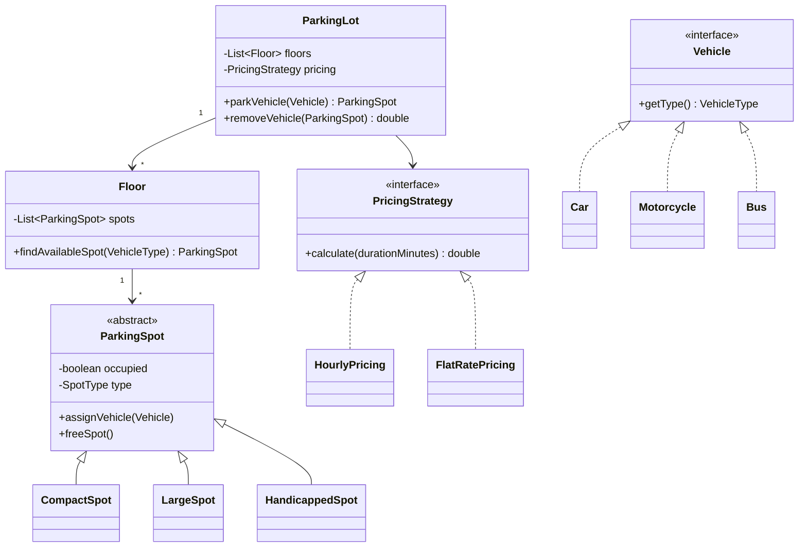

# Design a Parking Lot

**Real prompt:** "Design a parking lot system that supports multiple vehicle types, multiple spot types, tracks availability, and calculates a parking fee on exit."

The canonical first machine-coding problem — not hard algorithmically, but a dense test of whether you reach for the right patterns unprompted.

## 1. Clarifying Questions
- Multiple floors, or a single level? (Assume multiple floors — it's a near-free extension once the core design is right, and shows you're thinking ahead.)
- Multiple vehicle types (motorcycle, car, bus) with different spot-size requirements? (Assume yes — this is what makes spot assignment non-trivial.)
- Fixed or variable pricing (hourly, flat rate, first-hour-free)? (Assume it should be pluggable — this is the Strategy signal.)
- Payment handling in scope, or just fee calculation? (Assume fee calculation is in scope, actual payment processing is not — keep scope bounded.)

## 2. Requirements
**Functional**
- Park a vehicle: find and assign an available, appropriately-sized spot
- Remove a vehicle: free the spot, calculate and return the fee
- Track real-time availability by spot type

**Non-functional**
- Extensible to new vehicle types and spot types without modifying existing classes (OCP)
- Extensible to new pricing models without modifying `ParkingLot` itself (DIP/Strategy)

## 3. Core Entities & Relationships

## 4. Deep Dive: Pattern Choices
- **[[04 - Behavioral Design Patterns|Strategy]] for pricing**: `ParkingLot` holds a `PricingStrategy` reference, injected at construction (DIP, [[01 - SOLID Principles]]). Adding "first 30 minutes free" pricing is a new class implementing `PricingStrategy` — zero changes to `ParkingLot`.
- **[[02 - Creational Design Patterns|Singleton]] for `ParkingLotManager`** (if this is the top-level system entry point coordinating the whole facility) — there's genuinely one physical lot, so global uniqueness is a legitimate requirement, not a lazy default.
- **Spot-to-vehicle matching logic**: this is the part candidates most often get wrong by hardcoding `if (vehicle instanceof Car)` inside `Floor.findAvailableSpot()`. Better: each `Vehicle` type declares which `SpotType`(s) it can use (e.g. `Motorcycle` fits any spot, `Bus` needs `LargeSpot` only), and the matching logic queries that rather than branching on concrete vehicle classes — keeps `Floor` closed for modification when a new vehicle type is added.
- **Why not Factory for spots/vehicles here?** It's defensible (and [[02 - Creational Design Patterns|02]] covers exactly this shape) but not load-bearing for this specific problem — spots are typically pre-configured at lot setup, not dynamically created per request, so a Factory adds ceremony without a real corresponding need. Mentioning this trade-off explicitly (rather than reflexively adding a Factory) is itself a signal of judgment over pattern-matching.

## 5. Handling Multiple Floors
- `Floor.findAvailableSpot()` searches within one floor; `ParkingLot.parkVehicle()` iterates floors (nearest-first, or by some floor-priority rule) until a floor returns an available spot.
- This is a natural extension point: swapping "nearest floor first" for "most-available floor first" is itself a Strategy-shaped decision (a `FloorSelectionStrategy`) if the interviewer pushes on it — worth naming even if you don't implement it, to show you see the pattern recurring.

## 6. Trade-offs to Voice Explicitly
| | Hardcoded spot-matching (`if vehicle instanceof X`) | Vehicle-declares-compatible-spots |
|---|---|---|
| Adding a new vehicle type | Edit `Floor`'s matching logic | Add one new class, `Floor` unchanged |
| OCP compliance | Violates it | Honors it |
| Code at small scale | Marginally less code upfront | Slightly more structure upfront |

- **Concurrency**: two vehicles arriving simultaneously shouldn't both be assigned the same spot — `assignVehicle`/`findAvailableSpot` need to be thread-safe (a lock per spot, or a synchronized search-and-assign as one atomic operation) if the interviewer asks about concurrent access. Worth raising unprompted as a "what if two cars arrive at once" consideration.

## 7. Your Gaps to Close
- [ ] Practice drawing the class diagram from memory in under 5 minutes — this is usually the first 10 minutes of the actual interview.
- [ ] Be ready for "now add a reservation system where spots can be pre-booked" — this tests whether your `ParkingSpot` state model (just `occupied: boolean`) needs to become richer (a State pattern: `Available`/`Reserved`/`Occupied`) without a full redesign.
- [ ] Practice explaining, unprompted, why pricing is Strategy and not a hardcoded calculation — this is the single highest-signal design decision in this problem.

## Related
[[01 - SOLID Principles]] · [[02 - Creational Design Patterns]] · [[04 - Behavioral Design Patterns]] · [[02 - Design an Elevator System]]

## Quiz
Write your own answer first — then expand.

> [!question]- Q1. A new requirement: motorcycles can park in ANY spot type (compact, large, handicapped-if-empty), but cars can only use compact or large. Where does this logic live, and why does it matter that it's not in `Floor`?
> (think it through, then expand)

> [!success]- Answer: Q1
> This compatibility logic should live on (or be queryable from) each `Vehicle` type — e.g. `Motorcycle.getCompatibleSpotTypes()` returning all spot types, `Car.getCompatibleSpotTypes()` returning `{COMPACT, LARGE}`. If this logic instead lived in `Floor.findAvailableSpot()` as a chain of `if (vehicle instanceof Motorcycle) ... else if (vehicle instanceof Car) ...`, every new vehicle type would require editing `Floor` — a direct OCP violation. Keeping it on the vehicle type means `Floor` just asks "what spot types does this vehicle accept" generically, and stays unchanged when `Bus` or any future vehicle type is added.

> [!question]- Q2. The interviewer asks you to add a discount for electric vehicles (20% off). Where does this change live, and does it require touching `ParkingLot`?
> (think it through, then expand)

> [!success]- Answer: Q2
> This is a pricing concern, so it lives in a new or modified `PricingStrategy` implementation — e.g. wrapping the existing strategy in a `ElectricVehicleDiscountPricing` decorator ([[03 - Structural Design Patterns|Decorator]]) that applies the base strategy's calculation and then discounts it by 20% for electric vehicles, or a dedicated strategy selected when the parked vehicle is electric. Either way, `ParkingLot` itself doesn't change — it already depends only on the `PricingStrategy` interface (DIP), so swapping in a decorated or different strategy is a construction-time decision, not a `ParkingLot` code change. This is a good moment to notice Strategy and Decorator working together, not competing.

> [!question]- Q3. Why is Singleton a defensible choice for `ParkingLotManager` here, but would be a poor choice for `PricingStrategy`?
> (think it through, then expand)

> [!success]- Answer: Q3
> `ParkingLotManager` represents a genuinely unique real-world thing — there's exactly one physical parking facility this system manages, so global single-instance access is a real requirement, not a convenience. `PricingStrategy` is the opposite case: it's specifically designed to be swappable and potentially different per context (different pricing for different floors, promotional periods, vehicle types) — making it a Singleton would hardcode "there is exactly one pricing rule, forever," directly undermining the entire reason Strategy was chosen for it. Singleton fits "exactly one, by nature of the domain"; it actively fights against anything meant to vary.

## Next
[[02 - Design an Elevator System]] — introduces State as the primary pattern, on a problem where the object's own behavior genuinely changes based on internal transitions, not external configuration.
