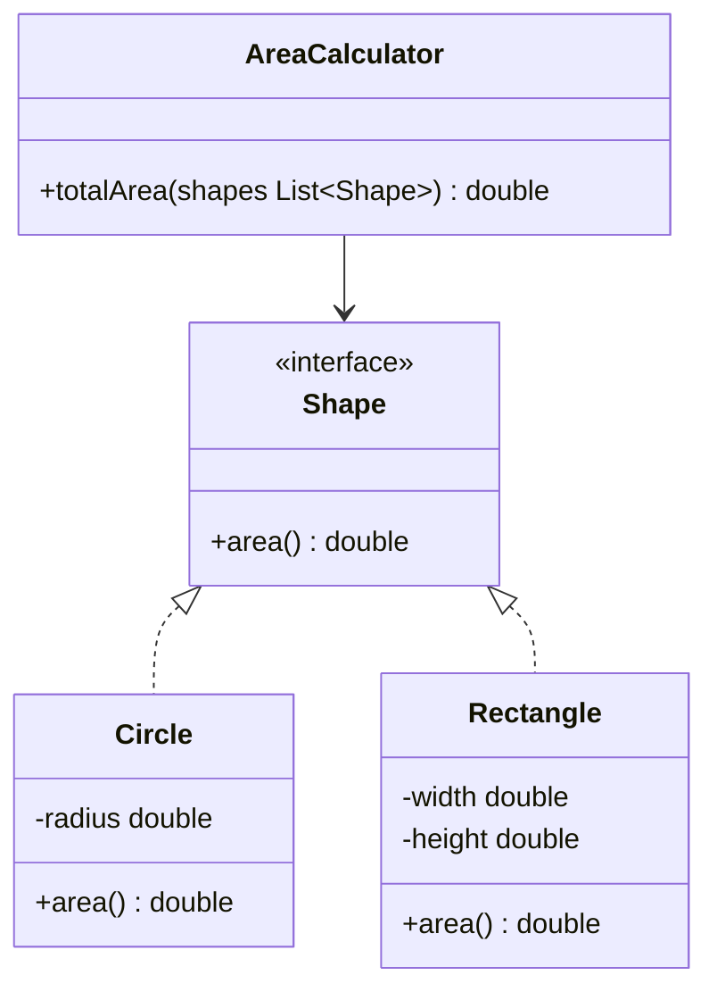

# Day 1 — SOLID Principles (LLD)

<small>5 min read</small>

## What we're learning today
Every design pattern you'll learn this track is, underneath, someone applying one of five principles to a recurring problem shape. Learn the principles first and patterns stop looking like memorized recipes — they start looking like the obvious answer to "how do I keep this extensible."

## Core concept
- **S — Single Responsibility:** a class should have one reason to change. Not "one method" — one *axis* of change. A class that both calculates an invoice and formats it as PDF has two reasons to change (pricing logic, output format) and will get modified for reasons unrelated to each other.
- **O — Open/Closed:** open for extension, closed for modification. Adding a new case should mean *adding new code*, not editing an existing, already-tested method's body.
- **L — Liskov Substitution:** a subclass must be usable anywhere its parent is expected, without the caller needing to know it's a subclass. The classic violation: `Square extends Rectangle` and overrides `setWidth`/`setHeight` to keep both sides equal — code that does `rect.setWidth(5); rect.setHeight(4); assert rect.area() == 20` breaks silently for a Square.
- **I — Interface Segregation:** don't force a class to implement methods it doesn't need. A fat `Worker` interface with `work()` and `eat()` breaks the moment you add a `RobotWorker` that can't eat.
- **D — Dependency Inversion:** depend on abstractions, not concrete classes. High-level policy code (`OrderService`) shouldn't directly `new PostgresRepository()` — it should depend on a `Repository` interface, with the concrete implementation injected.

## Visual diagram

*Adding `Triangle` means one new class implementing `Shape` — `AreaCalculator` never changes. This is OCP.*

## Explanation
**Violates SRP + OCP** — the calculator knows about every shape's internals, and adding a shape means editing this method:
```java
class AreaCalculator {
    double totalArea(List<Object> shapes) {
        double total = 0;
        for (Object s : shapes) {
            if (s instanceof Circle c) {
                total += Math.PI * c.radius * c.radius;
            } else if (s instanceof Rectangle r) {
                total += r.width * r.height;
            }
            // every new shape = another else-if, editing tested code
        }
        return total;
    }
}
```

**Follows SRP + OCP** — each shape owns its own area logic; the calculator only knows the `Shape` contract:
```java
interface Shape {
    double area();
}

class Circle implements Shape {
    private final double radius;
    Circle(double radius) { this.radius = radius; }
    public double area() { return Math.PI * radius * radius; }
}

class Rectangle implements Shape {
    private final double width, height;
    Rectangle(double width, double height) { this.width = width; this.height = height; }
    public double area() { return width * height; }
}

class AreaCalculator {
    double totalArea(List<Shape> shapes) {
        return shapes.stream().mapToDouble(Shape::area).sum();
    }
}
```
Adding `Triangle implements Shape` requires zero changes to `AreaCalculator` — that's the whole payoff of OCP, and it falls out naturally once SRP puts area logic on the shape itself.

## Real-world examples
- **Payment gateway integration:** a checkout service that depends on a `PaymentProcessor` interface (DIP) can add Stripe, PayPal, or Razorpay as new implementations without touching checkout logic — this is exactly why "add a new payment method" is a common interview follow-up, it's testing OCP + DIP together.
- **Spring/Django dependency injection:** the entire appeal of a DI framework is automating DIP — your service classes declare "I need a `Repository`," the framework decides which concrete class to hand them, at runtime or via config.
- **java.util.Comparator:** a sort method that takes a `Comparator<T>` instead of hardcoding comparison logic is Strategy in disguise, which is itself an application of DIP — you'll see this exact shape again in Day 2.

## Interview perspective
Interviewers essentially never ask "define SOLID." They hand you working code and ask you to add a feature, then watch which of these five you unconsciously violate. The single highest-signal moment: they ask "now add a new payment type" — if your instinct is to add an `else if` to an existing method instead of a new class implementing an interface, that's the tell.

## Trade-offs
| | Under-applying SOLID | Over-applying SOLID |
|---|---|---|
| Symptom | Long if/else chains, god classes, brittle to change | An interface and a factory for every single class, even ones with one implementation |
| Cost | Every new feature risks breaking unrelated code | Excess indirection — you're reading through 4 files to find where anything actually happens |
| When it's right | Never, past trivial scripts | Only where the abstraction axis is real — genuinely swappable, or genuinely likely to grow |

## Interview question
"You have a `Bird` base class with a `fly()` method. Product now wants to add a `Penguin`. What's wrong with just having `Penguin extends Bird` and overriding `fly()` to throw an exception?"

> [!question]- Think it through, then expand
> Which of the five principles does this specifically break, and why does "override and throw" feel like a red flag even before you name it?

> [!success]- Answer
> This violates **Liskov Substitution** — any code written against `Bird` that calls `.fly()` (a reasonable thing to do with a `Bird` reference) will now crash at runtime for a `Penguin`, even though `Penguin` type-checks as a `Bird`. The fix is to not put `fly()` on the base `Bird` type at all — introduce a `FlyingBird` interface (or similar) that only flying birds implement, so `Penguin` simply doesn't have a `fly()` method to violate, instead of having one that lies about working. This is the same shape as the Square/Rectangle problem: the inheritance relationship looked correct biologically ("a penguin is a bird") but was wrong *behaviorally*, which is the only kind of correctness LSP actually cares about.

## Key design principle
**Every SOLID violation has the same tell: adding a new case requires editing code that already works and was already tested, instead of adding new code next to it.**

## 30-second challenge
A `NotificationService` class has a method `send(String type, String message)` that does `if (type.equals("email")) ... else if (type.equals("sms")) ...`. Name the two principles this violates, and what interface would fix both at once.

## Tomorrow
Day 2 — Strategy Pattern: making "which algorithm runs" a runtime-swappable object instead of a branch.
