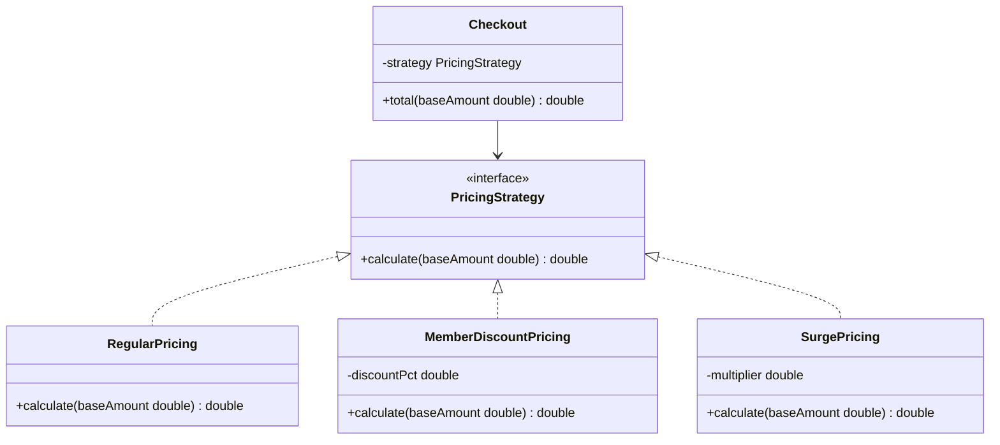

# Day 2 — Strategy Pattern (LLD)

<small>4 min read</small>

## What we're learning today
Yesterday's `AreaCalculator` fix already *was* Strategy — today it gets a name, and you learn to recognize the shape on sight: "an object needs one of several interchangeable algorithms, and the caller shouldn't need an if/else to pick one."

## Core concept
Strategy defines a family of algorithms behind a common interface, and makes the algorithm a runtime-injected object instead of a hardcoded branch. The context class (the one *using* the algorithm) holds a reference to the strategy interface, never to a concrete implementation — this is DIP from Day 1, applied specifically to swappable behavior.

The tell that you need Strategy: you're writing (or reading) a method with a parameter like `String mode` or `int type` that drives an if/else or switch choosing *how* to do something, and new modes get added over time.

## Visual diagram

*`Checkout` never checks "which pricing type am I" — it just calls `strategy.calculate()`. A new pricing rule is a new class, not a new branch inside `Checkout`.*

## Explanation
**Without Strategy** — every new pricing rule edits this method:
```java
class Checkout {
    double total(double baseAmount, String pricingType) {
        if (pricingType.equals("regular")) {
            return baseAmount;
        } else if (pricingType.equals("member")) {
            return baseAmount * 0.9;
        } else if (pricingType.equals("surge")) {
            return baseAmount * 1.5;
        }
        throw new IllegalArgumentException("unknown pricing type");
    }
}
```

**With Strategy** — `Checkout` depends only on the interface; each rule is its own class:
```java
interface PricingStrategy {
    double calculate(double baseAmount);
}

class RegularPricing implements PricingStrategy {
    public double calculate(double baseAmount) { return baseAmount; }
}

class MemberDiscountPricing implements PricingStrategy {
    private final double discountPct;
    MemberDiscountPricing(double discountPct) { this.discountPct = discountPct; }
    public double calculate(double baseAmount) { return baseAmount * (1 - discountPct); }
}

class SurgePricing implements PricingStrategy {
    private final double multiplier;
    SurgePricing(double multiplier) { this.multiplier = multiplier; }
    public double calculate(double baseAmount) { return baseAmount * multiplier; }
}

class Checkout {
    private final PricingStrategy strategy;
    Checkout(PricingStrategy strategy) { this.strategy = strategy; }
    double total(double baseAmount) { return strategy.calculate(baseAmount); }
}

// usage: the caller decides which strategy, Checkout doesn't know or care
Checkout checkout = new Checkout(new SurgePricing(1.5));
checkout.total(100.0);
```
Notice `MemberDiscountPricing` and `SurgePricing` take constructor parameters — Strategy objects can carry their own state, they're not just stateless function pointers.

## Real-world examples
- **`java.util.Comparator`** passed to `List.sort()` — the sort algorithm doesn't know or care what "less than" means for your objects, you inject that as a strategy.
- **Payment processing** (Day 1's example, revisited): `PaymentProcessor` as a Strategy interface with `StripeProcessor`, `PayPalProcessor` implementations, injected into `Checkout` at runtime based on what the user selects.
- **Ride-hailing surge pricing:** exactly the example above — the pricing rule active right now is a runtime decision (time of day, demand), not a compile-time one, which is precisely when Strategy earns its complexity over a simple if/else.

## Interview perspective
The follow-up that reveals whether you actually understand Strategy vs. just used the word: "what if two pricing rules need to be combined — member discount *and* surge, at the same time?" A shallow answer adds a `CombinedPricing` class hardcoding that one combination. The stronger answer recognizes this is now a **Decorator** problem (wrapping strategies to compose behavior) — worth flagging even before Decorator is formally covered, because noticing "this is actually a different pattern" unprompted is the signal interviewers are fishing for.

## Trade-offs
| | If/else branch | Strategy pattern |
|---|---|---|
| Adding a new case | Edit existing method | Add new class, zero edits elsewhere |
| Runtime flexibility | Fixed at the call site | Swappable per-instance, even per-call |
| Overhead for 2 stable cases | None — simplest thing that works | An interface + 2 classes for something that may never grow |
| Right choice when | The set of cases is small and genuinely fixed | The set of cases grows over time or varies per caller |

## Interview question
"You're asked to add logging that records which pricing strategy was actually used for every checkout, without modifying `RegularPricing`, `MemberDiscountPricing`, or `SurgePricing`. How?"

> [!question]- Think it through, then expand
> The constraint is "without modifying the strategy classes" — where else could this behavior live?

> [!success]- Answer
> Wrap the chosen strategy in a `LoggingPricingStrategy` that also implements `PricingStrategy`, holds a reference to the real strategy, and delegates to it after logging: `calculate()` logs the strategy's class name, calls `wrapped.calculate(baseAmount)`, and returns the result. `Checkout` doesn't need to change either — it's still just given a `PricingStrategy`, it doesn't know it's holding a wrapper instead of a "real" strategy. This is Strategy composing cleanly with **Decorator** (tomorrow-tomorrow's pattern) — the wrapper adds behavior around an existing object without changing its class or the classes that use it.

## Key design principle
**If you can describe a piece of behavior as "one of several interchangeable ways to do the same job," it should be an object implementing a shared interface — not a string/enum parameter driving a branch.**

## 30-second challenge
A `ShippingCalculator` has a method `cost(Order order, String method)` where `method` is `"standard"`, `"express"`, or `"overnight"`. Sketch the Strategy interface name and its single method signature — what does the method need as input beyond just the order?

## Tomorrow
Day 3 — State Pattern: when an object's *legal set of operations* itself changes depending on what state it's in.
