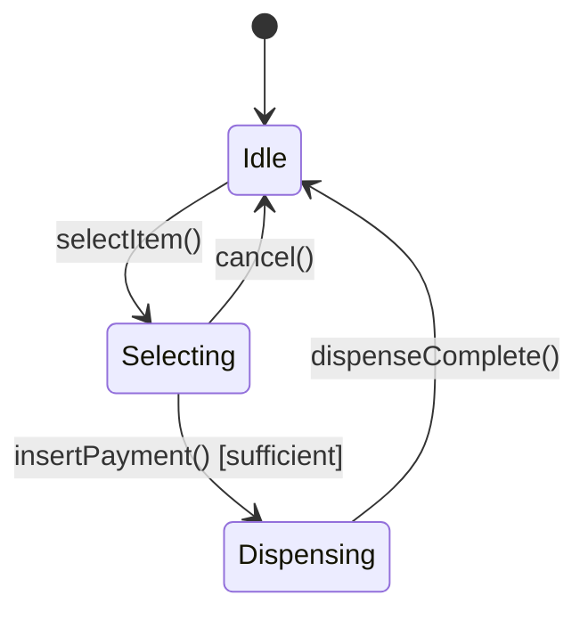

# Day 3 — State Pattern (LLD)

## What we're learning today
Strategy swaps *which algorithm* runs. State swaps *what's even legal to call* — an object behaves differently, and allows different operations, depending on an internal state that changes over its lifetime. This is the pattern behind almost every "design a Vending Machine / Elevator / Order lifecycle" machine-coding question, and it's the same idea as [the Circuit Breaker's state machine](../system-design/system-design-notes/Day 26 - Circuit Breaker Implementation (LLD).md) — just applied to OOD instead of a resilience mechanism.

## Core concept
Without State, an object tracks its status as a field (`String status` or an enum) and every method starts with a branch on that field to decide if the call is even legal right now. With State, each state is its own class implementing a shared interface, the object holds a reference to its *current state object*, and delegates behavior to it — including the decision to transition to a different state.

The tell that you need State: a class has a status field, and multiple methods each start with "if status is X, do this; if status is Y, throw/reject."

## Visual diagram

*Each state (`Idle`, `Selecting`, `Dispensing`) is a class. `selectItem()` called while `Dispensing` isn't a branch to reject inside one giant method — it's simply a method the `Dispensing` state class doesn't implement meaningfully, because it can't be called from outside that transition table anyway.*

## Explanation
**Without State** — every method re-checks the status field:
```java
class VendingMachine {
    private String status = "IDLE";

    void selectItem(String item) {
        if (!status.equals("IDLE")) throw new IllegalStateException("can't select now");
        status = "SELECTING";
    }

    void insertPayment(double amount) {
        if (!status.equals("SELECTING")) throw new IllegalStateException("select an item first");
        if (amount < price) throw new IllegalStateException("insufficient payment");
        status = "DISPENSING";
        dispense();
    }
    // every new state = another status string, checked everywhere
}
```

**With State** — each state owns its own legal transitions:
```java
interface VendingState {
    default void selectItem(VendingMachine ctx, String item) {
        throw new IllegalStateException("can't select item in this state");
    }
    default void insertPayment(VendingMachine ctx, double amount) {
        throw new IllegalStateException("can't insert payment in this state");
    }
}

class IdleState implements VendingState {
    public void selectItem(VendingMachine ctx, String item) {
        ctx.setSelectedItem(item);
        ctx.setState(new SelectingState());
    }
}

class SelectingState implements VendingState {
    public void insertPayment(VendingMachine ctx, double amount) {
        if (amount < ctx.getSelectedPrice()) {
            throw new IllegalStateException("insufficient payment");
        }
        ctx.setState(new DispensingState());
        ctx.dispense();
    }
}

class DispensingState implements VendingState {
    // dispenseComplete() transitions back to IdleState — omitted for brevity
}

class VendingMachine {
    private VendingState state = new IdleState();
    void setState(VendingState state) { this.state = state; }
    void selectItem(String item) { state.selectItem(this, item); }
    void insertPayment(double amount) { state.insertPayment(this, amount); }
    // ...
}
```
`VendingMachine` itself no longer contains a single `if` about status — it just forwards every call to whichever state object is current, and that state object either handles it or (via the interface default) rejects it. Adding a new state (`OutOfStockState`) means adding a new class, not touching `IdleState` or `SelectingState`.

## Real-world examples
- **Order lifecycle** (`Created → Paid → Shipped → Delivered → Cancelled`): the exact same shape — `cancel()` is legal from `Created`/`Paid` but not from `Shipped`, and modeling this with a status enum plus scattered `if` checks is how "cancel a shipped order" bugs happen in real production systems.
- **TCP connection state machine** (`CLOSED → LISTEN → SYN_RECEIVED → ESTABLISHED → ...`) — a textbook State pattern, formalized decades before the GoF book named it.
- **[Circuit Breaker](../system-design/system-design-notes/Day 26 - Circuit Breaker Implementation (LLD).md)** — CLOSED/OPEN/HALF_OPEN is State applied to a resilience mechanism instead of a UI-facing object; same pattern, different domain, which is exactly the kind of connection worth saying out loud in an interview.

## Interview perspective
The question that separates "knows the GoF diagram" from "actually gets it": *"Why not just use an enum and a switch statement — isn't that simpler for 3 states?"* The honest answer is a trade-off, not a dogmatic "State is always better" — see below. Interviewers want you to justify the pattern against the problem's actual growth, not recite it as a rule.

## Trade-offs
| | Status field + branches | State pattern |
|---|---|---|
| For 2-3 states, rarely changing | Simpler, one file, easy to read top-to-bottom | Extra classes for not much payoff |
| For 5+ states, or states likely to grow | Every method accumulates another branch, easy to miss a case | New state = new class, existing states untouched |
| Where the transition logic lives | Scattered across every method that checks status | Localized to each state class's own methods |
| Testability | Must set up the right status string per test | Can instantiate and test a single state class in isolation |

## Interview question
"Your `VendingMachine` needs to support an `OutOfStockState` where `selectItem()` for that specific product should be rejected, but selecting a *different*, in-stock product should still work. Does this fit cleanly into the State pattern as shown above?"

> [!question]- Think it through, then expand
> The states above (`Idle`, `Selecting`, `Dispensing`) describe the *machine's* overall status. "Out of stock" is a property of one specific *item*, not the machine. Does that change which object should own this state?

> [!success]- Answer
> Not cleanly — this reveals a real limitation to name out loud rather than force-fit. The machine-level State pattern models "what can the machine as a whole do right now," but stock is a per-item property, not a machine-wide state. The cleaner fix is a separate concern: each `Item` (or a stock-tracking map) has its own availability, checked when `selectItem()` runs in `IdleState` — `IdleState.selectItem()` looks up the item's stock and rejects *that specific selection* if unavailable, without needing an `OutOfStockState` in the machine's own state machine at all. Recognizing "this doesn't actually fit the pattern I just learned, here's why, and here's the actual fix" is a stronger signal than forcing every new requirement into the pattern of the day.

## Key design principle
**When "what's legal to call right now" depends on status, make status an object with behavior (State) instead of a field checked by every method — but only when the state count and transition complexity actually justify it over a switch statement.**

## 30-second challenge
An `ElevatorState` interface will need states like `Idle`, `MovingUp`, `MovingDown`, `DoorsOpen`. Name one transition that should be *illegal* (i.e., a state whose method should reject a call) and which state should reject it.

## Tomorrow
Day 4 — Factory & Builder: patterns about *how objects get created*.
