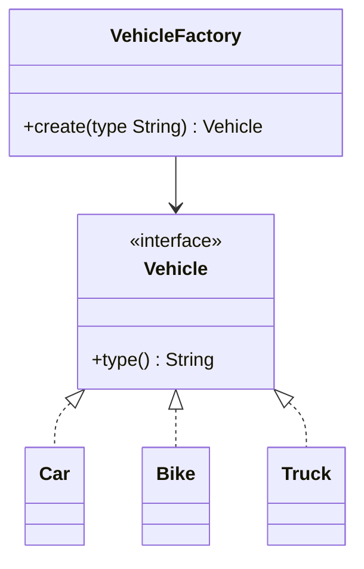

# Day 4 — Factory & Builder Patterns (LLD)

## What we're learning today
Days 1–3 covered patterns about *behavior* (which algorithm runs, what's legal right now). Today starts the creational family — patterns about *how objects get made*, starting with the two you'll use in almost every applied problem this track builds toward.

## Core concept
- **Factory** encapsulates "which concrete class to instantiate" behind a single method or class, so callers depend on an interface, never a constructor. The tell: a `new Car()` / `new Bike()` / `new Truck()` choice driven by a type parameter, scattered across the codebase — every call site needs updating when a new type is added, which is exactly the OCP violation from Day 1, applied to *construction* instead of behavior.
- **Builder** solves a different problem: an object with many fields, several of them optional, where a constructor taking 8 parameters (a "telescoping constructor") is unreadable and error-prone at the call site (`new Order(id, null, true, 3, null, false, null, "USD")` — which `null` is which?). Builder constructs the object step by step via named methods, only assembling the real object at the end.

## Visual diagram

*Every caller depends on `VehicleFactory` and `Vehicle` — never on `Car`/`Bike`/`Truck` directly. Adding `Motorcycle` means one new class plus one line in the factory, not edits scattered across the codebase.*

## Explanation
**Factory** — this is the exact shape Design a Parking Lot needs for creating vehicles from a spot-assignment request:
```java
interface Vehicle {
    String type();
}

class Car implements Vehicle {
    public String type() { return "CAR"; }
}
class Bike implements Vehicle {
    public String type() { return "BIKE"; }
}
class Truck implements Vehicle {
    public String type() { return "TRUCK"; }
}

class VehicleFactory {
    static Vehicle create(String type) {
        return switch (type) {
            case "CAR" -> new Car();
            case "BIKE" -> new Bike();
            case "TRUCK" -> new Truck();
            default -> throw new IllegalArgumentException("unknown vehicle type: " + type);
        };
    }
}

// caller never sees `new Car()` — just the type it wants
Vehicle v = VehicleFactory.create("CAR");
```
The `switch` still exists — Factory doesn't eliminate branching on type, it **contains** it to exactly one place, instead of every call site that needs a vehicle.

**Builder** — avoiding a telescoping constructor for an `Order` with several optional fields:
```java
class Order {
    private final String id;
    private final String couponCode;   // optional
    private final boolean giftWrap;    // optional, defaults false
    private final String deliveryNote; // optional

    private Order(Builder b) {
        this.id = b.id;
        this.couponCode = b.couponCode;
        this.giftWrap = b.giftWrap;
        this.deliveryNote = b.deliveryNote;
    }

    static class Builder {
        private final String id; // required
        private String couponCode;
        private boolean giftWrap = false;
        private String deliveryNote;

        Builder(String id) { this.id = id; }
        Builder couponCode(String v) { this.couponCode = v; return this; }
        Builder giftWrap(boolean v) { this.giftWrap = v; return this; }
        Builder deliveryNote(String v) { this.deliveryNote = v; return this; }
        Order build() { return new Order(this); }
    }
}

// call site reads like a sentence — no positional-argument guessing
Order order = new Order.Builder("ORD-123")
    .couponCode("SAVE10")
    .giftWrap(true)
    .build();
```
The required field (`id`) is a constructor argument on the `Builder` itself, so you can't build an `Order` without it — optional fields get named, chainable setters instead.

## Real-world examples
- **Factory:** a `PaymentProcessorFactory` returning `StripeProcessor` / `RazorpayProcessor` based on region — the same shape as Day 1's payment example, now formalized as its own pattern name.
- **Builder:** `StringBuilder` itself (append-append-append-toString), and Lombok's `@Builder` annotation, which generates exactly the boilerplate written above automatically.
- **Combined:** a `PizzaOrderFactory` that returns a `Pizza.Builder` pre-configured for "Margherita" or "Pepperoni" defaults, which the caller then customizes (extra cheese, thin crust) before `.build()` — Factory deciding the starting point, Builder handling the customization.

## Interview perspective
The follow-up that tests real understanding: *"Why not just make `Vehicle`'s constructor take a `type` string and branch internally?"* The answer isn't "because Factory is the pattern" — it's that a constructor **must** return an instance of its own class; it structurally cannot return a `Car` from a `Vehicle` constructor call. Factory exists specifically because polymorphic construction (returning different concrete types from one call) isn't something constructors can do at all.

## Trade-offs
| | Factory | Direct `new` at call sites |
|---|---|---|
| Adding a new concrete type | One new class + one factory case | Edit every call site that constructs that family |
| Testability | Can substitute a `FakeVehicleFactory` in tests | Concrete classes hardcoded, harder to substitute |
| Overhead for 1 concrete type | Unnecessary indirection | Simplest thing that works |

| | Builder | Telescoping constructor | Setters on a mutable object |
|---|---|---|---|
| Readability at call site | Named, self-documenting | Positional, easy to mix up | Readable but object is mutable after construction |
| Immutability | Final object, built once | Final object, built once | Object can be mutated anytime — bugs from unexpected later changes |
| Required vs optional fields | Required in Builder's constructor, optional as chainable methods | All fields must be positioned, even with dummy `null`s | No distinction enforced |

## Interview question
"You're asked to add a `WATER_TRUCK` vehicle type to the parking lot's `VehicleFactory`. What has to change, and — separately — what would have to change if the factory had been implemented as `if (type.equals("CAR")) ... else if ...` chains scattered in three different files (spot assignment, pricing, entry gate)?"

> [!question]- Think it through, then expand
> The question is really asking you to contrast the blast radius of a change under Factory vs. without it — count the actual number of edits in each case.

> [!success]- Answer
> With `VehicleFactory`: one new `WaterTruck implements Vehicle` class, one new `case` in the factory's switch. Every other file (spot assignment, pricing, entry gate) already depends only on the `Vehicle` interface and never changes. Without a factory — three separate `if/else` chains in three files — adding `WATER_TRUCK` means finding and editing all three, and missing one is a real, easy-to-make bug (e.g. pricing knows about the new type but entry-gate validation doesn't, so trucks get priced but rejected at the gate). This is the concrete, countable version of "OCP violation": the fix isn't abstract, it's the literal number of files you have to remember to touch.

## Key design principle
**Factory centralizes "which concrete class" so it's changed in one place; Builder makes complex construction readable and immutable by separating the steps from the final object — neither pattern removes complexity, both relocate it to exactly one place instead of scattering it.**

## 30-second challenge
A `Report` object has 2 required fields (`title`, `author`) and 5 optional ones (`footer`, `watermark`, `pageNumbers`, `theme`, `exportFormat`). Would you reach for Factory, Builder, both, or neither — and why?

## Tomorrow
Day 5 — Observer: how a subject notifies many dependents about a change without knowing their concrete types.
