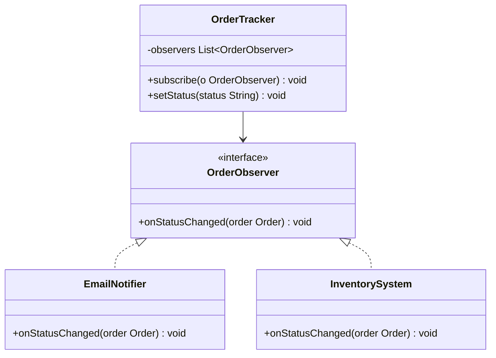

# Day 5 — Observer Pattern (LLD)

<small>5 min read</small>

## What we're learning today
Every pattern so far involved one object and its own behavior or construction. Observer is the first pattern about **relationships between objects** — specifically, how one object (a subject) notifies many others (observers) about a state change, without the subject needing to know anything concrete about who's listening.

## Core concept
A subject holds a list of observers (all referenced only through a shared `Observer` interface), and calls a common `update()` method on each when something changes. The subject never imports or references a concrete observer class — this is DIP again, applied to a one-to-many relationship instead of a single dependency.

The tell that you need Observer: one piece of state changing needs to trigger several unrelated actions (send an email, update a cache, log an audit event, push a UI update), and those actions shouldn't need to know about each other or be hardcoded into the thing that changed.

## Visual diagram

*`OrderTracker` calls `onStatusChanged()` on everything subscribed — it has no idea `EmailNotifier` or `InventorySystem` exist as concrete classes. Adding a `SmsNotifier` means subscribing a new class, not editing `OrderTracker`.*

## Explanation
**Without Observer** — `OrderTracker` has to know about, and directly call, every interested party:
```java
class OrderTracker {
    private EmailNotifier emailNotifier;
    private InventorySystem inventorySystem;
    // add SMS? add analytics? this constructor and setStatus() both grow forever

    void setStatus(String status) {
        this.status = status;
        emailNotifier.sendStatusEmail(status);
        inventorySystem.adjustForStatus(status);
    }
}
```

**With Observer** — `OrderTracker` knows only the interface:
```java
interface OrderObserver {
    void onStatusChanged(Order order);
}

class EmailNotifier implements OrderObserver {
    public void onStatusChanged(Order order) {
        System.out.println("Emailing customer: order now " + order.getStatus());
    }
}

class InventorySystem implements OrderObserver {
    public void onStatusChanged(Order order) {
        if (order.getStatus().equals("CANCELLED")) {
            // release reserved stock
        }
    }
}

class OrderTracker {
    private final List<OrderObserver> observers = new ArrayList<>();
    private Order order;

    void subscribe(OrderObserver observer) {
        observers.add(observer);
    }

    void setStatus(String status) {
        order.setStatus(status);
        for (OrderObserver observer : observers) {
            observer.onStatusChanged(order);
        }
    }
}

// wiring, done once, elsewhere — OrderTracker's own code never changes
OrderTracker tracker = new OrderTracker();
tracker.subscribe(new EmailNotifier());
tracker.subscribe(new InventorySystem());
tracker.subscribe(new SmsNotifier()); // new observer, zero changes to OrderTracker
```

## Real-world examples
- **[04-design-notification-system](../system-design/Claude Notes/04-design-notification-system.md)'s multi-channel fan-out** (email + SMS + push from one event) is Observer at the distributed-systems scale — a message queue plus multiple consumers is the same "one change, many independent reactions" shape, just implemented with infrastructure instead of an in-process list.
- **UI frameworks:** React's state updates triggering re-renders, or a plain JS `EventEmitter`/DOM `addEventListener` — the DOM element is the subject, every listener is an observer that doesn't know about the others.
- **Redux / any pub-sub store:** components `subscribe()` to store changes without the store knowing anything about which components exist.

## Interview perspective
The question that separates "recites the definition" from "understands the trade-off": *"What happens if one observer's `onStatusChanged()` throws an exception — should the others still run?"* This isn't in any textbook definition of Observer, but it's the actual production question: a naive `for` loop calling observers synchronously means one failing observer (say, the email service is down) can block inventory from ever updating. A strong answer proposes isolating each notification (try/catch per observer, or moving to an actual async queue) — recognizing the pattern's synchronous, in-process default isn't automatically safe for real notification fan-out.

## Trade-offs
| | Observer | Direct calls (hardcoded) |
|---|---|---|
| Adding a new reaction to a change | Subscribe a new observer, zero edits to the subject | Edit the subject's method that triggers reactions |
| Coupling | Subject knows only the interface | Subject imports and calls every concrete dependent |
| Failure isolation | Needs deliberate handling — one observer throwing can affect others in a naive loop | Same problem, just more visible since it's all inline |
| Overhead for exactly one, permanent reaction | Unnecessary interface + list for something that'll never grow | Simplest thing that works |

## Interview question
"Two observers are subscribed to the same `OrderTracker`: `EmailNotifier` and `InventorySystem`. A new requirement arrives — `InventorySystem` must run and complete *before* `EmailNotifier` sends anything (so the email can accurately say 'in stock' or 'backordered'). Does the plain Observer pattern as shown above support this, and if not, what's missing?"

> [!question]- Think it through, then expand
> Look at how `subscribe()` and the notification loop are actually implemented above — is there anything enforcing order?

> [!success]- Answer
> The plain pattern as shown does happen to notify observers in subscription order (a `List` iterated in insertion order), so *by accident* it would work if `InventorySystem` was subscribed first — but nothing in the design **guarantees** this; it's an implementation detail an interviewer will push on. The honest answer: Observer as a pattern doesn't model ordering or dependencies between observers at all — that's out of scope for what it solves. If ordering is a real requirement, you need something more explicit: either a documented subscription-order contract (fragile — depends on every future caller subscribing in the right order), priority levels on `subscribe()`, or, if the ordering dependency is strong enough, reconsidering whether `InventorySystem`'s check should happen *before* `setStatus()` is even called rather than as a reactive observer at all. Correctly saying "Observer doesn't solve ordering, here's why, and here's what would" is the stronger answer than pretending the pattern handles it.

## Key design principle
**Observer decouples "something changed" from "here's everything that should happen as a result" — but it deliberately doesn't guarantee ordering or failure isolation between observers; both need to be designed on top if the problem actually requires them.**

## 30-second challenge
A `StockPriceTracker` needs to notify a `PriceChart` (must update in real time) and an `EmailAlertService` (fine to be a few seconds delayed) when a price changes. Is treating both as equal-priority Observers the right call, or does this hint at a different design?

## Tomorrow
Not yet written — Adapter, Decorator, Facade, Composite: patterns about *how objects are composed*, next in the [roadmap](Day-by-Day Roadmap.md).
