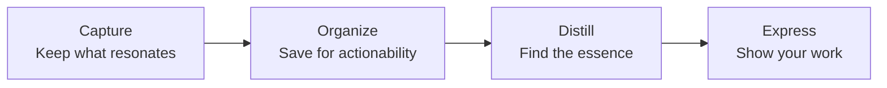

# 02 — The CODE Framework

<small>2 min read</small>

## Core idea
CODE is the operative framework of the book, and the spine the rest of it is built on: **Capture, Organize, Distill, Express.** Capture is keeping what resonates as you move through the world — articles, quotes, conversations, half-formed thoughts. Organize is filing that material by where you'll actually use it, not by what shelf it belongs on. Distill is condensing a saved note down to its essence so a future version of you can grasp it in seconds. Express is the step where captured, organized, distilled material actually turns into something — a document, a decision, a piece of work — instead of sitting in the system forever.

## Why it matters
Most note-taking advice treats capture as the whole problem — "just write things down" — and stops there. CODE's contribution is insisting that capture without the other three steps is close to worthless: a pile of unorganized, undistilled notes that never gets expressed is functionally the same as never having taken them. The four steps also aren't equally weighted in most people's habits — Forte's observation is that knowledge workers overinvest in capture and organize, and underinvest in distill and express, which is exactly backward if the goal is usable output rather than a tidy archive.

## Example from the book
Forte frames CODE as directly mirroring how a chef actually cooks, rather than how an outsider imagines cooking works. A chef doesn't start from raw, unprepared ingredients mid-dinner-service — they do "mise en place" beforehand: sourcing ingredients (capture), organizing their station (organize), and prepping — chopping, portioning, pre-cooking — before service starts (distill), so that when an order comes in, they can assemble a finished dish in minutes (express). The prep work that happens before the pressure moment is what makes fast, high-quality output possible under pressure later — and Forte argues knowledge work runs on the same logic, even though most people try to do all four steps at once, in the moment they need the output, which is far harder than doing them ahead of time.

## Practical application
Take one piece of unfinished work you're avoiding — a report, a proposal, a difficult email — and instead of asking "how do I write this," ask which of the four CODE steps is actually missing. Often the block isn't a writing problem at all: it's that nothing has been captured yet, or what's captured is scattered and unorganized, or it's organized but never distilled into anything usable. Naming which step is missing turns a vague sense of being stuck into a concrete next action.

## Something to sit with
> [!question]- A question to think about
> Of the four steps — capture, organize, distill, express — which one do you actually skip most often in practice, and what does that do to the other three?

## Linked from

- [Building a Second Brain](index.md)
