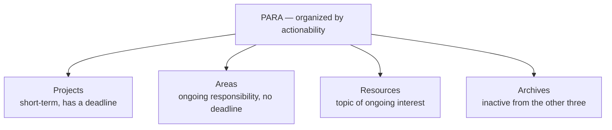

# 05 — Organize — The PARA Method

<small>3 min read</small>

## Core idea
PARA is Forte's answer to the Organize step: sort everything you keep into one of four categories — **Projects** (short-term efforts with a defined goal and a deadline), **Areas** (ongoing responsibilities you maintain indefinitely, with no finish line — health, finances, a role at work), **Resources** (topics of ongoing interest you're not actively acting on), and **Archives** (anything from the first three that's now inactive). The organizing principle isn't subject matter — it's actionability. The same note on negotiation tactics might belong in Projects if you're mid-negotiation, Areas if it's part of an ongoing job responsibility, or Resources if it's just a topic you find interesting with nothing currently riding on it.

## Why it matters
The default way most people organize notes is by topic, the way a library organizes books — a folder for "Marketing," a folder for "Health," a folder for "Books I've Read." Forte's argument is that this fails quietly and consistently, because topic-based systems don't match how you actually retrieve information: you don't wake up wanting "everything filed under Marketing," you wake up needing what's relevant to the specific project or responsibility in front of you right now. PARA reorganizes around that real retrieval need. It also explains why so many careful, well-intentioned filing systems get built and then abandoned — they were organized around a structure (topic) that never matched the moment (actionability) when the person actually went looking for the note again.

## Example from the book
Forte describes moving a note the same content can sit in different PARA categories depending entirely on what's live in your life at the moment, not on the content itself. A folder of research on a competitor might sit in Projects while you're actively writing a competitive analysis due Friday, get moved to Areas once competitive monitoring becomes an ongoing part of your job rather than a one-off task, and eventually land in Archives once that responsibility ends or changes hands — the notes themselves may never change, but where they need to live changes as your relationship to them changes.

## Practical application
Pick one folder or notebook in your current system that's organized by topic — "Ideas," "Articles," "Misc" — and sort its contents into the four PARA buckets by asking, for each item, "what am I actually doing with this right now?" not "what is this about?" Items with no clear project or area attached and no ongoing interest either are Archive candidates; you'll likely find the folder shrinks by more than half once sorted this way.

## Something to sit with
> [!question]- A question to think about
> Pick any note you filed away and haven't looked at since. If you tried to retrieve it today by asking "what project or area is this for," would you find it — or only if you remembered the topic you originally filed it under?

## Linked from

- [Building a Second Brain](index.md)
