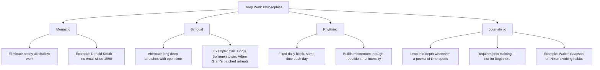

# 03 — The Four Philosophies of Deep Work

<small>3 min read</small>

## Core idea
Before adopting any specific tactic, Newport argues you need a philosophy — a top-level answer to how deep work fits into your schedule at all, since trying to "just find time" for it without a structural commitment reliably loses to whatever's urgent that day. He lays out four philosophies, ordered roughly from most extreme to most flexible: **Monastic**, which eliminates or radically minimizes shallow obligations altogether, dedicating nearly all working life to a single deep pursuit; **Bimodal**, which divides time into clearly defined, often multi-day stretches devoted entirely to deep work, with the remaining time left open to everything else; **Rhythmic**, which turns deep work into a regular daily habit at a fixed time, generating momentum through repetition rather than through large blocks; and **Journalistic**, which fits deep work into whatever pockets of time become available, switching in and out of depth on short notice — a mode Newport is explicit requires considerable practice before it's reliable, since most people can't drop into deep concentration on demand without training.

## Why it matters
Picking a philosophy up front matters because each one makes a different trade-off between depth and flexibility, and mismatching the philosophy to your actual constraints is a common reason attempts at deep work quietly fail — someone with a demanding, meeting-heavy job who tries to run a monastic schedule will simply fail the job's other requirements, while someone with genuine autonomy who tries only the journalistic mode may never build the concentrated stretches that produce their best work. The choice isn't about which philosophy is "best" in the abstract; it's about which one your actual job, family situation, and current skill at concentrating can realistically sustain.

## Example from the book
Newport's clearest illustrations: Donald Knuth, the computer scientist, exemplifies the monastic approach — he has stated he stopped using email entirely starting in 1990, structuring his professional life almost entirely around uninterrupted, long-form concentration. Carl Jung, during the period he was developing his major theories, exemplifies the bimodal approach — he built a stone retreat tower at Bollingen where he would withdraw for extended, isolated stretches of deep thinking, while otherwise maintaining an active clinical practice and social life in Zurich. Newport also cites organizational psychologist Adam Grant as a modern bimodal example, batching two-to-four-day fully monastic stretches once or twice a month while remaining highly available the rest of the time. For journalistic, he points to writer Walter Isaacson's account of how Richard Nixon, and journalists more broadly, could shift into focused writing the moment any pocket of time opened up, without needing a long ramp-up.

## Practical application
Rather than trying to force a single "correct" schedule, match the philosophy to your actual constraints: if your job has near-total flexibility, consider bimodal or even monastic stretches; if it has fixed hours but some daily control, rhythmic is usually the most sustainable starting point; if your schedule is genuinely unpredictable, journalistic is the only realistic option, but treat the ability to switch into depth quickly as a skill to build deliberately (chunks 08–09 give the training exercises), not something to assume you already have.

> [!question]- A question to think about
> Looking honestly at your actual schedule and obligations this year, not the schedule you wish you had — which of the four philosophies could you sustain for a month without it quietly collapsing under your real constraints?

## Linked from

- [Deep Work](index.md)
