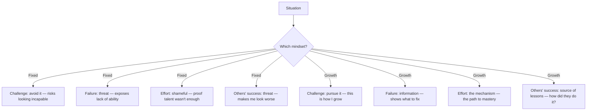

# 02 — How the Two Mindsets React to Failure and Challenge

<small>3 min read</small>

## Core idea
Dweck spends much of the book's early chapters showing that the fixed/growth distinction isn't abstract — it produces sharply different, almost automatic reactions across four specific situations: facing a challenge, encountering an obstacle or failure, putting in effort, and receiving criticism or hearing about someone else's success. In the fixed mindset, each of these is a referendum on your fixed level of ability, so challenge feels risky, failure feels like exposure, effort feels like an admission that you weren't naturally good enough, and criticism or another person's success feels like a threat. In the growth mindset, the same four situations are read as *information* — challenge is how you grow, failure is data, effort is the mechanism, and someone else's success is a source of lessons rather than a comparison to lose.

## Why it matters
This is the part of the theory with the most everyday leverage, because these four situations aren't rare — they happen constantly, in ordinary weeks, at work and at home. A fixed mindset doesn't need a dramatic crisis to do damage; it does its damage in the routine moments where a person quietly avoids a hard task, stops trying the moment something gets uncomfortable, or feels a flash of resentment at a colleague's promotion. Seeing these as one pattern rather than four unrelated moods is what makes the mindset framework diagnostic instead of just descriptive.

## Example from the book
Dweck describes fixed-mindset students who, given a choice between a puzzle they'd already mastered and a harder one they might fail, reliably chose the easier one — not because they lacked ambition, but because the harder puzzle put their self-image at risk. Growth-mindset students in the same experiments consistently chose the harder puzzle, and some even found the easy one mildly insulting. She also describes how fixed-mindset individuals, when shown feedback about their errors, showed reduced attention and engagement almost immediately, essentially tuning out the information that would have helped them improve — while growth-mindset individuals showed heightened engagement with exactly that same corrective feedback.

## Practical application
Use the four categories as a quick diagnostic in the moment rather than after the fact. When you notice yourself avoiding a task, minimizing a mistake, resenting extra work, or feeling stung by someone else's win, name which of the four it is — that alone interrupts the automatic fixed-mindset response and gives you a beat to choose the growth-mindset reframe instead ("what would trying this teach me" rather than "what if I'm bad at this").

## Something to sit with
> [!question]- A question to think about
> Of the four triggers — challenge, failure, effort, others' success — which one reliably gets you? Where in the last month did it show up, and what did you do instead of the growth-mindset version?

## Linked from

- [Mindset](index.md)
