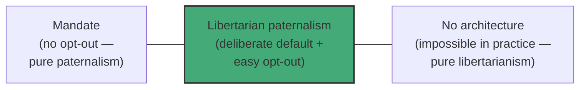

# 08 — Libertarian Paternalism

<small>3 min read</small>

## Core idea
Thaler and Sunstein name their overall philosophy "libertarian paternalism," and they're aware it sounds like an oxymoron — libertarianism usually means leaving people alone, paternalism usually means overriding their choices for their own good. Their resolution is that these aren't opposite ends of one dial that a designer has to choose between; they're two independent questions. The "libertarian" part means the opt-out always has to be real, cheap, and easy — nothing is banned, nothing is mandated, anyone who wants a different option can have it. The "paternalist" part means the choice architect is entitled to try to influence people toward choices that would make their lives better, as judged by their own stated preferences and values, not the architect's. Combined, the position is: since some default or arrangement is unavoidable anyway (as chunk 04 established), it should be the one that helps people, as long as walking away from it remains genuinely easy.

## Why it matters
The philosophical weight of this idea is that it reframes the debate people usually think they're having. The instinctive objection — "who are you to decide what's good for me?" — assumes there's a neutral, architecture-free alternative on the table where no one is deciding anything, and libertarian paternalism is a departure from that neutral baseline. Thaler and Sunstein's response is that the neutral baseline doesn't exist. A cafeteria has to arrange its food somehow. A retirement plan has to have some default enrollment status. A choice architect who claims to be "staying out of it" by picking whatever's administratively convenient isn't more neutral than one who deliberately picks the option evidence suggests most people would choose for themselves — they've just outsourced the decision to inertia, or to whoever benefits from the convenient default, instead of making it deliberately. Once that's accepted, the real debate isn't "nudge or don't nudge" — it's "which nudge, and is the opt-out genuinely as easy as claimed."

## Example from the book
The authors use a spectrum to show libertarian paternalism doesn't collapse into either pole. At one end sits full mandate — banning junk food outright, or forcing retirement contributions with no way to opt out, which is paternalism with no libertarian half at all. At the other end sits pure laissez-faire — no defaults, no structure, every choice presented in whatever arrangement happens to occur, which sounds libertarian but, as the Carolyn cafeteria example shows, isn't actually achievable. Libertarian paternalism sits in between: a deliberately chosen default (auto-enrollment in a retirement plan, fruit at eye level in the cafeteria) paired with a preserved, low-friction exit for anyone who wants something else. The authors' repeated test for whether a specific nudge belongs in this middle zone is simple — would the person, on calm reflection with full information, endorse being nudged this way? If yes, it's paternalism aimed at their own considered preferences, not someone else's.

## Practical application
Use the two-part test the next time you're evaluating a nudge aimed at you, or designing one aimed at someone else. First: is the opt-out genuinely easy, or just technically available while actually being buried, confusing, or costly? A default that's "optional" but requires three phone calls to escape doesn't pass the libertarian half of the test. Second: is the direction of the nudge something the person would endorse on reflection, or does it mainly benefit whoever set the default? Applying both questions honestly is a good filter for telling a legitimate nudge (auto-enrollment toward saving) from a dark pattern dressed up in the same language (a subscription that's technically cancellable but deliberately hard to find).

## Something to sit with
> [!question]- A question to think about
> Think of a nudge you've encountered recently — a default, a pre-checked box, a suggested option. Would you endorse it on reflection, and was the opt-out actually as easy as it claimed to be?

## Linked from

- [Nudge](index.md)
