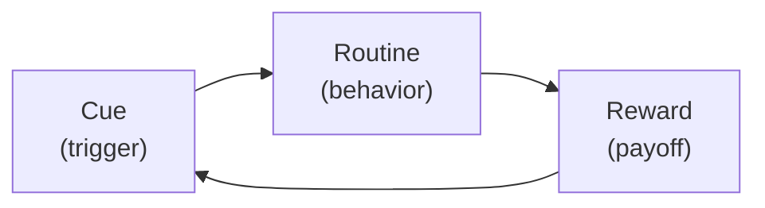

# 01 — The Habit Loop: Cue, Routine, Reward

<small>3 min read</small>

## Core idea
Duhigg opens with the same three-step mechanism underneath every habit: a **cue** (a trigger that tells the brain which routine to run), a **routine** (the behavior itself, physical, mental, or emotional), and a **reward** (the payoff that tells the brain this particular loop is worth remembering for next time). Repeat the loop enough times in the same context and the brain stops treating it as a decision at all — it becomes a stored, automatic pattern that runs with minimal conscious input. This isn't a metaphor Duhigg is proposing; it's the literal finding of decades of neuroscience on how the brain converts effortful action into automatic behavior.

## Why it matters
The mechanism matters because of what it implies about effort. A brain that had to consciously deliberate over brushing your teeth, making coffee, and choosing a route to work every single day would burn through an enormous amount of energy just getting through a morning. Habits are the brain's shortcut — a way of offloading well-worn sequences so conscious attention is free for whatever's actually novel that day. That's a feature, not a flaw, but it has a cost: once a loop is stored, the brain doesn't distinguish between good loops and bad ones. It will run "reach for a cigarette when stressed" with the same efficiency as "reach for running shoes when stressed," which is exactly why habits can feel like they're operating outside of a person's control — because, once formed, they largely are.

## Example from the book
Duhigg's foundational evidence comes from MIT neuroscientist Ann Graybiel's lab, which ran rats through a T-shaped maze with a partition that made a click when it opened, and a piece of chocolate waiting past one of the two turns. Researchers monitored the rats' brain activity throughout training. Early on, the rats' brains stayed highly active for the entire run through the maze — sniffing at walls, doubling back, working out the layout. But as the maze became routine, something changed: brain activity spiked right as the partition clicked (the cue) and again once the rats reached the chocolate (the reward), but activity in between — during the actual running of the maze — dropped off dramatically. The brain had "chunked" the routine into a single automatic unit, freeing itself from having to think through each step. This chunking process, Duhigg argues, is identical to what happens when a person learns to back a car out of a driveway or tie a shoe without looking.

## Practical application
Before trying to change any habit, write out its cue, routine, and reward as three separate lines — not vaguely, but as specifically as you can reconstruct them. Most people can name the routine easily (it's the visible part) but have never isolated the cue or the reward, which is exactly why willpower-only attempts to quit a habit tend to fail: they're aimed at the routine while leaving the cue that triggers it and the reward that reinforces it completely untouched. Getting all three onto paper is what makes every later idea in the book — keystone habits, the golden rule of habit change — actually usable rather than abstract.

## Something to sit with
> [!question]- A question to think about
> Pick a habit that runs on autopilot for you. Can you name its cue and its reward without watching yourself do it first — or have you only ever noticed the routine in the middle?

## Linked from

- [The Power of Habit](index.md)
