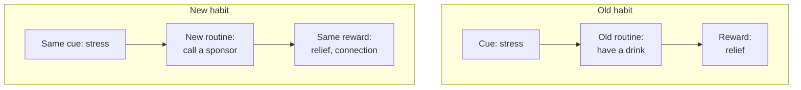

# 04 — The Golden Rule of Habit Change

<small>3 min read</small>

## Core idea
Duhigg's central prescription for changing any habit is what he calls the golden rule: **you cannot extinguish a bad habit, you can only replace it — by keeping the same cue and the same reward, and inserting a new routine in between.** Trying to eliminate the cue is usually impractical (stress, boredom, and social situations don't disappear on command), and trying to skip the reward defeats the point, since the craving for that reward is what's driving the loop in the first place. The only piece that's actually swappable is the routine — the specific behavior that runs between trigger and payoff.

## Why it matters
This reframes what "willpower" is actually being asked to do. Most failed attempts at behavior change try to suppress the whole loop through sheer resistance — white-knuckling past the cue and the craving with nothing to replace the routine. That's exhausting and, per chunk 07 on willpower being a limited resource, unsustainable over any real stretch of time. The golden rule asks for something much narrower and more achievable: don't fight the craving, redirect it. Give the same cue permission to fire and the same reward permission to land — just make sure a different, deliberately chosen action sits in the middle.

## Example from the book
Duhigg's clearest case study is Alcoholics Anonymous. He argues AA's twelve-step program works, to the extent it does, not by removing the cues that trigger a craving for alcohol (stress, social anxiety, an unwelcome memory) but by giving members a substitute routine for the same cues and, crucially, a substitute reward: instead of the numbing relief of a drink, meetings and sponsor calls offer the reward of being heard, supported, and part of a community — a different route to a similar emotional payoff. He pairs this with football coach Tony Dungy, who rebuilt his teams' defenses around drastically simplified, deeply drilled reactions to a small number of cues, so that under the pressure of a live game — conditions where conscious decision-making tends to break down — players would fall back on the trained routine instead of hesitating or improvising. Dungy's Colts won the Super Bowl running this system, though Duhigg is careful to note it also failed him in high-pressure losses where players reverted to older, deeper-grooved routines instead of the new one — a reminder that a new routine has to be drilled deeply enough to actually outcompete the old one under stress, not just exist as an intention.

## Practical application
Take a habit you've tried to quit before and identify its cue and reward honestly — not the routine you want to remove, but what triggers it and what it actually gives you emotionally, not just physically. Then choose a specific, concrete substitute routine that could plausibly deliver a similar reward from the same cue. The rule fails quietly if the substitute is vague ("do something else when stressed") — it has to be as specific and as rehearsed as the habit it's replacing, because under real pressure, the brain will default to whichever routine is more deeply grooved, not whichever one you intended to run.

## Something to sit with
> [!question]- A question to think about
> For a habit you want to change, what reward is it actually giving you underneath the surface behavior — and can you name a different routine, right now, that could plausibly deliver that same reward from the same cue?

## Linked from

- [The Power of Habit](index.md)
