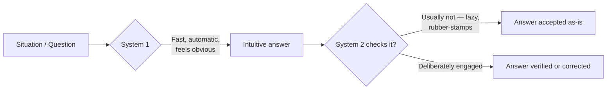

# 01 — System 1 and System 2

<small>3 min read</small>

## Core idea
Kahneman's central device is a fictional pair of "characters" living in your head. **System 1** is fast, automatic, intuitive, and effortless — it's what completes "bread and ___," reads the emotion on a scowling face, and answers "2 + 2" without you deciding to think about it. **System 2** is slow, deliberate, and effortful — it's what you use to multiply 17 × 24, fill out a tax form, or park in a tight space. Kahneman is explicit that neither is a real brain structure; they're a useful fiction for talking about two very different styles of mental operation that trade off constantly, without your noticing the handoff.

## Why it matters
Almost everything else in the book is a special case of one fact: System 1 is running by default, and System 2 mostly rubber-stamps whatever System 1 hands it. You *feel* like a deliberate, reasoning agent, but the vast majority of your judgments — including ones that feel like conclusions you reasoned your way to — are actually System 1 impressions that System 2 never bothered to check. Every bias catalogued later in the book (anchoring, availability, representativeness, loss aversion) is a specific way System 1 substitutes an easy question for a hard one and hands you a confident answer before System 2 even wakes up. Understanding this architecture is the prerequisite for noticing it happen in your own head.

## Example from the book
Kahneman opens with a simple demonstration: read the phrase "A bat and a ball cost $1.10. The bat costs $1.00 more than the ball. How much does the ball cost?" Most people's System 1 blurts out "10 cents" instantly and with total confidence — it's wrong (the answer is 5 cents), but it *feels* right because it's fast and fluent. Getting the correct answer requires System 2 to intervene and actually check the intuitive one, which most people, even at elite universities, don't bother to do. Kahneman uses this "bat and ball" problem throughout the book as a diagnostic for how readily people accept a System 1 answer without engaging System 2 at all.

## Practical application
When a judgment or decision arrives in your head fully formed and feels obviously correct, treat that fluency as a signal to double-check, not as evidence of correctness. Before committing to a fast answer on anything that matters — a hiring decision, a big purchase, an argument you're about to make — ask yourself the bat-and-ball question in disguise: "Does this answer feel right because I checked it, or because it came easily?" The two are not the same thing, and System 1 makes no distinction between them.

## Something to sit with
> [!question]- A question to think about
> Think of a recent decision that felt obvious in the moment. Did you actually check it with deliberate reasoning, or did it just feel confident and fast — and how would you tell the difference after the fact?

## Linked from

- [Thinking, Fast and Slow](index.md)
