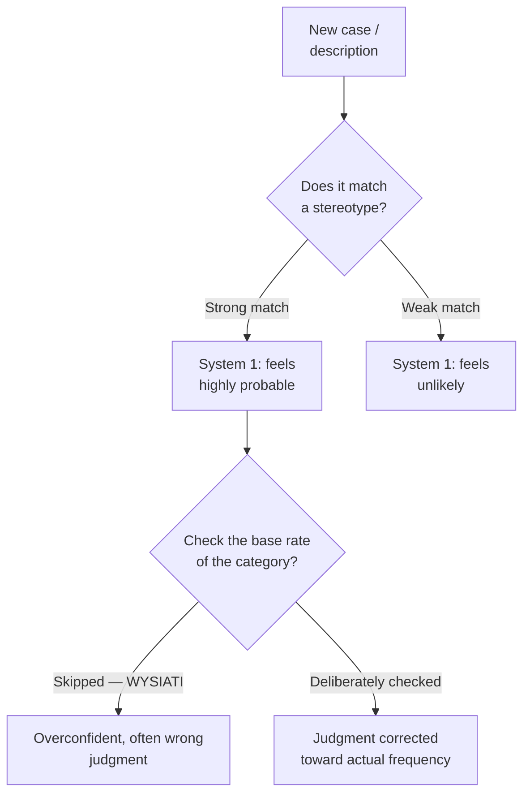

# 06 — Representativeness and the Linda Problem

<small>2 min read</small>

## Core idea
The **representativeness heuristic** is System 1's habit of judging probability by how much something resembles a stereotype or a mental prototype, rather than by the actual statistical likelihood. It systematically crowds out a much duller but more important input: base rates — how common something actually is in the underlying population. When a vivid, specific description matches a stereotype well, people will rate a *more detailed, more specific* scenario as more probable than a broader, less detailed one — a logical impossibility, since any specific case is necessarily a subset of the broader category and can never be more likely than it.

## Why it matters
This is the source of the famous "conjunction fallacy," and it matters because it's not a fringe error made by careless people — it's made reliably by statisticians and experts who know the underlying math perfectly well but still get outvoted by their own System 1's stereotype-matching. It's the same mechanism behind stereotyping in hiring, medical diagnosis, and forecasting: a vivid, story-consistent detail overrides a boring but statistically dominant base rate, and people don't experience this as an error — they experience it as good pattern recognition.

## Example from the book
Kahneman and Tversky's classic "Linda problem": subjects read a description of Linda — 31, single, outspoken, a philosophy major who was deeply concerned with discrimination and social justice as a student — then rank the probability of several statements, including "Linda is a bank teller" and "Linda is a bank teller and is active in the feminist movement." A large majority of subjects, including many trained in statistics, ranked the second, more specific statement as *more* probable than the first — even though any bank teller who is also a feminist is necessarily a subset of all bank tellers, making the conjunction mathematically less likely, never more. The vivid match between Linda's description and the feminist stereotype simply overpowered the basic logic of set membership.

## Practical application
When a specific, story-like description feels highly probable, explicitly separate two questions: "how well does this match a stereotype?" and "how common is this actually, statistically?" Before accepting a detailed, plausible-sounding scenario (in hiring, forecasting, or diagnosis), ask what the base rate is for the broader category it belongs to — and remember that adding more specific, resonant detail to a story can only make it *less* statistically likely, even as it makes the story feel more convincing.

## Something to sit with
> [!question]- A question to think about
> Think of a time you found a detailed, specific explanation more convincing than a vague, general one — was the extra detail actually evidence, or did it just make a better story?

## Linked from

- [Thinking, Fast and Slow](index.md)
