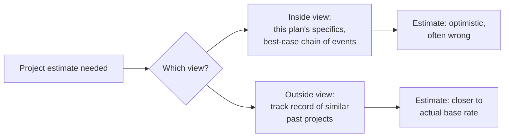

# 08 — The Planning Fallacy

<small>3 min read</small>

## Core idea
People systematically underestimate how long a project will take, how much it will cost, and how many things will go wrong — even when they know, in the abstract, that similar projects usually run over. Kahneman traces this to a habit of forecasting from the **inside view**: focusing on the specifics of the plan in front of you, the best-case chain of events, and your own particular circumstances, rather than the **outside view** — the actual track record of how similar projects have gone for other people in the past. The inside view feels more relevant because it's about *this* project specifically; the outside view is the one that's actually predictive.

## Why it matters
The planning fallacy isn't a failure of intelligence or effort — it happens to experts, to people who've made the same mistake before, and to people explicitly warned about it, because the bias operates at the level of which question feels natural to ask, not at the level of available information. Large-scale project overruns — construction, software, government infrastructure — are routine rather than exceptional, and the reason isn't usually incompetence; it's that everyone involved forecasts from the inside view by default and has to be deliberately forced into the outside view to get a realistic number.

## Example from the book
Kahneman recounts a personal case: while helping design a new curriculum for Israeli high schools, he asked his team to individually estimate how long the project would take. Estimates clustered around one to two years. He then asked a team member with direct experience of similar curriculum projects elsewhere how long those had typically taken to completion — the answer was that roughly 40% of similar teams never finished at all, and the ones that did took seven to ten years. The project Kahneman was working on ultimately took eight years — matching the outside-view base rate almost exactly, despite every inside-view estimate clustering far below it. He also cites the Scottish Parliament building, budgeted at roughly £40 million and ultimately costing more than £400 million, as a large-scale public example of the same pattern.

## Practical application
For any project estimate that matters, deliberately seek out the outside view before trusting your inside-view number: find several genuinely comparable past projects (not the best-case ones you remember, but a representative sample) and use their actual outcomes — time, cost, failure rate — as your starting anchor, then adjust from there rather than starting from your own plan's specifics. This is uncomfortable because it usually produces a much less flattering estimate than the inside view does, which is exactly why it's more accurate.

## Something to sit with
> [!question]- A question to think about
> Think of a project you're currently estimating — for work or personally. If you looked only at how similar projects have actually gone for other people, would your estimate change?

## Linked from

- [Thinking, Fast and Slow](index.md)
