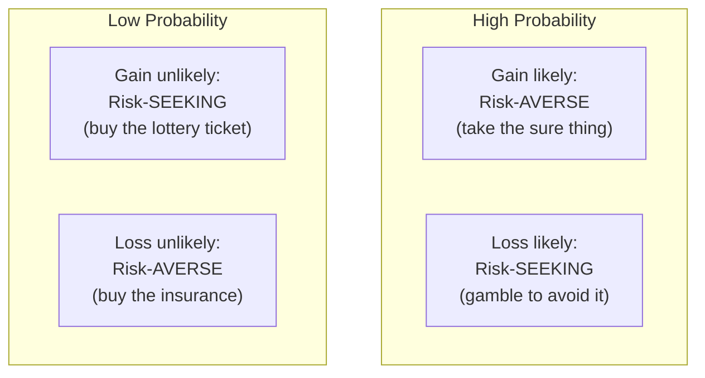

# 10 — Prospect Theory and the Fourfold Pattern

<small>3 min read</small>

## Core idea
Prospect theory, the work that eventually won Kahneman the Nobel Prize in Economics (awarded jointly to the framework he developed with Amos Tversky), replaced the classical economic assumption that people evaluate outcomes by their final wealth with a more accurate model: people evaluate outcomes as **gains and losses relative to a reference point** — usually the status quo — and the resulting psychological "value" of a gain or loss follows a curve that is steeper for losses than gains (loss aversion) and flattens out for larger amounts in both directions (diminishing sensitivity — the difference between losing $10 and $20 feels much bigger than the difference between losing $1,010 and $1,020). Combining loss aversion with diminishing sensitivity produces the **fourfold pattern**: people are risk-*averse* for likely gains and risk-*seeking* for likely losses, but flip to risk-*seeking* for unlikely gains and risk-*averse* for unlikely losses.

## Why it matters
The fourfold pattern isn't just an academic curiosity — it explains behavior that looks contradictory under classical rational-choice theory but is highly consistent under prospect theory: why the same person buys lottery tickets (risk-seeking on an unlikely gain) and buys insurance (risk-averse on an unlikely loss) in the same week, and why people facing a likely loss (a lawsuit they're probably going to lose, a failing business) often take reckless gambles to avoid accepting the loss for certain, while people sitting on a likely gain often lock it in early rather than risk it. Prospect theory reframed decades of economic theory because it modeled how people actually choose, not how a purely rational wealth-maximizer would.

## Example from the book
Kahneman and Tversky asked subjects to choose between a certain gain of $900 and an 90% chance to win $1,000 (with a 10% chance of nothing) — most people take the certain $900, even though the gamble has identical expected value, because they're risk-averse when a gain is likely. Flip the frame to losses — a certain loss of $900 versus a 90% chance to lose $1,000 (with a 10% chance of losing nothing) — and most people now choose the gamble, becoming risk-*seeking* to avoid a near-certain loss, even though the expected value is again identical. This single reframing, gain versus loss with the same underlying probabilities, reliably flips people's risk preference — a result classical expected-utility theory has no way to explain, since it evaluates only final wealth, not gains and losses relative to a reference point.

## Practical application
When facing a decision under risk, explicitly identify your reference point and whether you're framing the choice as a gain or a loss — the same objective options can produce opposite decisions depending on that framing alone. Be especially alert when you notice yourself taking a large risk specifically to avoid "locking in" a loss (selling a losing investment, settling a weak legal case, walking away from a failing project) — that impulse is often the fourfold pattern's risk-seeking-in-losses quadrant operating on you, not a considered judgment that the gamble is actually a good bet.

## Something to sit with
> [!question]- A question to think about
> Think of a recent risky choice you made to avoid accepting a loss as final. If the same odds and stakes had been framed as a possible gain instead, would you have made the same decision?

## Linked from

- [Thinking, Fast and Slow](index.md)
