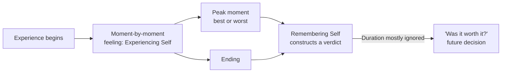

# 13 — The Experiencing Self and the Remembering Self

<small>3 min read</small>

## Core idea
Kahneman argues we don't have one unified self evaluating our lives — we have two, and they often disagree. The **experiencing self** lives entirely in the present moment, feeling pleasure or pain as each instant happens, with no memory and no narrative. The **remembering self** is the one that keeps score afterward, constructs a story out of an experience, and is the only one that gets consulted when you decide whether something was "worth it" or whether you'd do it again. Critically, the remembering self doesn't average across an experience's duration at all — it judges almost entirely by the **peak** moment (best or worst) and the **end**, largely ignoring how long the experience lasted. Kahneman calls this the **peak-end rule**, and the near-total insensitivity to duration **duration neglect**.

## Why it matters
Because the remembering self is the one making decisions about the future — whether to repeat a vacation, a medical procedure, a job — and it systematically distorts based on the ending and the peak rather than the total experience, people make choices that don't actually optimize for what the experiencing self will go through. A longer experience that ends slightly better can be *remembered* as preferable to a shorter one that ends slightly worse, even though the experiencing self endured strictly more total pain or pleasure in the longer one. Kahneman's blunt formulation: we don't choose between experiences, we choose between memories of experiences — and those memories are constructed by rules that ignore duration almost entirely.

## Example from the book
In Kahneman's cold-hand experiment, subjects endured two trials of immersing a hand in painfully cold water: a short trial, and a long trial that repeated the same short trial but added an extra period where the water was gradually warmed slightly (still painful, just less so) before ending. Given a choice of which trial to repeat, most subjects chose the longer one — objectively more total pain endured — because it ended on a less-bad note, and the remembering self weighted that improving ending over the extra suffering, which the remembering self essentially discounted. Kahneman also cites Donald Redelmeier's colonoscopy studies, where patients whose procedures ended with a period of reduced discomfort (even though the procedure itself was extended to include it) rated the overall experience as less unpleasant and were more willing to return for follow-up procedures than patients whose shorter procedures ended abruptly at peak discomfort.

## Practical application
When designing or evaluating an experience you want people (including yourself) to remember positively — a trip, an event, a customer interaction, a difficult conversation — pay disproportionate attention to how it ends and its most intense moment, since those two points will dominate the memory regardless of the experience's actual duration or average quality. Conversely, when deciding whether to repeat something based on how you remember it, ask explicitly whether your memory is dominated by the ending rather than reflecting the whole experience — the remembering self is a poor guide to what the experiencing self would actually choose if it could vote.

## Something to sit with
> [!question]- A question to think about
> Think of an experience you remember as good or bad mainly because of how it ended. If you focused only on the average of how you felt throughout, rather than the ending, would your verdict on it change?

## Linked from

- [Thinking, Fast and Slow](index.md)
