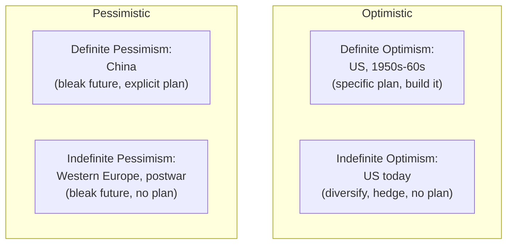

# 02 — Definite vs Indefinite Optimism and Pessimism

<small>3 min read</small>

## Core idea
Thiel maps attitudes toward the future onto two independent axes. The first is optimism versus pessimism: do you expect the future to be better or worse than the present? The second, which he treats as the more important and more overlooked axis, is definite versus indefinite: do you have a specific view of *how* that future will happen, and a plan to build it — or just a general sense of direction with no particular plan? Crossing the two axes produces four stances. Definite optimism is confidence in a specific better future you can design and build (his example is the United States roughly from the 1950s through the 1960s, the era of big, planned engineering projects). Indefinite optimism, which he argues has quietly become the dominant American mindset since around the 1980s, believes the future will be better without having any specific idea how — so instead of building toward a particular outcome, people hedge, diversify, and accumulate optionality. Definite pessimism expects a worse future but has a concrete plan to prepare for or manage it (his example is China, which he frames as pursuing an explicit strategy of catching up and building despite a bleak long-term outlook). Indefinite pessimism expects a worse future with no plan to prepare for it at all, only resignation (his example is Western Europe in the postwar decades).

## Why it matters
Thiel's claim is that only definite optimism — a specific belief about a better future paired with an actual plan to build it — produces genuine 0 to 1 companies. Indefinite optimism, by contrast, produces a culture oriented around process instead of substance: instead of committing to build one specific great thing, people collect flexible, generically valuable credentials and options (a diversified stock portfolio, a broadly prestigious degree, a resume built for optionality) precisely because they believe things will work out but can't say how or through what. That mindset is individually rational under uncertainty, but it's structurally incompatible with the kind of singular, long-horizon commitment that building something new requires.

## Example from the book
Thiel points to the shift in what ambitious, high-achieving young people in the US actually pursue as a symptom of this change: a disproportionate share funnel into law, finance, or management consulting — fields that reward accumulating generically valuable, transferable credentials and staying optionality-rich — rather than committing years to one specific, hard-to-reverse technical or engineering bet. He contrasts this with the mid-century era of definite optimism, exemplified by large, singular, planned national projects undertaken with a specific end state in mind rather than a diversified hedge against an unknown one.

## Practical application
Apply the same 2x2 to your own company or career plan: are you making an indefinite bet (staying diversified, optionality-maximizing, ready to pivot toward whatever works) or a definite one (a specific view of an outcome, with a concrete plan to build toward it)? Neither is unconditionally right, but Thiel's argument is that only the definite version can produce something genuinely new — if your current strategy is really a hedge against not knowing what will work, be honest that it's optimized for resilience, not for building the one specific thing you'd need real conviction to commit to.

> [!question]- A question to think about
> Looking honestly at how you're spending your effort right now — your career, your company, your investments — are you optimizing for optionality because you believe things will work out somehow, or are you committed to one specific, planned bet? Which of those has actually produced the results you're most proud of so far?

## Linked from

- [Zero to One](index.md)
