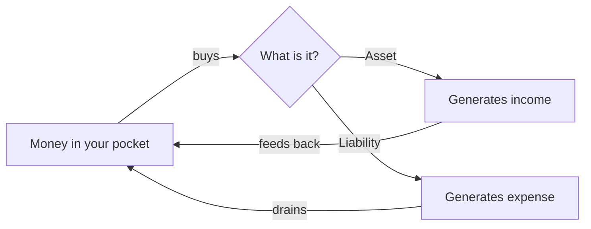

# 03 — Assets vs Liabilities

<small>2 min read</small>

## Core idea
Lesson Two, and the single idea the entire book actually rests on: an asset is anything that puts money in your pocket, a liability is anything that takes money out — regardless of what the thing looks like, costs, or is conventionally called. This definition is deliberately stripped of the usual markers of status or size. A stock paying dividends is an asset. A rental property with positive cash flow is an asset. A house you live in, a car you drive, a boat in the driveway — none of these are assets under this definition unless they're generating income, because every month they cost you money in mortgage, insurance, maintenance, and depreciation regardless of what their resale value might someday be.

## Why it matters
Rich dad's claim is that financial struggle, even among highly educated and highly paid people, is less often a math problem than a vocabulary problem: people have been taught to call liabilities "assets," and then spend their working lives accumulating more of them as their income rises. Once the definition is this simple and this consistently applied, previously confusing financial decisions become mechanical to evaluate — you just ask which direction the cash flows.

## Example from the book
The book's most quoted and most argued-over claim: "your house is not an asset." Rich dad's reasoning is purely cash-flow based — a house you live in doesn't put money in your pocket every month; it takes money out, in the form of mortgage interest, property tax, insurance, and upkeep, whether or not its market value happens to be rising in the background. He's not arguing homes are worthless or bad purchases — only that calling one an asset, in the strict cash-flow sense he's defined, is a category error that leads people to feel wealthier on paper than their monthly cash flow actually supports.

## Practical application
List your five largest recurring monthly expenses. For each one, ask honestly whether it's the result of something that puts money into your pocket (an asset payment — a loan against income-producing property, for instance) or something that only takes money out (a liability payment — most car loans, most mortgages on a primary residence, most consumer debt). You don't have to act on the list immediately; the goal is just to see, in plain cash-flow terms, which column your money has actually been flowing into.

> [!question]- A question to think about
> Pick the single largest purchase you've made in the last few years. Using rich dad's strict definition — did it put money in your pocket, or take money out — which column does it actually belong in, and does that match which column you'd been mentally filing it under?

## Linked from

- [Rich Dad Poor Dad](index.md)
