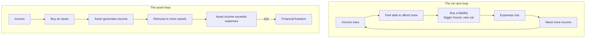

# 04 — The Rat Race Loop

<small>2 min read</small>

## Core idea
Rich dad illustrates why raises alone don't build wealth using simple income-statement and balance-sheet diagrams. His claim about the pattern he calls the middle-class trap, or "the rat race": as income rises, most people expand their liability column roughly in step with it — a bigger house, a newer car, private schooling — rather than directing the increase toward their asset column. The result is a closed loop: more income creates the feeling of being able to afford more liabilities, which creates more expense, which creates the need for still more income, with the loop never producing any actual accumulation of assets no matter how many times it repeats.

## Why it matters
This reframes "just earn more" as incomplete advice on its own. The leak isn't the size of the paycheck — it's the direction the paycheck is habitually routed in. Someone whose income doubles over a decade can end up feeling more financially strapped than before, not less, if every increase was absorbed by proportionally larger liabilities. Escaping the loop, in this framing, isn't about earning your way out — it's about redirecting new income toward the asset column before lifestyle has a chance to expand around it.

## Example from the book
Kiyosaki describes couples whose combined income climbs steadily over the years — through raises, promotions, career changes — while their sense of financial security doesn't improve at all, because every increase in income was matched almost immediately by a larger mortgage, a second car payment, or increased discretionary spending. On paper their lives look more successful; on a cash-flow statement, they're running the identical loop they were running a decade earlier, just at a higher dollar amount.

## Practical application
Before your next raise, bonus, or windfall actually arrives, decide in advance what percentage of it is earmarked for the asset column — before your lifestyle has any chance to expand to absorb it. Treat that decision as non-negotiable and made in advance, precisely because it's much harder to make once the money is sitting in your account and a liability is looking attractive.

> [!question]- A question to think about
> Look back at your last meaningful raise or bonus. Where did the extra money actually go — and if you trace it honestly, was it the asset loop or the rat race loop that absorbed it?

## Linked from

- [Rich Dad Poor Dad](index.md)
