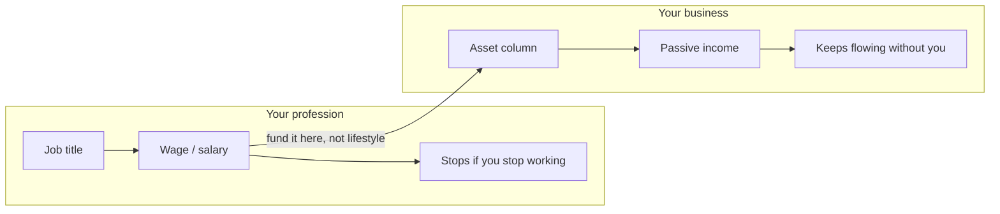

# 05 — Mind Your Own Business

<small>3 min read</small>

## Core idea
Lesson Three. Kiyosaki draws a line between your profession and your business that most people never draw at all: your profession is what you do to earn a paycheck — accountant, manager, engineer, whatever title is on your business card. Your business is your asset column — the things you own that generate income independent of whether you personally show up to work that day. Rich dad's instruction to "mind your own business" isn't a warning against gossip; it's a literal directive. He argues most people spend their entire working lives building someone else's business (their employer's) and someone else's asset column (their landlord's, their bank's, the stockholders of the company they work for), while contributing nothing to their own, because they've never separated the two ideas in their head.

## Why it matters
This distinction matters because a career can look, from the outside, exactly like financial progress — promotions, raises, a more impressive title — while the person's actual asset column stays empty the entire time. Climbing a corporate ladder and building wealth are not the same activity, even though they're easy to conflate, because the ladder-climbing produces income tied entirely to continued employment, while an asset column produces income whether or not you keep showing up. Kiyosaki's point isn't that you should quit your job — it's that a job is where you earn the capital and, per chunk 07, the skills to fund and run a business, not the business itself. Someone can be a highly successful surgeon or executive by every conventional measure and still be one missed paycheck away from real trouble, because their entire financial life is a profession with no business underneath it.

## Example from the book
Kiyosaki describes rich dad's insistence, from the time Kiyosaki was a boy, that a job's real value wasn't the wage — it was whatever the job taught him that he could later use to build something of his own. Rich dad kept his primary business — his restaurants, real estate, and other ventures — entirely separate from any job he might have held, and he pushed Kiyosaki toward the same habit: keep your day job's income flowing into your own asset column (rental units, notes, stocks, businesses you have equity in) rather than into a bigger house or a nicer car tied to your job title. Kiyosaki contrasts this with his own father, "poor dad," whose entire identity and financial plan were the job itself — a stable, respected, well-paying position with no separate asset column standing behind it, which left him financially exposed the moment that position was no longer guaranteed.

## Practical application
Write down your job title, then next to it write down your actual asset column — the specific things you own that produce income without your labor. If the second list is empty or thin compared to the first, that's the gap Kiyosaki is pointing at. Pick one small, concrete step this month to start or grow that list — even something modest, like redirecting a fixed amount from each paycheck into an income-producing asset — treating it as the beginning of "your own business" running in parallel with your job, not as a replacement for it.

> [!question]- A question to think about
> If your job disappeared tomorrow, what would keep producing income without you? Be specific — list the actual assets, not the hope that you'd quickly find another job.

## Linked from

- [Rich Dad Poor Dad](index.md)
