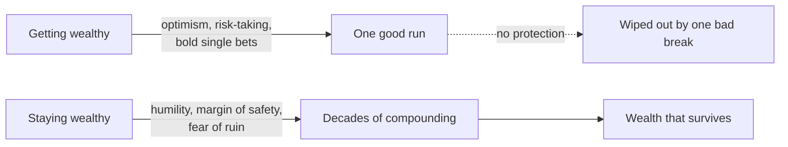

# 05 — Getting Wealthy vs. Staying Wealthy

<small>3 min read</small>

## Core idea
Housel's argument here is that "building wealth" and "keeping wealth" are two almost opposite skill sets, and that most financial advice only teaches the first one. Getting money requires taking risks, being optimistic, and putting yourself out there — starting a business, buying stocks, betting on a specific view of the future. Keeping money that you've already built requires nearly the reverse: humility, frugality, and a persistent assumption that what made you successful could just as easily be taken away. A single-minded focus on getting rich, without the complementary instinct for staying rich, is what turns fortunes into cautionary tales.

## Why it matters
It matters because the skill that got someone their first success is rarely the skill that protects it. Someone who made a fortune by taking a bold, concentrated bet is often tempted to keep taking bold, concentrated bets — because that's the behavior they associate with their success — even after the math has changed and they now have far more to lose than to gain. Housel frames this as a survival problem: the single most important variable in long-term financial outcomes isn't the size of your gains, it's whether you stay in the game long enough for compounding to keep working. Getting wiped out once, even after a string of brilliant decisions, erases the benefit of all of them.

## Example from the book
Housel tells the story of Jesse Livermore, one of the most legendary stock traders of the early twentieth century, who made and lost several enormous fortunes over his career — famously earning about $100 million shorting the market during the 1929 crash, an almost unimaginable sum at the time. Livermore had, by any measure, mastered the skill of getting rich. But he never mastered the complementary skill of staying rich: he traded with heavy leverage, ignored his own rules about risk when he felt confident, and repeatedly rebuilt and then lost fortunes. He eventually died by suicide, having lost his money for the final time. Housel contrasts this pattern with figures who compounded modest, consistent decisions over long periods without ever taking a bet large enough to end the game — a far less exciting story, but a far more reliable one.

## Practical application
When you make a financial decision, ask which skill it belongs to. Building a business, negotiating a raise, or investing in a promising opportunity draws on the getting-wealthy skill set, and some optimism and risk tolerance there is appropriate. But protecting what you've already built — insurance, diversification, not overleveraging, keeping enough of a cushion that a single bad year can't end everything — draws on an entirely different, more defensive skill set, and needs to be practiced deliberately rather than assumed to come naturally from the same instincts that built the wealth in the first place.

## Something to sit with
> [!question]- A question to think about
> Think about the boldest financial decision that helped you get ahead. Is there a version of that same boldness still active in your decisions today, in a place where it's now working against you rather than for you?

## Linked from

- [The Psychology of Money](index.md)
