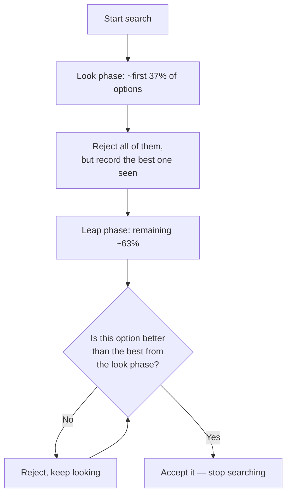

# 01 — The 37 Percent Rule and Optimal Stopping

<small>3 min read</small>

## Core idea
Christian and Griffiths open with "optimal stopping" — the branch of math that deals with when to stop looking and commit, in situations where you can't go back to an option you've already passed on. The clean version is the "secretary problem": you interview a fixed number of candidates in random order, you must accept or reject each one on the spot, and you want the single best candidate. The provably optimal strategy is the "Look-Then-Leap Rule": reject the first roughly 37% of your candidates outright, no matter how good they seem, using them purely to calibrate what "good" looks like. After that cutoff, accept the very next candidate who beats everyone you've seen so far. Follow this rule and you'll end up with the best possible candidate about 37% of the time — far better odds than intuition suggests are available when you're flying blind.

## Why it matters
The number 37% (which is 1/e, roughly 0.368) isn't a rounded-off rule of thumb — it's derived mathematically from the structure of the problem, and it answers a question that otherwise feels unanswerable: how much looking is enough looking? Without a rule like this, people tend to err in one of two directions — leaping too early, before they've calibrated what's actually available, or looking too long, past the point where continuing to search has any real payoff. The 37% rule gives a principled boundary between the "look" phase, where the job is purely to gather information, and the "leap" phase, where the job is purely to act on it.

## Example from the book
The chapter opens with Johannes Kepler, who after the death of his first wife conducted a strikingly methodical search for a second, meeting and evaluating a string of candidates over roughly two years before settling on one. The authors use his search — deliberate, sequential, with no ability to un-reject someone he'd already moved past — as a real-world instance of exactly the mathematical structure the secretary problem describes. They extend the same logic explicitly to apartment hunting: touring a city's rental listings one at a time, unable to hold multiple offers open at once, facing the same look-then-leap tradeoff Kepler faced.

## Practical application
Before starting any search with a real deadline and no ability to go back — an apartment hunt, a hiring process, even choosing among a bounded set of offers — estimate your total search window up front and mark the point 37% of the way through it. Treat everything before that mark as pure information-gathering: you're not allowed to say yes yet, only to build a sense of what "good" looks like in this particular market. Past that mark, commit to accepting the first option that beats your look-phase benchmark, rather than continuing to hold out for something even better. The discipline is in trusting the cutoff instead of relitigating it in the moment.

## Something to sit with
> [!question]- A question to think about
> Think of a decision you're currently "still looking" on — a search you haven't committed to yet. Have you actually passed your own 37% mark without noticing, and if so, what's the next option that beats your best so far?

## Linked from

- [Algorithms to Live By](index.md)
