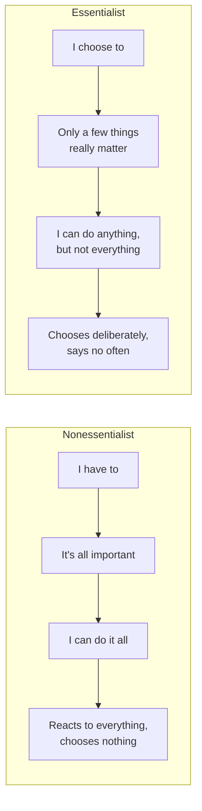

# 01 — The Essentialist vs Nonessentialist Mindset

<small>3 min read</small>

## Core idea
McKeown opens by arguing that the problem underneath most people's overwhelm isn't a shortage of time or a shortage of technique — it's a mindset that quietly accepts three false beliefs: "I have to," "it's all important," and "I can do it all." He calls this the Nonessentialist stance, and it produces a life spent reacting to whatever's loudest rather than choosing deliberately. The Essentialist replaces each belief with its opposite: "I choose to," "only a few things really matter," and "I can do anything, but not everything." The shift isn't about doing more things faster — it's about recognizing that choice itself is the thing being surrendered when you operate on autopilot, and reclaiming it is the actual starting point of the entire book.

## Why it matters
This reframes discipline as a mindset problem before it's a tactics problem. Someone who genuinely believes "it's all important" will never successfully prioritize, no matter how many productivity systems they adopt, because the system will just get filled with everything. The three-truths shift matters because it targets the belief underneath the behavior: you can't eliminate what you don't yet believe is eliminable. Everything McKeown builds afterward — the frameworks, the specific tactics for saying no, the criteria for selection — only works on someone who has already accepted that trade-offs are real and that choosing is their job, not something that happens to them.

## Example from the book
McKeown opens the book with a story from his own life: not long after his wife gave birth to their daughter, a client emailed insisting he attend a meeting that same day. He felt he couldn't say no, so he left the hospital, sat through the meeting, and returned to find he'd missed hours of his newborn daughter's first day for a meeting the client barely seemed to need him at. He describes physically regretting the decision almost immediately — he had made an irreplaceable trade for something replaceable, on the unexamined assumption that he "had to" go. That moment is what sent him looking for a different way to decide what deserves a yes, and it's the story he uses to introduce the Nonessentialist's core failure: treating every request as equally obligatory.

## Practical application
Next time you catch yourself thinking "I have to" about a request or obligation, pause and rewrite the sentence as "I choose to" — even if you still end up doing it. The point isn't to change the answer every time, it's to notice that you're making a choice rather than following an obligation that was handed to you. Do the same audit on your calendar for one week: for each commitment, ask whether it's there because you decided it mattered, or because saying no felt harder than saying yes.

## Something to sit with
> [!question]- A question to think about
> Think of the last thing you agreed to that you regretted almost immediately. Were you actually choosing it — or were you just avoiding the discomfort of saying no?

## Linked from

- [Essentialism](index.md)
