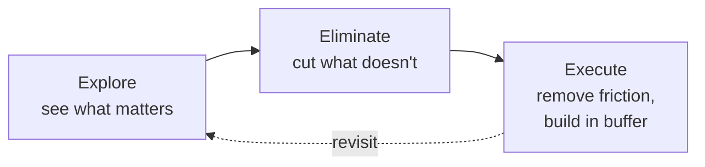

# 04 — Explore, Eliminate, Execute: The Framework

<small>3 min read</small>

## Core idea
The book's operative structure, and the spine the rest of it is built on: McKeown organizes the essentialist process into three phases. **Explore** is about creating the space and conditions to see clearly what actually matters — through solitude, sleep, play, and careful observation — before you try to decide anything. **Eliminate** is where you apply hard selection criteria to cut everything that doesn't meet a very high bar, and learn to say no gracefully to the rest. **Execute** is about removing the obstacles in the way of the vital few things you kept, and building in enough slack that execution doesn't collapse the first time something goes wrong. The three phases run in that order for a reason — McKeown is explicit that trying to eliminate before you've explored means cutting based on guesswork, and trying to execute before you've eliminated means investing real effort into things you never should have kept.

## Why it matters
Without this structure, "essentialism" risks becoming just a mood — a vague commitment to doing less that has no mechanism attached to it. The three-phase framework turns it into a repeatable process: every specific tactic later in the book belongs to one of the three phases, which means you can diagnose where your own effort is breaking down. If you're constantly eliminating the wrong things, the actual problem might be that you skipped exploration and never saw clearly what mattered. If your executed plans keep falling apart under pressure, the problem probably isn't your selection — it's that you executed without building in buffer. The framework gives every chapter after this one a "slot," the same way the Four Laws did for Atomic Habits.

## Example from the book
McKeown structures the entire second half of the book around these three verbs as literal part titles, then devotes several chapters to each: Explore covers protecting time to think, sleep, play, and careful selection criteria; Eliminate covers clarifying your intent, saying no, uncommitting from things you've already invested in, and setting boundaries; Execute covers building in buffer, removing obstacles, and making progress in small, deliberate steps. He's explicit that the ordering matters — an Essentialist doesn't jump straight to cutting their calendar without first doing the work of Explore to see what's actually worth keeping, and doesn't try to execute flawlessly on a list that was never properly narrowed down by Eliminate.

## Practical application
For any decision you're currently stuck on, name which phase you're actually in before doing anything else. If you don't yet have clarity about what matters, the answer isn't to force a decision — it's to explore more before eliminating. If you already know what matters but keep failing to say no to the rest, you're stuck in Eliminate and need better boundary tactics, not more reflection. If you've already chosen well but the plan keeps falling apart under real-world pressure, the problem is in Execute, and the fix is removing obstacles and adding slack, not reconsidering the choice itself.

## Something to sit with
> [!question]- A question to think about
> Take something in your life that currently feels stuck. Which of the three phases — Explore, Eliminate, or Execute — is it actually failing in, and have you been trying to fix a different one instead?

## Linked from

- [Essentialism](index.md)
