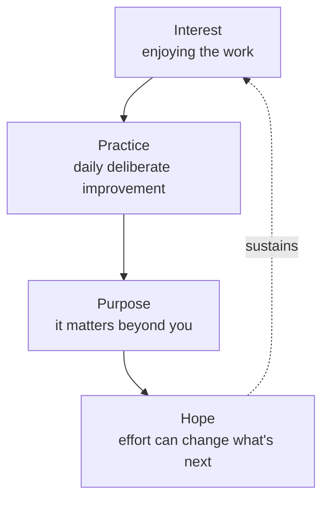

# 06 — The Four Psychological Assets of Grit

<small>3 min read</small>

## Core idea
In the book's second half, Duckworth turns from measuring grit to explaining where it comes from psychologically, and lands on four assets she finds again and again in the people she studies and interviews, roughly in the order they tend to develop: **interest** (you have to genuinely enjoy the work before anything else matters), **practice** (a daily discipline of deliberately getting better at it), **purpose** (a conviction that the work matters to more than just you), and **hope** (a belief that effort can improve your future, which is what carries you through the inevitable setbacks). None of the four is sufficient alone — an interest without practice stays a hobby, practice without purpose burns out, and any of the first three without hope collapses the first time things go seriously wrong.

## Why it matters
This gives grit a developmental shape instead of leaving it as a single trait you either have or don't. It also gives a diagnostic tool: when someone's commitment to a long-term goal is faltering, the four assets let you ask which one specifically is missing, rather than reaching for a vague "try harder." Someone who's bored has an interest problem; someone who's stagnant has a practice problem; someone who's technically excellent but unmotivated has a purpose problem; someone who folds at the first real obstacle has a hope problem. Each calls for a different fix.

## Example from the book
Duckworth builds this framework out of interviews she conducted with people she calls "paragons of grit" across very different fields — not just athletes and academics, but chefs, investors, and swim coaches — looking for what they had in common despite having almost nothing else in common. What kept surfacing across all of them wasn't a shared personality type or work ethic slogan, but this same sequence: they liked what they did before they got good at it, they got good at it through daily uncomfortable practice rather than passive enjoyment, they came to see the work as connected to something bigger than their own advancement, and they kept a specific kind of optimism about their ability to improve even after real failures.

## Practical application
Take a goal that's currently stalling and run it through the four assets in order rather than assuming you know the problem: do you still actually enjoy this, are you practicing it deliberately or just doing it, does it connect to anything beyond your own outcome, and when it goes badly do you believe effort will change the next attempt? Fix the first one on the list that's actually broken before assuming the problem is further down the chain.

## Something to sit with
> [!question]- A question to think about
> For a goal you're currently struggling to sustain, which of the four — interest, practice, purpose, or hope — is the one that's actually missing right now?

## Linked from

- [Grit](index.md)
