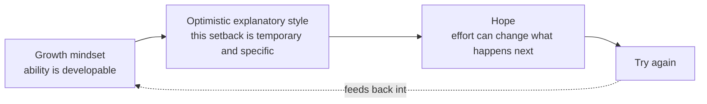

# 09 — Hope and the Growth Mindset

<small>3 min read</small>

## Core idea
The hope Duckworth means isn't passive wishing that things will work out — it's what she calls a "rising to the occasion" kind of hope: the belief that your own effort can improve your future, especially right after something has gone badly. It's the asset that has to survive contact with failure, which is why she places it last in the sequence — interest, practice, and purpose can all get someone to a real setback, but only hope determines whether they try again afterward. She builds this chapter directly on Carol Dweck's growth mindset research (the belief that abilities can be developed through effort, as opposed to a fixed mindset that treats ability as innate and unchangeable) and on learned-helplessness research from her own mentor, psychologist Martin Seligman.

## Why it matters
How someone explains a setback to themselves — what Seligman calls "explanatory style" — predicts whether they keep going or give up, independent of how talented or interested they are. People with a pessimistic explanatory style treat failures as permanent ("I'll never be good at this"), pervasive ("I'm bad at everything"), and personal ("it's just me"), which makes trying again feel pointless. People with an optimistic explanatory style treat the same failure as temporary, specific to this situation, and addressable through changed effort — which is a mindset, not a personality trait, and one Duckworth argues can be deliberately taught. This is what ties hope back to the growth mindset: believing ability is developable is what makes an optimistic explanation of failure rational in the first place, rather than just denial.

## Example from the book
Duckworth cites Seligman's foundational research on learned helplessness: animals and, later, people exposed to bad outcomes they had no control over would eventually stop trying to escape even once escape became possible, because they'd learned that effort didn't matter. She pairs this with Dweck's studies on praise and mindset — including research finding that children praised for their intelligence after succeeding at a task became more likely to avoid harder challenges afterward and to fold when they hit real difficulty, compared to children praised for their effort, who were more willing to take on harder problems and persist through failure. The praise itself had planted a fixed or growth mindset, which then shaped how the children explained their own setbacks going forward.

## Practical application
The next time you fail at something you care about, notice the explanation you reach for automatically. If it's permanent, pervasive, and personal ("I'm just not cut out for this"), deliberately rewrite it in temporary, specific terms tied to something you can change ("that approach didn't work this time — here's what I'd adjust"). This isn't about denying that the failure happened; it's about locating the cause somewhere effort can actually reach, which is what keeps the door open to trying again.

## Something to sit with
> [!question]- A question to think about
> Think of your most recent real setback. Was your internal explanation for it permanent and personal, or temporary and specific? What would change if you rewrote it the second way?

## Linked from

- [Grit](index.md)
