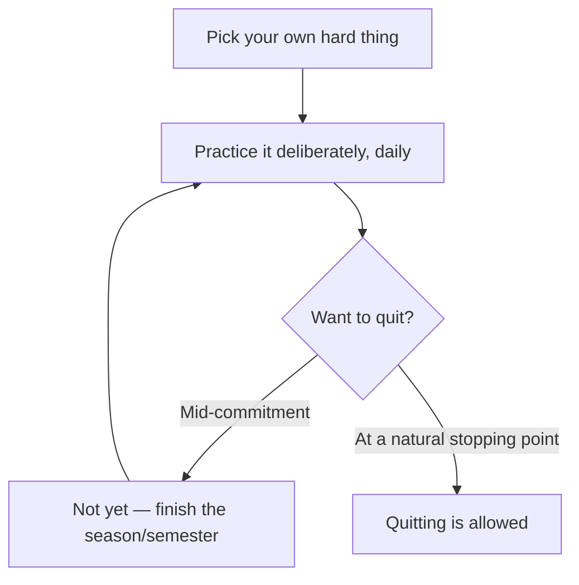

# 10 — The Hard Thing Rule

<small>3 min read</small>

## Core idea
Duckworth turns from research to prescription with a family policy she actually applies at home, which she calls the Hard Thing Rule. It has three parts: first, everyone in the family — including the parents — has to be doing a "hard thing," something that requires daily deliberate practice and isn't naturally easy or fun in the moment. Second, you're allowed to quit, but not in the middle — not mid-season, mid-semester, or mid-commitment, only at a natural stopping point you agreed to in advance. Third, you get to choose your own hard thing; nobody assigns it to you. She found a version of this same pattern, often informal and unstated, among the families of the gritty high achievers she interviewed elsewhere in the book.

## Why it matters
Each rule targets a specific failure mode that stops people from developing grit. Requiring a hard thing (rather than letting comfort be the default) forces the deliberate-practice habit described earlier in the book rather than leaving it optional. Banning mid-stream quitting removes the easiest exit — the moment right after a bad practice or a rough week, when motivation is lowest and quitting feels most justified — without banning quitting altogether, which would just breed resentment or force people to stay in things they've genuinely outgrown. And letting people choose their own hard thing preserves the interest half of the equation — a hard thing picked by someone else rarely survives the discomfort of deliberate practice, because there's no underlying interest to sustain it once things get difficult.

## Example from the book
Duckworth applies this rule to her own daughters, requiring them to each pick an activity requiring sustained, effortful practice, and to herself, treating her own research and writing the same way. She's candid that the rule doesn't guarantee anyone becomes a prodigy or even stays with any single activity for years — one of her daughters did in fact quit a few different hard things, but only ever at the agreed natural endpoint, never in the middle of a bad week. The value she points to isn't the specific activity retained but the repeated experience of pushing through discomfort toward a real stopping point rather than an emotional one, which she connects to the broader survey finding that kids who stuck with extracurricular commitments longer tended to score higher on measures of grit later on.

## Practical application
You can run a version of this rule on yourself as an adult without needing a family to enforce it: name one hard thing you're committing to right now, set a real natural stopping point in advance (end of a course, end of a season, a fixed number of weeks), and treat any urge to quit before that point as information to note, not something you act on immediately. The rule isn't about never quitting — it's about only quitting on purpose, at a moment you chose in advance rather than in the exact moment your motivation happens to be lowest.

## Something to sit with
> [!question]- A question to think about
> Is there something you quit recently in the middle of a rough patch rather than at a planned stopping point? Looking back, was the difficulty actually a sign you'd outgrown it, or just a bad week?

## Linked from

- [Grit](index.md)
