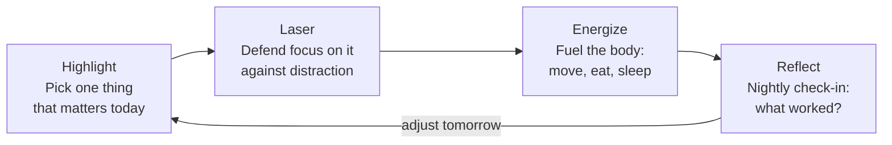

# 01 — The Daily Framework: Highlight, Laser, Energize, Reflect

<small>3 min read</small>

## Core idea
Knapp and Zeratsky build the entire book around one repeating daily loop rather than a comprehensive system you adopt once and follow forever. Each day runs through four steps: pick a **Highlight** (the one thing you want to be true you did by day's end), use **Laser** tactics to defend your attention on it against the pull of endlessly-refreshing apps and sites, use **Energize** tactics (movement, real food, sleep) to keep your body capable of sustained focus, and close with **Reflect** — a short nightly check-in on what worked so you can adjust tomorrow. The book is explicit that this loop is the whole architecture; everything else in it — roughly 80-plus specific tactics — is optional material you sample within that structure, not additional structure to layer on top of it.

## Why it matters
Most productivity advice fails in one of two ways: it operates at the level of values ("find your purpose," "align with your why"), which is inspiring but gives you nothing to do on a Tuesday morning, or it demands a comprehensive system with real setup cost (full inbox-zero architectures, exhaustive task-capture rituals) that collapses the first week you're too busy to maintain it. The Highlight-Laser-Energize-Reflect loop is designed to be small enough to run in full every single day regardless of how the day is otherwise going, and because it resets every 24 hours, a bad day doesn't compound — you just Reflect on it and try again tomorrow. That daily reset is the actual innovation; it borrows directly from the design-sprint discipline the authors developed at Google Ventures, where you build something small, test it fast, and keep only what works.

## Example from the book
The authors describe the loop concretely as a morning-to-night sequence: you choose your Highlight first thing (often before checking email), you "clock block" a chunk of calendar time to actually do it, you spend the rest of the day applying whichever Laser tactics you've chosen to keep from getting pulled into your phone or inbox, you deliberately fuel yourself with exercise and real food rather than running on caffeine and willpower, and at night you jot down what happened — did the Highlight get done, what tactic helped, what got in the way. They frame the book itself as a menu you're meant to raid selectively: try a tactic for a day or two, keep it if it earns its place, discard it without guilt if it doesn't.

## Practical application
Run the loop once, deliberately, tomorrow. Before you open email or any app, name one Highlight for the day and put a block of time on your calendar for it. Pick just one Laser tactic to defend that block (phone in another room, one app deleted, whatever is realistic). Do one Energize thing you'd otherwise skip — a walk, an actual lunch instead of eating at your desk. At night, write two sentences: did the Highlight happen, and what would you change tomorrow. That's the entire system in miniature — everything else in the book is a longer menu of options for the same four slots.

## Something to sit with
> [!question]- A question to think about
> If you ran only this four-step loop tomorrow — nothing else from the book — which step do you already have some version of, and which step have you never deliberately done even once?

## Linked from

- [Make Time](index.md)
