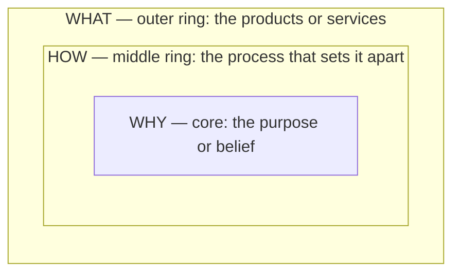

# 01 — The Golden Circle

<small>3 min read</small>

## Core idea
Sinek's organizing framework is three concentric rings. **What** is the outer ring — the products or services an organization actually sells, or the tasks a person actually does. **How** is the middle ring — the process, method, or "differentiating value proposition" that supposedly sets the organization apart. **Why** is the innermost ring — the purpose, cause, or belief that explains why the organization exists at all, beyond making money. Every organization can answer "what" they do. Most can answer "how" they do it, at least in a features-and-benefits sense. Very few can clearly articulate "why" — not profit, which is a result, but the underlying belief that got the whole thing started. Sinek's claim is about direction of communication: most organizations think, act, and communicate from the outside in — What, then How, then (rarely) Why. The ones that inspire loyalty do the reverse, communicating from the inside out.

## Why it matters
The order of communication changes what a message is asking the listener to do. Leading with What asks people to evaluate features and compare specs — a rational, comparative act that tends to produce a transaction at best, and only if your price or quality wins that particular comparison. Leading with Why asks people to recognize a belief they already hold and decide whether they want to be part of it — which produces something closer to a relationship than a purchase. This is Sinek's explanation for why some brands, leaders, and movements build fiercely loyal followings that keep choosing them even when a cheaper or objectively "better" alternative exists on the What and How rings, while others with comparable or superior products struggle to build any loyalty at all.

## Example from the book
Sinek illustrates the difference with two ways an ordinary computer company might pitch the same laptop. Led with What, the pitch is a features list: it's beautifully designed, simple to use, user-friendly — buy one. Led with Why, the pitch starts somewhere else entirely: a belief that the status quo should be challenged, and everything the company makes is evidence of that belief; the computer is just the current expression of it. Sinek argues the second version is what real Why-first companies (Apple being his central case, covered in its own chunk) actually sound like, and that most organizations, when asked to write their own marketing copy, default to the first version without noticing they've done it.

## Practical application
Take something you or your organization currently describes only in What terms — a job title, a product description, a resume bullet — and try rewriting it starting from the inside ring out. Don't start with "I do X" or "we sell Y." Start with the belief underneath it: what did you (or the organization) originally think should be different about the world, and how does the What you currently produce serve as evidence for that belief? If you can't find a Why underneath the What, that's diagnostic information in itself — not every activity has one, and Sinek's claim is specifically that the ones that inspire loyalty do.

> [!question]- A question to think about
> Pick something you currently describe purely in What terms. If you tried to answer "why does this exist, beyond the outcome it produces," what's the honest answer — and is it one you'd actually want to lead with?

## Linked from

- [Start with Why](index.md)
