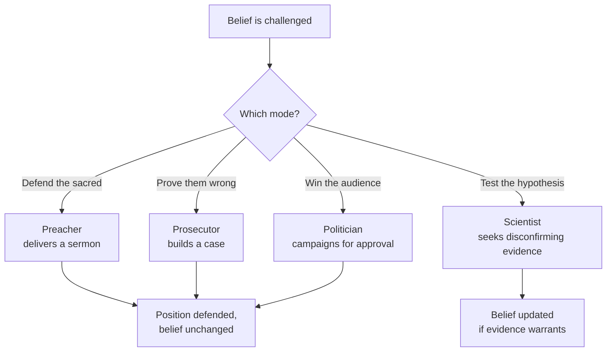

# 01 — The Four Mindsets

<small>3 min read</small>

## Core idea
Grant opens the book with a claim about mental posture: most of us default into one of three unproductive modes whenever a belief we hold is challenged. In **preacher** mode, we deliver a sermon to defend a sacred conviction. In **prosecutor** mode, we build a case to prove the other side wrong. In **politician** mode, we campaign for approval, telling an audience what will win them over rather than what's true. All three modes share the same flaw: they treat the goal of the conversation as protecting or promoting a position you already hold, not testing whether that position is still correct. The alternative is the **scientist** mindset — treating your own opinions as hypotheses to be tested rather than treasures to be guarded, actively searching for reasons you might be wrong, and updating when the evidence says you are.

## Why it matters
This framework is the spine the rest of the book hangs off of, and it reframes what "changing your mind" even means. It's not a single event where you finally admit defeat — it's a mode you can choose to operate in, moment to moment, in any disagreement. The insight that makes this more than a platitude is Grant's observation that expertise makes the problem worse, not better: the deeper someone's knowledge and identity are tied to a domain, the more natural it becomes to slip into preacher or prosecutor mode when that domain is questioned, because there's more ego and status wrapped up in being right. Being smart, in other words, doesn't protect you from these three modes — it can load the dice toward them.

## Example from the book
Grant traces the three unproductive modes back to their literal origins to make them recognizable: a preacher's job is to defend doctrine, a prosecutor's job is to win a case against an opponent, and a politician's job is to court a constituency — none of them are in the business of updating their conclusion mid-sermon, mid-trial, or mid-campaign. He then points out how easily ordinary disagreements borrow the same postures: a manager defending a decision she made months ago starts sounding like a preacher protecting doctrine; a colleague picking apart a proposal in a meeting starts sounding like a prosecutor building a case; someone softening their real opinion to keep the room happy starts sounding like a politician working a crowd. None of these people think of themselves as doing any of this — the modes are default settings, not conscious choices, which is precisely why naming them is useful. (Chunk 3 covers Grant's clearest single case study of what unchecked confidence costs — the Wright brothers' race against a far more credentialed rival.)

## Practical application
The next time you feel yourself getting defensive in a disagreement — bristling, repeating the same point louder, searching for the flaw in the other person's argument before you've fully heard it — that's the signal to notice which mode you've slipped into. Ask which one: are you preaching (protecting something you've made sacred), prosecuting (trying to win rather than understand), or politicking (saying what will play well rather than what you think is true)? Naming the mode out loud, even just to yourself, is often enough to shift toward the scientist question instead: what evidence would actually change my mind here, and have I looked for it?

## Something to sit with
> [!question]- A question to think about
> Think back to your last real disagreement — not a trivial one. Which of the three unproductive modes did you slip into, and what would the scientist-mode version of that same conversation have sounded like?

## Linked from

- [Think Again](index.md)
