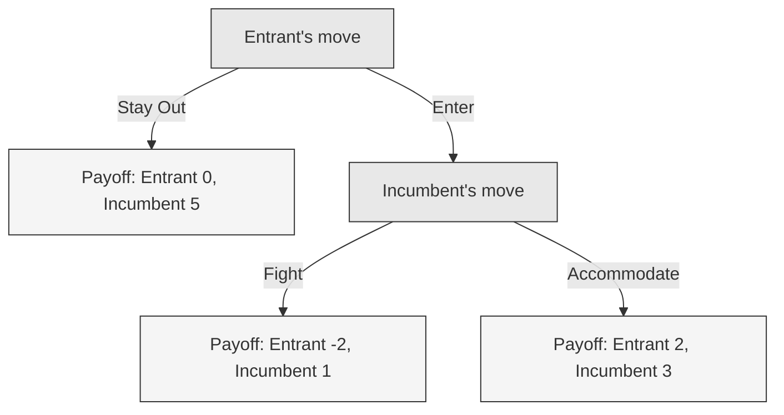

# 02 — Look Forward, Reason Backward

<small>3 min read</small>

## Core idea
In a **sequential game** — one where moves happen in a known order and each side can see what came before — the right way to decide your first move is to work out the whole tree of future moves first, then solve it from the end backward. Figure out what the last mover would rationally do at the final decision point, fold that answer back into the move before it, and keep folding backward until you reach the beginning, at which point your own first move becomes obvious because you already know how everything downstream plays out. Dixit and Nalebuff's shorthand for this — "look forward and reason backward" — is the book's single most load-bearing method: it's the tool for any game with a defined order of moves, as opposed to the simultaneous-move games (prisoner's dilemma, mixed strategies) covered in later chunks.

## Why it matters
Without backward induction, people evaluate a first move by its immediate, visible effect — does this look good right now — rather than by where the whole anticipated sequence of responses actually lands them. That's a systematic error whenever a competitor, counterparty, or rival gets to respond to your move before the outcome is settled. Backward induction forces you to simulate the other side's future decision *before* you make your own present one, which is exactly the discipline that separates strategic thinking from short-sighted reaction.

## Example from the book
Dixit and Nalebuff teach the mechanics of backward induction using the kind of simple market-entry scenario that sits at the center of Dixit's own academic work on entry deterrence: a challenger has to decide whether to enter a market, and if it does, an incumbent then has to decide whether to fight (a costly price war that hurts them both) or accommodate (share the market peacefully). Solved forward — challenger picks first, without looking ahead — entering looks risky, because a fight would be ruinous. Solved backward, the challenger first asks what the incumbent would *actually* do if entry happened: since fighting is costly to the incumbent too, accommodation is often the incumbent's genuine best response once entry is a fact — which means the incumbent's threat to fight, made *before* entry, may not survive contact with its own self-interest. The challenger who reasons backward through the incumbent's real payoffs, rather than reacting to the incumbent's stated threat, arrives at a different — and often correct — decision.

Reasoning backward: at node C, the incumbent compares 1 (Fight) to 3 (Accommodate) and rationally accommodates. Knowing that, the entrant at node A compares 0 (Stay Out) to 2 (Enter, since Accommodate is what actually follows) — and enters. The incumbent's threat to fight was real on paper but not credible once you look ahead to its own payoffs, and only backward induction reveals that.

## Practical application
Before your next move in a multi-step negotiation or competitive decision, sketch the tree: your move, their likely response to each branch, your response to that. Then solve it from the last branch backward, using what each party would *actually* prefer at that point — not what they claim they'd do. Choose your first move based on the leaf you'd genuinely end up at, not the branch that looks best one step ahead.

> [!question]- A question to think about
> Is there a threat someone is currently making against you — or one you're making against someone else — that looks credible only if you stop looking one move ahead? What does it look like once you fold in what the threatener would actually prefer to do once the threat is tested?

## Linked from

- [Thinking Strategically](index.md)
