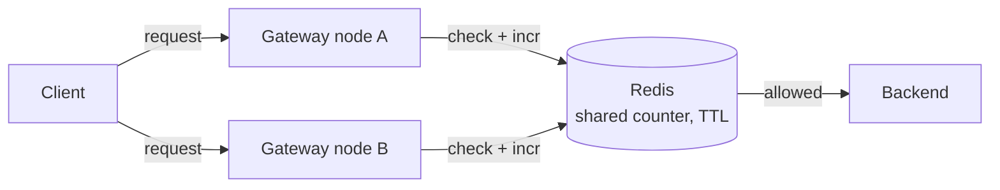
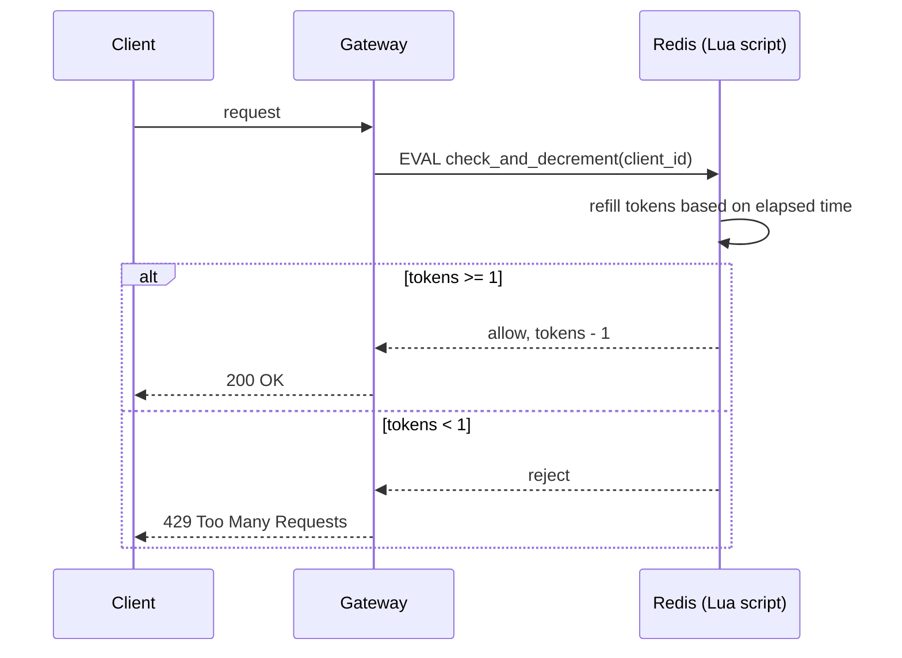

# Design a Rate Limiter

**Real prompt (as usually asked):** "Design a rate limiter for an API gateway that limits each client to N requests per time window."

## 1. Clarifying Questions (ask these out loud in the interview)
- Per-user, per-IP, or per-API-key limiting?
- Fixed limit or tiered (different limits per plan)?
- Single server or distributed (multiple gateway nodes)?
- What happens on limit breach — reject (429) or queue/delay?
- Need exact accuracy, or is approximate (best-effort) acceptable?

## 2. Requirements
**Functional**
- Limit requests per client to N per T seconds
- Return 429 + retry-after header on breach

**Non-functional**
- Low latency (rate limiter sits in the hot path — must add <1ms)
- Must work across multiple servers (distributed state)
- Should not become a single point of failure

## 3. Algorithm Options (this is what interviewers actually probe)

| Algorithm              | How it works                                                  | Pros                      | Cons                                                  |
| ---------------------- | ------------------------------------------------------------- | ------------------------- | ----------------------------------------------------- |
| Fixed Window Counter   | Count requests in a fixed time bucket (e.g. per minute)       | Simple, memory-light      | Burst at window edges (2x limit possible at boundary) |
| Sliding Window Log     | Store timestamp of every request, count within rolling window | Accurate                  | Memory-heavy (stores every timestamp)                 |
| Sliding Window Counter | Weighted average of current + previous fixed window           | Good accuracy, low memory | Slight approximation                                  |
| Token Bucket           | Bucket refills at fixed rate, request consumes a token        | Allows bursts, smooth     | Slightly more complex to implement                    |
| Leaky Bucket           | Requests processed at fixed outflow rate via a queue          | Smooths bursts completely | Can add latency, queue can overflow                   |

**Interview signal:** naming these five and explaining the fixed-window edge-burst problem is what separates a pass from a borderline pass. Most candidates only know token bucket.

## 4. High-Level Design
- Client → API Gateway → Rate Limiter Middleware → Backend
- Rate limiter checks a shared counter store (Redis) before forwarding request
- Redis chosen because: in-memory speed, atomic INCR, TTL support for window expiry



Key point this diagram makes: every gateway node hits the **same** Redis counter — that's what prevents the limit from silently multiplying when you scale to N nodes.

## 5. Distributed State — the part candidates fumble
- Naive approach: each gateway node keeps its own local counter → wrong under multiple nodes, limit gets multiplied by node count
- Fix: centralized counter store (Redis) shared across all gateway nodes
- Redis atomicity: use `INCR` + `EXPIRE`, or a Lua script to make check-and-increment atomic (avoid race condition between GET and SET)
- Scaling Redis itself: sharding by client ID (consistent hashing) if single Redis instance becomes bottleneck

## 6. Deep Dive: Token Bucket in Redis (common follow-up)
```
Key: rate_limit:{client_id}
Value: {tokens: int, last_refill: timestamp}

On request:
1. Compute tokens to add = (now - last_refill) * refill_rate
2. new_tokens = min(bucket_capacity, tokens + tokens_to_add)
3. If new_tokens >= 1: allow, decrement, update last_refill
4. Else: reject
(Do steps 1-4 atomically via Lua script to avoid race conditions)
```



This sequence diagram is the one to redraw from memory before an interview — it's exactly what "walk me through what happens on a request" is asking for.

## 7. Trade-offs to Voice Explicitly
- Redis single point of failure → mitigate with Redis Cluster / replica failover
- Strict accuracy vs latency: sliding log is accurate but expensive; sliding window counter is the practical middle ground almost everyone actually ships
- Local (per-node) vs global rate limiting: local is faster but less accurate; most real systems use a hybrid (local cache + periodic sync to global store)

## 8. Your Gaps to Close (based on where you're starting from)
- [ ] You know caching — but can you explain *why* Redis INCR is atomic and GET+SET isn't? Say this out loud without notes.
- [ ] Practice drawing the fixed-window edge-burst problem on a whiteboard — this is the single most common "aha" moment interviewers wait for.
- [ ] Be ready for the follow-up: "what if Redis goes down?" — have a degraded-mode answer ready (fail open vs fail closed, and why you'd pick one).
- [ ] Practice saying the trade-off out loud in under 30 seconds — interviewers penalize rambling more than missing an algorithm.

## Related
- [02-url-shortener](02-url-shortener.md)
- [03-design-twitter](03-design-twitter.md) — same hot-path/async-decoupling thinking applied to fan-out
- Caching (link to your existing note)
- Consistent Hashing (link to your existing note)
