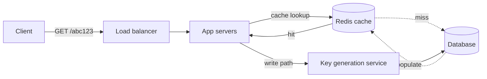

# Design a URL Shortener (e.g. bit.ly / TinyURL)

<small>4 min read</small>

**Real prompt:** "Design a service that shortens long URLs and redirects short URLs to the original."

Considered "easy" — but most candidates fail it by not going deep enough on the parts below. This is a filter question: interviewers use it to see if you can go past the obvious.

## 1. Clarifying Questions
- Custom aliases allowed, or only auto-generated?
- Expiration of links needed?
- Expected scale — reads vs writes ratio? (usually read-heavy, ~100:1)
- Analytics needed (click tracking)?

## 2. Requirements
**Functional**
- Shorten a long URL → unique short code
- Redirect short URL → original URL (fast, low latency)
- Optional: custom alias, expiration, click analytics

**Non-functional**
- High availability (redirects must always work)
- Low latency redirect (<100ms)
- Read-heavy: design for read scale first

## 3. Capacity Estimation (do this out loud, even roughly)
- Say: 100M new URLs/month → ~40 writes/sec
- Read:write ratio ~100:1 → ~4000 reads/sec
- Storage: 100M URLs/month × 500 bytes/record × 5 years ≈ few TB — cheap, not the bottleneck
- **Point of estimation:** show you understand read-heavy systems need read-optimized architecture (caching, read replicas), not just "add a database."

## 4. The Core Design Decision: Short Code Generation
This is the part interviewers actually care about. Three approaches:

| Approach | How | Pros | Cons |
|---|---|---|---|
| Hash + truncate (MD5/base62) | Hash the long URL, take first 7 chars | Simple | Collisions possible, need collision handling |
| Counter + base62 encoding | Global auto-incrementing counter, encode to base62 | No collisions, short | Counter is a bottleneck/single point of failure at scale |
| Pre-generated key pool | Generate & store batches of unique keys ahead of time, servers pull from pool | No collision, no bottleneck | Extra infra (key generation service) |

**Interview signal:** explaining why a naive global counter doesn't scale (needs a lock, becomes contention point) and proposing the pre-generated key range approach (each server pulls a block of keys, e.g. Twitter Snowflake-style) is the difference between "fine" and "strong."

## 5. High-Level Architecture
```
Client → Load Balancer → App Servers → Cache (Redis) → Database
                                      ↳ Cache miss → DB → populate cache
```
- Redirect flow reads should hit cache >90% of the time (hot URLs are very skewed — classic Zipf distribution)
- Write flow: app server requests a key from Key Generation Service, writes mapping to DB, returns short URL



Dotted lines = cache-miss path. This is the diagram to draw first in the interview — it immediately signals you're thinking read-heavy, cache-first.

## 6. Database Choice
- Simple key-value access pattern (short_code → long_url) → NoSQL (DynamoDB/Cassandra) fits well, no complex joins needed
- If analytics/relational queries needed later → consider a secondary analytics store, don't force it into the primary DB

## 7. Deep Dive: Handling Custom Aliases + Expiration
- Custom alias: check availability before insert, same table, flag `is_custom`
- Expiration: TTL field, background job (or DB native TTL if using DynamoDB/Redis) to purge expired entries — don't check expiration on every read if avoidable, it adds latency to the hot path

## 8. Scaling the Redirect Path Specifically
- This is a read-heavy problem — 90% of interview signal comes from how you scale reads, not writes
- CDN edge caching for extremely hot links
- Read replicas for DB
- Cache eviction: LRU, since old/unused short links naturally go cold

## 9. Trade-offs to Voice Explicitly
- Counter-based encoding = shorter, predictable codes but requires solving distributed counter bottleneck
- Hash-based = simpler but collision handling adds complexity
- Redirect type: 301 (permanent, cached by browser, less load on your server but you lose click analytics) vs 302 (temporary, hits your server every time, enables analytics) — **always mention this, it's a real trade-off interviewers listen for**

## 10. Your Gaps to Close
- [ ] Don't stop at "use a hashmap" — go straight to the counter-vs-hash-vs-key-pool discussion, that's the actual test
- [ ] Practice explaining 301 vs 302 trade-off out loud — small detail, high signal
- [ ] Be ready for "what if two servers grab the same key" — pre-generated key ranges per server avoids this, know why
- [ ] Practice capacity estimation numbers cold — interviewers notice hesitation on back-of-envelope math

## Related
- [01-rate-limiter](01-rate-limiter.md)
- [03-design-twitter](03-design-twitter.md) — reuses this note's key-generation/counter-bottleneck reasoning for Snowflake-style tweet IDs
- Caching
- Consistent Hashing
- Database Sharding


## Linked from

- [Design a Rate Limiter](01-rate-limiter.md)
- [Design Twitter (Post + Follow + Home Timeline)](03-design-twitter.md)
- [Design YouTube (Video Upload + Streaming)](08-design-youtube.md)
- [High-Level Design and API Definition](../Interview%20Framework/03%20-%20High-Level%20Design%20and%20API%20Definition.md)
