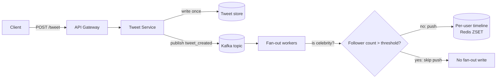
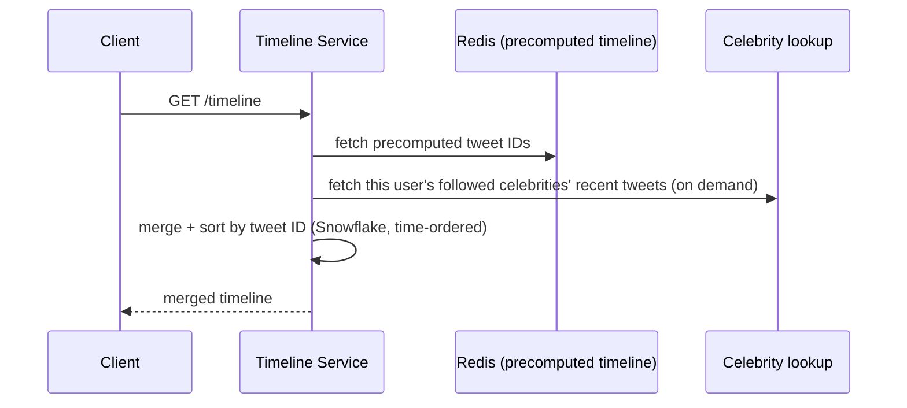

# Design Twitter (Post + Follow + Home Timeline)

<small>11 min read</small>

**Real prompt:** "Design a system where users post short text updates, follow other users, and see a home timeline aggregating posts from everyone they follow — roughly in order, at scale."

This is the capstone of the caching → sharding → messaging → consistency arc (Days 11–31). Nothing here is a new primitive — it's those primitives combined under one asymmetric, adversarial constraint: **follower count is a power-law distribution**, and that single fact drives almost every real decision below.

## 1. Clarifying Questions
- Chronological timeline, or ranked/algorithmic? → assume **chronological** as the baseline design; ranking is a separate scoring-service problem layered on top, not a storage problem.
- Do we need retweets, likes, replies, media? → assume core loop only (post, follow, timeline) — everything else is an extension of the same fan-out pipeline.
- Timeline freshness — can a new post take a few seconds to appear in a follower's feed? → yes (this answer is what makes the problem tractable — see Day 23 below).
- Follower distribution — are we told anything about celebrity accounts? → always ask this explicitly; interviewers who don't volunteer it are testing whether you bring it up yourself.

## 2. Requirements
**Functional**
- Post a tweet (≤280 chars)
- Follow / unfollow a user
- Load home timeline: reverse-chronological merge of tweets from everyone you follow

**Non-functional**
- Extreme **read:write skew** — timeline reads vastly outnumber posts
- Timeline read latency low (<200ms) — this is the page users open dozens of times a day
- High availability over strict consistency for the timeline (Day 23: this entity is **AP**)
- Must not fall over when one account has 50M+ followers (the "celebrity problem")

## 3. Capacity Estimation (rough, out loud)
- 200M DAU, each opens the timeline ~10×/day → **2B reads/day ≈ 23k reads/sec** average (peak several× that)
- 100M tweets/day → **≈1,150 writes/sec** average
- Read:write ratio ≈ **20:1** — confirms this is a read-optimization problem first, same shape as the URL shortener's redirect path ([02-url-shortener](02-url-shortener.md)), just with a fan-in/fan-out step in between instead of a flat key lookup.
- Storage: 100M tweets/day × ~300 bytes × 5 years ≈ low tens of TB for tweet content alone — cheap. The bottleneck is never storage; it's the **timeline read path**.

## 4. The Core Design Decision: Fan-out Strategy
This is the question the entire interview hinges on. Everything else is detail.

| Strategy | How | Pros | Cons |
|---|---|---|---|
| **Fan-out on write** (push) | On tweet, immediately push the tweet into every follower's precomputed timeline | Reads are O(1) — just read your own precomputed list | Write amplification: one tweet from a 50M-follower account = 50M writes |
| **Fan-out on read** (pull) | Timeline computed at read time: fetch recent tweets from every account you follow, merge, sort | No write amplification, ever | Read is expensive — merging hundreds of followees' tweet lists on every timeline load |
| **Hybrid** (what production systems actually do) | Fan-out on write for normal accounts; skip fan-out for accounts above a follower threshold (e.g. >1M) and merge those in at read time | Bounds both the write amplification and the read fan-in cost | More moving parts — two code paths to reason about and test |

**Interview signal:** naming "fan-out on write" alone and stopping there is a common-but-incomplete answer. The differentiator is unprompted recognition of the celebrity case and proposing the hybrid — that's the actual senior-level signal here, the same way the URL shortener's key-generation bottleneck was the real test in that problem.

> [!info]- Why this connects to Day 27/28 (Message Queues, Kafka Producer/Consumer)
> Fan-out on write is never a synchronous part of the tweet-post request — that would tie your write latency to however many followers the poster has. Instead: `POST /tweet` writes the tweet once, publishes a `tweet_created` event to Kafka, and returns immediately. A pool of fan-out **consumer** workers reads that event and pushes the tweet into follower timelines asynchronously. This is exactly the producer/consumer decoupling from Day 28, applied to solve a fan-out problem instead of an ingestion problem.

## 5. High-Level Architecture

Two separate paths, same as the fan-out decision itself: the **write path** decides whether to push, the **read path** always merges in whatever wasn't pushed.

## 6. Deep Dive: Timeline Storage
- Each user's timeline is a **Redis sorted set** (`ZSET`), key = `timeline:{user_id}`, score = tweet ID.
- Tweet IDs are **Snowflake-style** (timestamp-embedded, roughly sortable, globally unique without a central counter) — the same distributed-ID problem you already solved conceptually in [02-url-shortener](02-url-shortener.md)'s counter-vs-key-pool discussion, reused here because a centralized auto-increment tweet ID would be a single point of contention at 1,150 writes/sec minimum.
- Timelines are **trimmed** to the most recent ~800 entries per user — a home timeline is a bounded working set, not an infinite log. Older entries are never read in practice, so there's no reason to keep them hot.

## 7. Database Choice
- **Tweet content**: wide-column / key-value store (tweet_id → author, text, timestamp). Access pattern is a simple point lookup by ID — no joins needed, so this is a direct fit for something like Cassandra or DynamoDB, not a relational store.
- **Social graph (follows)**: adjacency-style table, `(follower_id, followee_id)`, sharded by `follower_id` for the "who do I follow" query and by `followee_id` for "who are my followers" (fan-out workers need this direction) — this typically means maintaining **two sharded indexes** of the same edge, a deliberate denormalization for read speed. This is the same sharding-key trade-off from Day 21 — the "right" shard key depends entirely on which query pattern you're optimizing, and here you need both directions, so you pay for two copies.

## 8. Deep Dive: The Celebrity Problem, Precisely
- Fan-out workers must check follower count **before** deciding to push. This check itself has to be cheap and cached — you cannot query "how many followers does this account have" synchronously against the live graph on every single tweet.
- The fan-out job must be **idempotent** ([Day 24](../system-design-notes/Day 24 - Idempotency Keys (LLD).md)): Kafka guarantees at-least-once delivery, so a fan-out worker can process the same `tweet_created` event twice after a crash/retry. Pushing the same tweet ID twice into a `ZSET` is naturally idempotent (same score, same member → no duplicate), but if you were incrementing counters or doing non-idempotent writes in that same job, you'd need an explicit dedup key. This is exactly why Day 24 exists as a prerequisite here, not a standalone curiosity.

## 9. Trade-offs to Voice Explicitly
| | Fan-out on write | Fan-out on read | Hybrid |
|---|---|---|---|
| Read latency | Fast, O(1) | Slow, O(followees) merge | Fast for normal accounts, small merge cost only for celebrity followees |
| Write cost | O(followers) — unbounded | O(1) | O(followers), but capped by threshold |
| Consistency | Eventually consistent (async fan-out lag) | Always reads live state | Eventually consistent, same as pure push |
| Where this breaks | Celebrity accounts | Users who follow thousands of accounts | Requires accurate, cheap follower-count checks |

**CAP/PACELC callback (Day 23):** the timeline is unambiguously **AP** — a tweet appearing 2–3 seconds late in a follower's feed is invisible to the user; refusing to load the timeline at all because the fan-out worker is lagging would be a far worse failure mode. Contrast this explicitly with the tweet **content store itself**, which needs no such trade-off — losing or duplicating the canonical tweet record is a real bug, not an acceptable staleness.

## 10. Your Gaps to Close
- [ ] Practice stating the fan-out trade-off table from memory in under 60 seconds — this is the single highest-signal moment in the interview.
- [ ] Be ready for "what's the threshold for celebrity status, and who decides it?" — there's no universally correct number; the answer interviewers want is that it's a tunable operational parameter, not a hardcoded constant.
- [ ] Be ready for: "the fan-out worker pool falls behind by 10 minutes during a viral spike — what does the user experience?" (Answer shape: stale-but-available timeline for push-model users; unaffected for the celebrity pull-path, since that's computed live — a good moment to show you understand *which part* of your own design degrades and which doesn't.)
- [ ] Practice explaining why a single global tweet-ID counter doesn't work here — same root cause as the URL shortener's key-generation bottleneck, different system.

## Related
- [02-url-shortener](02-url-shortener.md) — Snowflake-style ID generation, read-heavy scaling
- [01-rate-limiter](01-rate-limiter.md) — async/hot-path latency thinking
- [Day 11 - Caching Strategies at Scale](../system-design-notes/Day 11 - Caching Strategies at Scale.md) — cache-aside pattern underlying the timeline cache
- Day 15 - Consistent Hashing / [Day 16 - Consistent Hashing Ring Implementation (LLD)](../system-design-notes/Day 16 - Consistent Hashing Ring Implementation (LLD).md) — how Redis/timeline shards distribute users
- [Day 21 - Database Sharding and Partitioning (HLD)](../system-design-notes/Day 21 - Database Sharding and Partitioning (HLD).md) / [Day 22 - Shard Router Implementation (LLD)](../system-design-notes/Day 22 - Shard Router Implementation (LLD).md) — social graph sharding
- [Day 23 - CAP Theorem and PACELC (HLD)](../system-design-notes/Day 23 - CAP Theorem and PACELC (HLD).md) — why the timeline is AP
- [Day 24 - Idempotency Keys (LLD)](../system-design-notes/Day 24 - Idempotency Keys (LLD).md) — why fan-out workers must be idempotent
- [Day 27 - Message Queues Deep Dive (HLD)](../system-design-notes/Day 27 - Message Queues Deep Dive (HLD).md) / [Day 28 - Kafka Producer Consumer Design (LLD)](../system-design-notes/Day 28 - Kafka Producer Consumer Design (LLD).md) — the async fan-out pipeline
- [Day 31 - Search Systems and Elasticsearch (HLD)](../system-design-notes/Day 31 - Search Systems and Elasticsearch (HLD).md) — how tweet/hashtag search would sit alongside this as a separate index

## Quiz
Write your own answer first — then expand.

> [!question]- Q1. A user with 50M followers posts a tweet. Why is pure fan-out-on-write dangerous here, and what's the actual fix?
> (think it through, then expand the answer below)

> [!success]- Answer: Q1
> Pure fan-out-on-write means one tweet triggers 50M individual writes into 50M separate timeline caches, all near-simultaneously — a massive write-amplification spike and thundering-herd load on the fan-out workers and Redis, caused by a single API call. The fix is the hybrid model: skip the precomputed push for accounts above a follower-count threshold, and merge their tweets into each follower's timeline at **read** time instead. The cost doesn't disappear — it moves from a single unbounded write-time spike to many small, incremental read-time costs spread across each follower's own timeline load.

> [!question]- Q2. Why must the fan-out worker's write into a follower's timeline be idempotent, and what property of a Redis ZSET already gives you this for free?
> (think it through, then expand the answer below)

> [!success]- Answer: Q2
> Kafka delivers `tweet_created` events at-least-once — a worker crash or rebalance can cause the same event to be processed twice. If the fan-out write isn't safe to repeat, a retried event could corrupt a follower's timeline (e.g. duplicate entries, or double-counting something like an unread badge). A Redis `ZSET` add (`ZADD`) is naturally idempotent for this use case: adding the same member (tweet ID) with the same score twice is a no-op the second time — the set doesn't grow, the tweet doesn't appear twice. This is why the *storage structure itself* absorbs the retry problem for the timeline write, whereas a naive counter increment in the same job would not, and would need an explicit idempotency key (Day 24).

> [!question]- Q3. The tweet content store and the home timeline have different consistency requirements. What are they, and why the difference?
> (think it through, then expand the answer below)

> [!success]- Answer: Q3
> The **tweet content store** (the canonical record of what was posted) needs to behave close to **CP** in spirit for the write itself — you cannot lose or duplicate the source-of-truth tweet, that's a correctness bug, not a UX nuance. The **home timeline** is **AP** — it's a derived, denormalized view built asynchronously off the canonical tweet, and a few seconds of staleness is invisible to the user. Naming *both* answers and explaining that they're different entities in the *same* system — rather than giving one blanket "it's AP" answer for the whole design — is exactly the distinction Day 23 flags as the difference between a weak and a strong CAP answer.

## Next
Same hybrid fan-out reasoning generalizes almost unchanged to a "News Feed" (Instagram/Facebook) design — the interesting delta there is ranking (not just chronological merge) and media storage, not fan-out itself. A good next applied design to attempt using this same skeleton: **Design a Notification System** (push fan-out, but to devices instead of timelines — same celebrity-style fan-out asymmetry shows up for anything with a "broadcast" event).

## Linked from

- [Day 40 — Event Sourcing & CQRS (HLD)](../system-design-notes/Day%2040%20-%20Event%20Sourcing%20and%20CQRS%20%28HLD%29.md)
- [Day 42 — Object/Blob Storage Internals (HLD)](../system-design-notes/Day%2042%20-%20Object%20Storage%20Internals%20%28HLD%29.md)
- [Day 49 — Transcoding Pipeline, Sketched (LLD)](../system-design-notes/Day%2049%20-%20Transcoding%20Pipeline%20Implementation%20%28LLD%29.md)
- [Day 51 — Multi-Region & Disaster Recovery (HLD)](../system-design-notes/Day%2051%20-%20Multi-Region%20and%20Disaster%20Recovery%20%28HLD%29.md)
- [Day-by-Day Roadmap — Day 32 Onward](../Day-by-Day%20Roadmap%20%28Day%2032%20Onward%29.md)
- [Design a Chat System (WhatsApp / Messenger-style)](07-design-chat-system.md)
- [Design a Distributed Job Scheduler (Cron-as-a-Service)](05-design-job-scheduler.md)
- [Design a News Feed (Instagram/Facebook-style, Ranked)](09-design-news-feed.md)
- [Design a Notification System (Push + Email + SMS)](04-design-notification-system.md)
- [Design a Rate Limiter](01-rate-limiter.md)
- [Design a URL Shortener (e.g. bit.ly / TinyURL)](02-url-shortener.md)
- [Design Search Autocomplete (Typeahead Suggestions)](10-design-search-autocomplete.md)
- [Design Uber (Ride-Hailing: Driver-Rider Matching)](06-design-uber.md)
- [Design YouTube (Video Upload + Streaming)](08-design-youtube.md)
- [LLD / Object-Oriented Design — Roadmap](../LLD%20-%20Object-Oriented%20Design/README%20-%20Roadmap.md)
