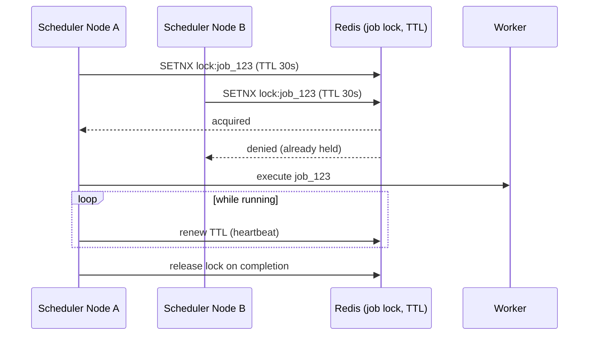
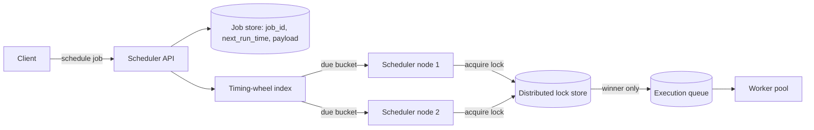

# Design a Distributed Job Scheduler (Cron-as-a-Service)

<small>8 min read</small>

**Real prompt:** "Design a system where clients schedule jobs to run at a specific time (or on a recurring schedule), and the system executes them reliably across a fleet of worker nodes — each job runs exactly once at its trigger time, even if machines crash."

Unlike [03-design-twitter](03-design-twitter.md) and [04-design-notification-system](04-design-notification-system.md), the interesting problem here isn't fan-out — it's **coordination**: many scheduler nodes exist for availability, but a given job must not run zero times or run twice.

## 1. Clarifying Questions
- One-off jobs, recurring (cron-style), or both?
- What happens if the scheduler is down when a job's trigger time passes — run immediately on recovery, or skip? (This is a real product decision, not a technical detail — always ask it.)
- Is "exactly once" a hard requirement, or is "at-least-once with idempotent job handlers" acceptable? (Almost always the honest answer is the latter — say so.)
- Job duration — short (seconds) or long-running (hours)? Changes whether a lock needs periodic renewal.

## 2. Requirements
**Functional**
- Schedule a job for a future time or recurring cadence
- Execute each job on exactly one worker at (approximately) its trigger time
- Support cancel/reschedule

**Non-functional**
- No single point of failure in the scheduler tier itself
- A job must not silently be dropped (missed) or run concurrently twice
- Must scale to millions of scheduled jobs without scanning all of them every tick

## 3. Capacity Estimation
- 10M scheduled jobs, average check interval 1 second → naive full-table scan every second is instantly disqualifying (10M row scan/sec) — this number exists specifically to force you to reject brute force and propose an efficient due-job lookup structure.
- Peak trigger rate: many jobs scheduled for the same round time (e.g. "every hour on the hour") — expect **bursts at time boundaries**, not smooth load.

## 4. The Core Design Decision: Efficient Due-Job Lookup
| Approach | How | Pros | Cons |
|---|---|---|---|
| Poll entire job table every tick | `SELECT * WHERE next_run_time <= now` | Simple | Doesn't scale — full scan grows with total job count, not due-job count |
| **Time-bucketed index / timing wheel** | Jobs indexed by `next_run_time` bucket (e.g. per-minute buckets); scheduler only reads the current and near-future buckets | Lookup cost scales with jobs *due now*, not total jobs | Bucket granularity is a tuning trade-off (too fine = many buckets to check; too coarse = imprecise trigger time) |

**Interview signal:** proposing a **timing wheel** or equivalent bucketed structure (rather than "add an index on next_run_time and query it") shows you understand that an index still costs a scan proportional to matching rows at scale — the real fix is reducing what you look at per tick, not just indexing what you're looking at.

## 5. The Second Core Decision: Exactly-Once-ish Execution Across Multiple Scheduler Nodes
This is where the problem actually gets hard, and where it connects to [Day 29](../system-design-notes/Day 29 - Distributed Locks (HLD).md) directly.

- Multiple scheduler nodes exist for availability, all watching the same due-job buckets.
- Without coordination, **two nodes could pick up the same due job simultaneously** and run it twice.
- Fix: before executing a job, a node must acquire a **distributed lock** on that specific job ID ([Day 30](../system-design-notes/Day 30 - Redis Distributed Lock Implementation (LLD).md)). Only the lock holder executes.
- The lock needs a **lease/TTL**, not a permanent hold: if the node holding the lock crashes mid-execution, the lock must expire so another node can retry the job — otherwise a crashed node's lock permanently blocks that job. This is the same lease-expiry reasoning from Day 30, now applied to job execution instead of a generic mutex.
- For **long-running jobs**, the lock holder must periodically **renew** (heartbeat) the lease while still executing — otherwise a legitimately-still-running job would have its lock expire and get double-executed by another node. This heartbeat-renewal pattern is the same idea leader election uses for "is the leader still alive" — a lease is really just leader election scoped to a single job instead of the whole cluster.

## 6. Deep Dive: What "Exactly Once" Actually Means Here
- The lock prevents **concurrent double-execution**. It does **not** prevent a job from running twice if the *result of execution* isn't itself idempotent — e.g. if job execution crashes right after doing its work but before releasing the lock/marking complete, a retry will re-run it.
- Honest framing for the interview: this design gives you **"effectively-once" execution** — no concurrent double-run, at-least-once delivery to a worker, and the job handler itself must be **idempotent** ([Day 24](../system-design-notes/Day 24 - Idempotency Keys (LLD).md)) to make retries safe. True exactly-once (execution *and* side effects) is not achievable without the job's own side effect being transactional with the completion marker — same honest limitation as [04-design-notification-system](04-design-notification-system.md)'s delivery guarantee.

## 7. High-Level Architecture

Note the shape: scheduler nodes **detect** due jobs redundantly (that's fine, cheap), but the **lock** is the single serialization point that ensures only one of them proceeds to actual execution — the same "detect broadly, act exclusively" pattern shows up anywhere multiple nodes watch the same state for availability.

## 8. Trade-offs to Voice Explicitly
| | Poll-based (DB scan) | Timing wheel | Push-based (external trigger, e.g. delayed queue) |
|---|---|---|---|
| Scales with | Total job count | Jobs due per tick | Depends on broker's delay-queue support |
| Precision | Depends on poll interval | Bucket granularity | Often good |
| Complexity | Lowest | Medium | Requires broker support (e.g. SQS delay queues, Kafka isn't naturally suited to this) |

- **Missed-schedule policy** (scheduler was down when trigger time passed): "run immediately on recovery" vs "skip to next scheduled time" is a product decision that changes the design — if you always catch up, a scheduler down for an hour causes a thundering herd of overdue jobs on recovery, which itself needs throttling.

## 9. Your Gaps to Close
- [ ] Practice explaining why a plain DB index on `next_run_time` isn't sufficient at scale — the distinction between "indexed" and "bucketed by due time" is the key insight interviewers probe for.
- [ ] Be ready for: "the node executing a 10-minute job crashes at minute 5 — what happens?" (Answer shape: lock lease expires since heartbeats stop, another node picks up the job and re-runs it from scratch — which is why the job handler must be idempotent, not just retried blindly.)
- [ ] Be ready to explicitly say "effectively-once," not "exactly-once," and explain the difference — this is the same discipline as Day 34's delivery-semantics framing, applied to execution instead of delivery.

## Related
- [Day 29 - Distributed Locks (HLD)](../system-design-notes/Day 29 - Distributed Locks (HLD).md) / [Day 30 - Redis Distributed Lock Implementation (LLD)](../system-design-notes/Day 30 - Redis Distributed Lock Implementation (LLD).md) — the exclusivity mechanism this design depends on
- [Day 24 - Idempotency Keys (LLD)](../system-design-notes/Day 24 - Idempotency Keys (LLD).md) — why job handlers must tolerate retries
- [04-design-notification-system](04-design-notification-system.md) — the same "at-least-once + idempotency, not true exactly-once" honesty applies to both
- [Day 23 - CAP Theorem and PACELC (HLD)](../system-design-notes/Day 23 - CAP Theorem and PACELC (HLD).md) — the lock store itself needs to favor consistency (CP) over availability; an AP lock store can let two nodes believe they both hold the lock

## Quiz
Write your own answer first — then expand.

> [!question]- Q1. Why is a plain DB query like `SELECT * WHERE next_run_time <= now` disqualifying at scale, even with an index?
> (think it through, then expand)

> [!success]- Answer: Q1
> An index makes the *lookup* of matching rows fast, but the cost still scales with how many rows currently match the condition — at 10M scheduled jobs, "matching rows" can itself be large during a burst (e.g. everything scheduled for the top of the hour). A timing-wheel/bucketed structure bounds the work per tick to jobs due in the *current* narrow window, rather than re-evaluating a condition across the whole table every tick.

> [!question]- Q2. Two scheduler nodes both detect the same due job at the same moment. What actually prevents both from executing it?
> (think it through, then expand)

> [!success]- Answer: Q2
> Detection is allowed to be redundant and cheap — both nodes seeing the same due job is fine. What prevents double-execution is a distributed lock (e.g. Redis `SETNX` with a TTL) scoped to that specific job ID: only the node that successfully acquires the lock proceeds to execute; the other is denied and moves on. The lock is the single serialization point, not the detection step.

> [!question]- Q3. A job's lock has a 30-second TTL, but the job takes 10 minutes to run. What goes wrong if the lock isn't renewed, and how do you fix it?
> (think it through, then expand)

> [!success]- Answer: Q3
> If the lock isn't renewed, it expires after 30 seconds even though the job is still legitimately running — a second node then sees the job as "unlocked and overdue," acquires the lock, and starts executing the same job concurrently, defeating the whole point of the lock. The fix is a heartbeat: the executing node periodically renews (extends) the lease while it's actively working, so the lock only expires if the node genuinely stops responding (crash), which is exactly when you *want* another node to take over.

## Next
[06-design-uber](06-design-uber.md) — a different kind of coordination problem: instead of "run this job exactly once," it's "assign this driver to exactly one rider," under high-frequency location updates instead of scheduled triggers.
