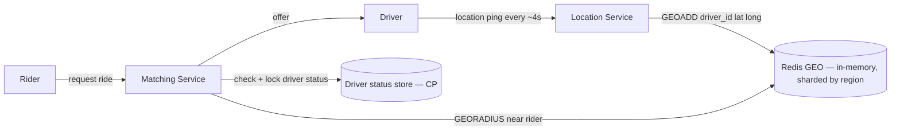

# Design Uber (Ride-Hailing: Driver-Rider Matching)

<small>8 min read</small>

**Real prompt:** "Design a system that matches riders with nearby available drivers, tracks driver locations in real time, and handles the request-to-pickup flow."

New primitive not seen in Days 11–31 or the earlier applied notes: **geospatial queries** ("find things near this point") at high write volume. Everything else — matching, consistency, locks — reuses tools you already have.

## 1. Clarifying Questions
- How often do drivers report location — every few seconds while online, or only on request? (Assume continuous pings while online — that's the realistic and harder case.)
- Matching: nearest driver only, or does the algorithm consider driver rating, ETA, surge pricing? (Assume nearest-available as the core; mention ranking as an extension, same pattern as [09-design-news-feed](09-design-news-feed.md)'s ranking layer on top of a simpler retrieval step.)
- Can a driver be offered multiple ride requests simultaneously? (Assume no — one active offer at a time, to avoid a driver accepting two rides.)
- Region-bound or global? (Assume regional sharding — a rider in NYC never needs to be matched against a driver in Tokyo, which is itself a useful sharding key.)

## 2. Requirements
**Functional**
- Drivers report live location while online
- Rider requests a ride; system finds and offers it to the nearest available driver
- Driver accepts/declines; on decline, offer moves to next-nearest driver

**Non-functional**
- Location writes are extremely high-frequency (every driver, every few seconds) — this is the dominant write load, far exceeding ride requests
- Matching must be low-latency (a rider waiting 10+ seconds for a match is a bad experience)
- Must never double-assign a driver to two riders simultaneously

## 3. Capacity Estimation
- 1M active drivers, location ping every 4 seconds → **250k location writes/sec**. This dwarfs ride-request volume (maybe a few thousand/sec at peak) — the design has to be built around the location-ping load first, matching second.
- This write volume rules out writing every ping straight to a durable relational DB — same read/write-shape reasoning as [Day 11](../system-design-notes/Day 11 - Caching Strategies at Scale.md), just applied to writes instead of reads: an in-memory, geo-indexed store is the only realistic fit.

## 4. The Core Design Decision: Geospatial Indexing
| Structure | How | Pros | Cons |
|---|---|---|---|
| **Geohash** | Encode lat/long into a string; nearby points share string prefixes | Simple, works as a normal sorted-index/hash key, easy to shard by prefix | Edge cases at grid-cell boundaries (two physically close points can hash to different cells) |
| **Quadtree** | Recursively subdivide space into quadrants based on point density | Naturally adapts to uneven density (dense cities vs sparse rural areas) | More complex to shard/distribute than a flat geohash string |
| Naive lat/long range scan | `WHERE lat BETWEEN x AND y AND long BETWEEN a AND b` | None really | Doesn't use a spatial index properly, scans grow with density, no natural "expanding radius" search |

**Interview signal:** naming the boundary problem with geohash (a driver 10 meters away across a cell boundary looks "far" by prefix match) and proposing the fix — search the current cell **and neighboring cells**, expanding radius if too few drivers found — is the differentiator. Redis's `GEOADD`/`GEORADIUS` commands implement geohash-backed proximity search directly, which is the practical answer for "what would you actually run in production."

## 5. High-Level Architecture



Two separate stores with two separate consistency requirements — see the CAP split below.

## 6. Deep Dive: The CAP Split — Location Pings vs. Driver Status
This is the same "different entities, different consistency choices" reasoning [Day 23](../system-design-notes/Day 23 - CAP Theorem and PACELC (HLD).md) and [03-design-twitter](03-design-twitter.md) both make explicit — here it's especially clean:

- **Location pings are AP.** A driver's position being 4 seconds stale is invisible/irrelevant — nobody notices a dot on a map lagging slightly. Losing a ping occasionally is fine, the next one arrives in 4 seconds anyway. Optimize purely for throughput and availability here.
- **Driver assignment status is CP.** Whether a driver is "available" or "assigned" **must** be strongly consistent — if two riders both see the same driver as available and both get matched to them, that's a real, user-visible failure (double-booking), not a cosmetic staleness issue. This needs the same distributed-lock discipline as [05-design-job-scheduler](05-design-job-scheduler.md): acquiring a lock (or a conditional/compare-and-swap update) on `driver_status` before offering a ride, so a second concurrent match attempt sees "already assigned" and moves to the next-nearest driver instead.

Naming both halves of this split — not just "we use Redis for speed" — is what separates a pass from a strong pass on this problem.

## 7. Deep Dive: The Matching Flow, Precisely
```
1. Rider requests ride at (lat, long)
2. MatchSvc: GEORADIUS around rider, expanding radius until N candidates found
3. Sort candidates by distance (cheap first-pass ranking — ETA-based ranking is a later refinement)
4. For nearest candidate:
     a. Attempt conditional update: driver_status[driver_id]: available -> offered (CAS / lock)
     b. If succeeds: send offer to driver, start accept-timeout
     c. If fails (already taken by a concurrent match): move to next candidate
5. On driver accept: status -> assigned. On decline/timeout: status -> available, retry with next candidate.
```
Step 4a is the load-bearing line — without the conditional update, two simultaneous ride requests near the same driver could both read "available" and both send an offer, and both could get accepted before either side notices the conflict.

## 8. Trade-offs to Voice Explicitly
| | Geohash (Redis GEO) | Quadtree |
|---|---|---|
| Implementation cost | Low — native Redis support | Higher — usually custom or specialized service |
| Handles uneven density well | Not natively — dense cities need finer geohash precision explicitly | Yes, by design |
| Sharding | Natural (prefix-based) | Needs custom partitioning logic |

- **Regional sharding**: partitioning the whole system (location store, matching service) by city/region isn't just a scaling optimization here — it's semantically correct, since a rider is never matched cross-region. This is a rare case where the sharding key is dictated by the problem domain itself, not chosen for load-balancing reasons the way [Day 21](../system-design-notes/Day 21 - Database Sharding and Partitioning (HLD).md)'s generic sharding usually is.
- **Ping frequency vs. battery/bandwidth**: 4-second pings are a real trade-off against driver phone battery life and cellular data — worth naming as a non-obvious cost of "just increase the frequency for better accuracy."

## 9. Your Gaps to Close
- [ ] Practice explaining the geohash boundary problem and its fix (expanding-radius neighbor-cell search) — this is the concrete "do you actually understand geospatial indexing" check.
- [ ] Be ready for: "two ride requests hit the same nearest driver within 50ms of each other — walk through exactly what happens." (Answer shape: both read "available" is possible in a naive design; the conditional/CAS update on driver_status is what makes only one of them win, echoing the lock discipline from Day 29/30 and [05-design-job-scheduler](05-design-job-scheduler.md).)
- [ ] Be ready for: "how would you extend nearest-driver matching to account for ETA, not just straight-line distance?" (Straight-line geohash distance is a fast first-pass filter; true ETA needs a routing/maps service call on the shortlist only, not on every candidate — a two-stage filter-then-rank pattern, same shape as [09-design-news-feed](09-design-news-feed.md)'s candidate-generation-then-ranking split.)

## Related
- [Day 23 - CAP Theorem and PACELC (HLD)](../system-design-notes/Day 23 - CAP Theorem and PACELC (HLD).md) — the location-vs-status CAP split
- [Day 29 - Distributed Locks (HLD)](../system-design-notes/Day 29 - Distributed Locks (HLD).md) / [Day 30 - Redis Distributed Lock Implementation (LLD)](../system-design-notes/Day 30 - Redis Distributed Lock Implementation (LLD).md) — preventing double-assignment
- [Day 21 - Database Sharding and Partitioning (HLD)](../system-design-notes/Day 21 - Database Sharding and Partitioning (HLD).md) — contrast with domain-driven regional sharding here
- Day 15 - Consistent Hashing / [Day 16 - Consistent Hashing Ring Implementation (LLD)](../system-design-notes/Day 16 - Consistent Hashing Ring Implementation (LLD).md) — conceptually related to geohash prefix-based partitioning
- [05-design-job-scheduler](05-design-job-scheduler.md) — same conditional-update/lock discipline, different domain
- [09-design-news-feed](09-design-news-feed.md) — the filter-then-rank pattern reused for ETA ranking

## Quiz
Write your own answer first — then expand.

> [!question]- Q1. Why can't ride-request volume alone determine your storage choice for driver locations — what actually dominates the design?
> (think it through, then expand)

> [!success]- Answer: Q1
> Location pings (every active driver, every few seconds) vastly outnumber ride requests — at 1M drivers pinging every 4 seconds, that's roughly 250k writes/sec, compared to maybe a few thousand ride requests/sec at peak. The storage layer has to be designed around absorbing continuous high-frequency location writes (an in-memory, geo-indexed store like Redis GEO) first; matching reads are the secondary concern layered on top.

> [!question]- Q2. Why is it wrong to store driver location and driver assignment status in the same consistency model?
> (think it through, then expand)

> [!success]- Answer: Q2
> They have genuinely different correctness requirements. Location is AP — a few seconds of staleness is invisible and losing an occasional ping is harmless, since the next one arrives shortly after. Assignment status is CP — if two riders both see a driver as "available" due to a stale or racy read, both can get matched to the same driver, which is a real, user-facing double-booking bug, not a cosmetic issue. Treating both as "just store it in Redis for speed" without distinguishing the consistency requirement is the mistake; the fix is a conditional/CAS update (or lock) specifically on status, while location stays a simple fast write.

> [!question]- Q3. What breaks with a naive geohash proximity search, and what's the practical fix?
> (think it through, then expand)

> [!success]- Answer: Q3
> A geohash maps points to grid cells via shared string prefixes, but two points can be physically very close while sitting on opposite sides of a cell boundary — a naive "search only this cell" query would miss a driver who's actually the nearest one, just one meter across the line. The fix is to search the rider's cell **and its neighboring cells**, and expand the search radius (more neighboring cells, or a coarser geohash precision) if too few candidates are found — this is exactly what Redis's `GEORADIUS` does under the hood.

## Next
[07-design-chat-system](07-design-chat-system.md) — moves from "periodic location pings" to genuinely real-time, persistent connections (WebSockets), and revisits Day 23's CAP framing once more: message delivery vs. presence/typing indicators.
