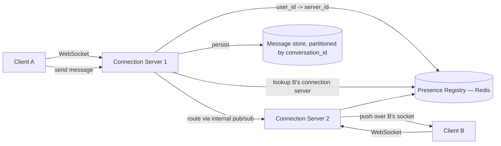

# Design a Chat System (WhatsApp / Messenger-style)

<small>9 min read</small>

**Real prompt:** "Design a system supporting 1:1 and group messaging, with real-time delivery, offline support, and read receipts/presence."

New primitive: previous applied designs were request/response. This one needs a **persistent, long-lived connection** per online user — the server has to be able to push to a client without the client asking first.

## 1. Clarifying Questions
- 1:1 only, or group chat too? (Assume both — group chat is a small, bounded fan-out, useful to contrast against Twitter's unbounded fan-out.)
- Delivery guarantee needed — must messages arrive in order, exactly once? (Assume ordered-per-conversation, at-least-once with client-side dedup — same honesty as [04-design-notification-system](04-design-notification-system.md).)
- Offline users — store and forward, or drop? (Assume store-and-forward; this is most of the actual complexity.)
- End-to-end encryption? (Worth raising even if out of scope — it constrains what the *server* is allowed to do, e.g. no server-side search or content moderation on message bodies.)

## 2. Requirements
**Functional**
- Send/receive messages 1:1 and in groups, in order per conversation
- Deliver in real time if recipient is online; store and deliver on reconnect if offline
- Read receipts and presence ("online"/"last seen")

**Non-functional**
- Low latency delivery to online recipients (sub-second)
- Must scale to hundreds of millions of concurrent open connections
- Message delivery must not silently drop messages; presence/read-receipts can

## 3. Capacity Estimation
- 500M DAU, ~20% concurrently connected at peak → **100M concurrent WebSocket connections**. A single server typically holds tens of thousands of connections (bounded by memory/file descriptors, not CPU) → this alone forces horizontal sharding of connection servers, independent of message volume.
- 500M users × 40 messages/day → 20B messages/day ≈ 230k messages/sec average, bursty around specific hours.

## 4. The Core Design Decision: Connection Management at Scale
| Approach | How | Pros | Cons |
|---|---|---|---|
| Long polling | Client repeatedly requests, server holds the request open until there's data or timeout | Works everywhere, no special protocol | Higher overhead per message, more connection churn |
| **WebSockets** | Single persistent bidirectional connection per online client | Low overhead per message, true server push | Requires connection-server infrastructure to track "which server holds which user's socket" |
| Server-Sent Events (SSE) | Persistent one-directional (server→client) stream | Simpler than WebSockets | One-directional — still need a separate channel for client→server sends |

**Interview signal:** the real design problem isn't "which protocol" (WebSockets is the standard answer) — it's **"how does Server B know to route a message to a user whose socket lives on Server A"** when you have thousands of connection servers. That routing/presence-registry problem is where this design actually gets tested.

## 5. High-Level Architecture

The **Presence Registry** (`user_id → which connection server holds their socket`) is the load-bearing piece — every cross-server message delivery depends on this lookup being fast and current. When a user connects, their server registers itself; on disconnect, it deregisters (with a TTL as a safety net against ungraceful disconnects, same lease-expiry idea as [Day 30](../system-design-notes/Day 30 - Redis Distributed Lock Implementation (LLD).md)'s lock TTL).

## 6. Deep Dive: The CAP Split, Again — Message Delivery vs. Presence
This is [Day 23](../system-design-notes/Day 23 - CAP Theorem and PACELC (HLD).md)'s own "30-second challenge" (posed back on Day 23, before this note existed) — now answered directly:

- **Message delivery is CP-leaning.** A message must not be lost. If it can't be persisted and confirmed, the send should fail visibly (client shows "not delivered, retry") rather than silently succeed and vanish. Messages are written to a durable, partitioned store (partitioned by `conversation_id`, so a single conversation's messages stay ordered on one partition) before the sender gets an ack.
- **Presence and read receipts are AP.** Whether a contact shows "online" a few seconds late, or a read receipt takes a moment to appear, is cosmetic — it's fine to serve stale presence data or even drop a presence update entirely under load, in exchange for never blocking message delivery on presence infrastructure health.

Naming this split explicitly — the same entity-by-entity reasoning as [03-design-twitter](03-design-twitter.md) and [06-design-uber](06-design-uber.md) — is the recurring "strong vs. weak CAP answer" signal across every applied design in this whole set.

## 7. Deep Dive: Offline Delivery and Ordering
- Messages are always written to the durable per-conversation store first, **regardless of recipient online status** — "online delivery" is just "also push it now," not a different code path for correctness.
- On reconnect, a client fetches any messages after its last-acknowledged message ID (per conversation) — a simple cursor/offset read against the same durable store, no separate "offline queue" data structure needed.
- **Ordering** is guaranteed only *within a conversation* (by writing to a single partition, same idea as [Day 21](../system-design-notes/Day 21 - Database Sharding and Partitioning (HLD).md)'s partition-key choice determining what ordering guarantee you get) — there's no meaningful "global order" across unrelated conversations, and promising one would force unnecessary cross-partition coordination for no user-visible benefit.
- **Delivery**: offline push notification (via [04-design-notification-system](04-design-notification-system.md)) is triggered when a message is stored for a recipient with no active connection-server registration — this is the direct reuse point between these two notes: chat's "recipient is offline" case *is* a trigger into the notification system's fan-out pipeline.

## 8. Deep Dive: Group Chat — Bounded Fan-out
- Group chat fan-out looks like [03-design-twitter](03-design-twitter.md)'s fan-out-on-write, but **bounded**: groups typically cap at a few hundred members, so there's no celebrity-scale problem here — push to every member's connection server (if online) or trigger offline notification (if not), synchronously or via a lightweight async job, without needing Twitter's hybrid push/pull split.
- This is a useful contrast to hold in mind: **the same fan-out shape can be a trivial synchronous loop or a hard distributed-systems problem, purely depending on the fan-out size** — Twitter needed the hybrid model because follower counts are unbounded and power-law distributed; a 256-member group chat cap doesn't.

## 9. Trade-offs to Voice Explicitly
| | Message delivery | Presence/read receipts |
|---|---|---|
| Consistency | CP-leaning — never silently lose a message | AP — stale/dropped is acceptable |
| Storage | Durable, partitioned, replicated | Ephemeral, in-memory (Redis-like) is fine |
| Failure mode if infra degrades | Must degrade to "send failed," visible to user | Silently show stale "last seen," invisible to user |

- **WebSocket server statefulness**: unlike the mostly-stateless app servers in earlier designs (Rate Limiter, URL Shortener), connection servers hold real per-connection state in memory — this changes deployment/scaling operations (you can't just round-robin behind a stateless load balancer the same way; a disconnect-and-reconnect during a deploy is a real, visible event) — worth naming as an operational cost specific to this design.

## 10. Your Gaps to Close
- [ ] Practice explaining the presence-registry routing problem cold — "how does server B know user X's socket is on server A" is the question this whole design is actually testing.
- [ ] Be ready for: "user's connection server crashes mid-conversation — what does the user experience?" (Answer shape: client detects socket drop, reconnects — possibly to a different connection server — re-registers presence, and catches up via the cursor-based fetch against the durable message store; no messages are lost because delivery never depended on that specific server being alive.)
- [ ] Be ready to state explicitly why group chat here does *not* need Twitter's hybrid fan-out model — bounded group size is the reason, and naming that bound is the signal.

## Related
- [Day 23 - CAP Theorem and PACELC (HLD)](../system-design-notes/Day 23 - CAP Theorem and PACELC (HLD).md) — directly resolves Day 23's own posed question about chat CAP choices
- [Day 21 - Database Sharding and Partitioning (HLD)](../system-design-notes/Day 21 - Database Sharding and Partitioning (HLD).md) — partition-by-conversation_id for ordering
- [Day 30 - Redis Distributed Lock Implementation (LLD)](../system-design-notes/Day 30 - Redis Distributed Lock Implementation (LLD).md) — TTL/lease pattern reused for presence-registry entries
- [03-design-twitter](03-design-twitter.md) — contrast bounded vs. unbounded fan-out
- [04-design-notification-system](04-design-notification-system.md) — offline delivery hands off directly into this system

## Quiz
Write your own answer first — then expand.

> [!question]- Q1. User A sends a message to User B, who is connected to a different connection server. What's the one piece of infrastructure that makes cross-server delivery possible, and what does it actually store?
> (think it through, then expand)

> [!success]- Answer: Q1
> A presence registry (typically Redis) mapping `user_id → which connection server currently holds that user's socket`. When A's connection server needs to deliver to B, it looks up B's entry in the registry, finds B is on a different server, and routes the message internally (e.g. via pub/sub) to that server, which then pushes it over B's actual WebSocket. Without this registry, a connection server would have no way to know where an online recipient's live connection actually lives.

> [!question]- Q2. Why is it fine for a "last seen" timestamp to be a few seconds stale, but not fine for a message to be silently dropped?
> (think it through, then expand)

> [!success]- Answer: Q2
> These are different entities with different user-facing failure modes. Stale presence is invisible — the user has no way to detect that "last seen 2 minutes ago" should actually say "1:58 ago," and no harm results either way. A dropped message is a directly observable, trust-breaking failure — the sender believes it was sent, the recipient never sees it, and there's no way for either party to detect the loss without an explicit ack/retry mechanism. This is why message delivery is built CP-leaning (durable write before ack) while presence is built AP (best-effort, ephemeral).

> [!question]- Q3. Why doesn't group chat fan-out need the same hybrid push/pull model that Twitter's celebrity-follower problem required?
> (think it through, then expand)

> [!success]- Answer: Q3
> Twitter's hybrid model exists because follower counts are unbounded and power-law distributed — a single tweet can require fanning out to tens of millions of followers, which naive push can't absorb. Group chats have a hard, small membership cap (typically a few hundred), so fanning out a message to every member — whether via a direct push to online members' connection servers or a notification trigger for offline ones — is bounded work with no celebrity-scale case to defend against. The fan-out *shape* is the same; the *scale* is what determines whether you need the hybrid complexity.

## Next
[08-design-youtube](08-design-youtube.md) — moves from small, real-time text payloads to large, asynchronously-processed media, and reuses CDN edge caching (Day 17) for a new content type.
