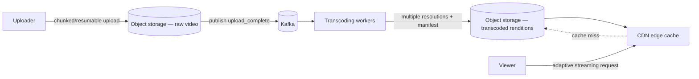

# Design YouTube (Video Upload + Streaming)

<small>8 min read</small>

**Real prompt:** "Design a system where users upload videos, the system processes them, and other users stream them smoothly across different devices and network conditions."

Two almost-independent subsystems hide inside this prompt: an **upload/processing pipeline** (write-heavy, latency-tolerant) and a **serving/streaming path** (read-heavy, latency-critical). Conflating them is the most common weak answer.

## 1. Clarifying Questions
- Live streaming in scope, or video-on-demand (VOD) only? (Assume VOD — live streaming has a materially different pipeline, worth mentioning as an extension, not solving inline.)
- Do we need multiple resolutions (adaptive bitrate), or is one fixed quality acceptable? (Assume adaptive — this is most of the interesting design.)
- Upload size/duration limits? (Assume large files, minutes to hours — forces resumable/chunked upload.)
- View count — exact or approximate acceptable? (Assume approximate is fine — this unlocks a much cheaper design.)

## 2. Requirements
**Functional**
- Upload a video; system processes it into multiple resolutions
- Stream video adaptively based on the viewer's bandwidth
- Track view counts and basic metadata (title, description, likes)

**Non-functional**
- Upload must survive network interruption (resumable)
- Playback start latency low; playback must adapt to changing bandwidth without stalling
- Storage cost matters at this scale — raw + transcoded copies of every video add up fast

## 3. Capacity Estimation
- 500 hours of video uploaded per minute (real-world YouTube-scale figure) → transcoding throughput has to keep pace with a continuous firehose, not a bursty trickle
- Each video transcoded into ~5 resolutions (240p–1080p+) → **storage is ~5x the raw upload size**, before even counting replication — this number alone is why "just store the raw file and transcode on request" fails: transcoding is CPU-expensive, you do it once and cache the result, not per playback.
- View traffic is extremely read-heavy and extremely skewed (a small fraction of videos get most views — same Zipf shape as [02-url-shortener](02-url-shortener.md)'s hot-URL distribution) — this is what makes CDN caching so effective here.

## 4. The Core Design Decision: Separate Upload Path from Serving Path
| | Upload path | Serving path |
|---|---|---|
| Access pattern | Write-once, large sequential blobs | Read-many, small chunked requests |
| Latency tolerance | Minutes acceptable (processing happens async) | Sub-second start, no stalls |
| Storage | Object storage (chunked, resumable) | CDN-fronted, cached at edge |

**Interview signal:** explicitly stating that these are two different systems with two different performance profiles — not "one video service" — is the structural insight everything else hangs off. This mirrors [03-design-twitter](03-design-twitter.md)'s write-path/read-path split, just for media instead of text.

## 5. High-Level Architecture

The transcoding step is triggered the same way [03-design-twitter](03-design-twitter.md)'s fan-out is: an event (`upload_complete`) published to Kafka, consumed by a worker pool — decoupling upload completion from processing completion, so the uploader gets a fast "upload received" response without waiting for transcoding to finish.

## 6. Deep Dive: Resumable/Chunked Upload
- Large files are split into chunks (e.g. 5–10MB each) uploaded independently; the client tracks which chunks succeeded and resumes only the missing ones after a network drop — same core idea as [Day 20](../system-design-notes/Day 20 - Write-Ahead Log Implementation (LLD).md)'s append-only, recoverable-from-a-known-point pattern, applied to a file instead of a database log.
- This is directly reusable as Day 42's multipart upload mechanism once that day exists — object storage services (S3-style) implement exactly this: independent, resumable, parallelizable chunk uploads assembled server-side once all parts arrive.

## 7. Deep Dive: Adaptive Bitrate Streaming
- Transcoding produces multiple resolution renditions (240p, 480p, 720p, 1080p, …) **plus a manifest file** (HLS/DASH) listing them, broken into small time-segments (e.g. 6-second chunks) per resolution.
- The player continuously measures its own download speed and requests the next segment at whatever resolution currently fits the available bandwidth — resolution can change **mid-playback**, segment by segment, without restarting the stream. This is why video is delivered as many small segment files, not one giant file: switching resolution only requires switching which segment URL you request next.
- **CDN edge caching directly reuses [Day 17](../system-design-notes/Day 17 - CDN and Edge Caching (HLD).md)** — segments for popular videos get cached at edge nodes close to viewers; unpopular/old videos fall back to origin object storage, same hot/cold split logic as any CDN use case.

## 8. Deep Dive: View Count as an Approximate, Eventually-Consistent Counter
- Incrementing a single global counter per video on every view is a write-contention bottleneck at scale, structurally the same problem [02-url-shortener](02-url-shortener.md)'s naive global-counter key generation had.
- Practical fix: each app/edge server increments a **local counter**, batched and flushed asynchronously (e.g. every few seconds) to aggregate into the real count — the displayed number is intentionally **eventually consistent and approximate**, which is acceptable because nobody makes a decision based on whether a video has exactly 1,000,004 vs 1,000,011 views. This is a direct application of [Day 23](../system-design-notes/Day 23 - CAP Theorem and PACELC (HLD).md)'s reasoning: view count is unambiguously AP, and the interesting design move is recognizing you don't even need strong eventual consistency, just an approximately-right number refreshed periodically.

## 9. Trade-offs to Voice Explicitly
| | Transcode all resolutions upfront | Transcode on-demand (first request) |
|---|---|---|
| Storage cost | Higher (all renditions always stored) | Lower (only requested renditions stored) |
| First-view latency | Fast (already processed) | Slow (transcode blocks first playback) |
| Best for | Popular platform, most videos get *some* views | Rarely-accessed archival content |

- **CDN cache invalidation on takedown/edit**: a video removed for a policy violation must be purged from edge caches promptly — worth naming as a real operational constraint the caching strategy has to account for, not just "CDN makes it fast."
- **Storage tiering**: old, rarely-watched videos are candidates for cheaper/colder storage classes (this is a direct AWS-knowledge crossover — S3 Standard vs. Infrequent Access vs. Glacier is the same underlying idea).

## 10. Your Gaps to Close
- [ ] Practice explaining *why* transcoding happens once at upload time and is cached, rather than per-playback — the CPU-cost argument is the concrete justification, not just "it's faster."
- [ ] Be ready for: "a viewer's connection degrades mid-video — what happens?" (Answer shape: the player detects the throughput drop from its own segment download timing and requests the next segment at a lower resolution from the manifest — no server-side involvement, no reconnect, no restart.)
- [ ] Be ready for: "how would live streaming change this design?" (Rough shape: no pre-transcoding step possible — transcoding has to happen in near-real-time on a continuous incoming stream, and the CDN caches very short, rapidly-expiring segments instead of stable long-lived ones — a materially different latency/consistency profile, good to name even without designing it fully.)

## Related
- [Day 17 - CDN and Edge Caching (HLD)](../system-design-notes/Day 17 - CDN and Edge Caching (HLD).md) — edge caching for popular video segments
- [Day 20 - Write-Ahead Log Implementation (LLD)](../system-design-notes/Day 20 - Write-Ahead Log Implementation (LLD).md) — conceptual root of resumable/chunked writes
- [Day 23 - CAP Theorem and PACELC (HLD)](../system-design-notes/Day 23 - CAP Theorem and PACELC (HLD).md) — approximate, AP view counters
- [03-design-twitter](03-design-twitter.md) — same upload/serving-path split pattern, same async-processing-via-queue pattern
- [02-url-shortener](02-url-shortener.md) — same global-counter contention problem reused for view counts

## Quiz
Write your own answer first — then expand.

> [!question]- Q1. Why is it wrong to treat "upload a video" and "stream a video" as the same system with the same performance requirements?
> (think it through, then expand)

> [!success]- Answer: Q1
> They have opposite performance profiles. Upload is write-once, large, sequential, and latency-tolerant (a user expects processing to take some time). Streaming is read-many, small chunked requests, and latency-critical (playback must start fast and never stall). Designing them as one system forces bad compromises in both directions — e.g. optimizing storage for sequential writes hurts the random, chunked reads streaming needs. Splitting them lets each side use the storage/caching strategy suited to its actual access pattern: object storage for upload, CDN-fronted chunked delivery for streaming.

> [!question]- Q2. Why is video split into small time-segments per resolution instead of stored as one file per resolution?
> (think it through, then expand)

> [!success]- Answer: Q2
> Adaptive bitrate streaming needs to be able to switch resolution **mid-playback** as the viewer's available bandwidth changes, without restarting the stream. If each resolution were one giant file, switching resolution would mean abandoning the current download and starting a new file from the beginning. By breaking each resolution into short segments (e.g. 6 seconds) listed in a manifest, the player can simply request the *next* segment at a different resolution — the switch happens at a segment boundary, seamlessly, because segments across resolutions represent the same time range.

> [!question]- Q3. Why is a global view counter incremented on every view a scaling problem, and what's the practical fix?
> (think it through, then expand)

> [!success]- Answer: Q3
> A single shared counter incremented on every view becomes a write-contention bottleneck under high concurrent view volume — many requests racing to update the same value, the same root problem as a naive global auto-increment key generator. The practical fix is local, per-server batching: each server accumulates view increments locally and periodically flushes an aggregate delta to the real counter (or a stream that's aggregated downstream), trading strict real-time accuracy for a counter that's approximately correct and refreshed every few seconds — which is all the product actually needs.

## Next
[09-design-news-feed](09-design-news-feed.md) — reuses Twitter's exact fan-out skeleton, but replaces "chronological merge" with a ranking stage, and reuses this note's storage-tiering thinking for media-heavy posts.

## Linked from

- [Day 41 — Event Store & Replay, Implemented (LLD)](../system-design-notes/Day%2041%20-%20Event%20Store%20Implementation%20%28LLD%29.md)
- [Day 42 — Object/Blob Storage Internals (HLD)](../system-design-notes/Day%2042%20-%20Object%20Storage%20Internals%20%28HLD%29.md)
- [Day 43 — Multipart/Resumable Upload, Implemented (LLD)](../system-design-notes/Day%2043%20-%20Multipart%20Upload%20Implementation%20%28LLD%29.md)
- [Day 45 — Geohash Proximity Search, Implemented (LLD)](../system-design-notes/Day%2045%20-%20Geohash%20Proximity%20Search%20Implementation%20%28LLD%29.md)
- [Day 47 — Connection & Session Management at Scale (LLD)](../system-design-notes/Day%2047%20-%20Connection%20Session%20Management%20%28LLD%29.md)
- [Day 48 — Video Streaming Fundamentals (HLD)](../system-design-notes/Day%2048%20-%20Video%20Streaming%20Fundamentals%20%28HLD%29.md)
- [Day 49 — Transcoding Pipeline, Sketched (LLD)](../system-design-notes/Day%2049%20-%20Transcoding%20Pipeline%20Implementation%20%28LLD%29.md)
- [Design a Chat System (WhatsApp / Messenger-style)](07-design-chat-system.md)
- [Design a News Feed (Instagram/Facebook-style, Ranked)](09-design-news-feed.md)
- [Design Search Autocomplete (Typeahead Suggestions)](10-design-search-autocomplete.md)
