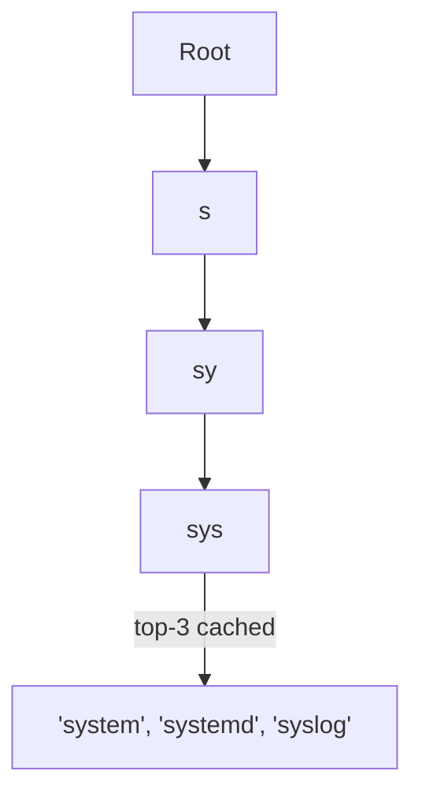

# Design Search Autocomplete (Typeahead Suggestions)

<small>9 min read</small>

**Real prompt:** "As a user types into a search box, suggest the top completions in real time, ranked by popularity."

Smaller in scope than the other applied designs, and deliberately closes this set — it forces you to justify *why neither* of the two indexing structures you've already learned (B-Tree from [Day 18](../system-design-notes/Day 18 - Database Indexing - B-Trees (LLD).md), inverted index from [Day 31](../system-design-notes/Day 31 - Search Systems and Elasticsearch (HLD).md)) is the right fit, and pick a third.

## 1. Clarifying Questions
- Personalized per-user, or global suggestions? (Assume global as the baseline — personalization is a layer on top, not a different core structure.)
- How many suggestions per keystroke, and how fresh does "trending" need to be? (Assume top-5 to top-10, refreshed periodically, not real-time-exact.)
- Full-text relevance (like a search results page), or literally just prefix matching? (This is the key distinguishing question — autocomplete is prefix matching, not relevance search, and the interviewer wants to see you separate the two.)

## 2. Requirements
**Functional**
- Given a partial string, return the top-K most popular completions
- Suggestions update over time as query popularity shifts (e.g. trending topics)

**Non-functional**
- Extremely low latency — this fires on **every keystroke**, so even 50–100ms feels sluggish
- High read QPS (every keystroke of every active user), low write QPS (popularity updates happen in the background, not per-keystroke)

## 3. Capacity Estimation
- A search box with 100M DAU, average query 20 characters typed → **~20 read requests per search**, before the user even hits enter. This is why "extremely read-heavy" isn't an exaggeration here — it's a structural property of the interaction, not just scale: **every single search generates roughly 20x the read load of a normal search request.**
- Client-side debouncing (only querying every ~150–200ms of typing pause, not on every literal keystroke) is a real, expected part of the design — worth naming as the first, cheapest optimization, before any backend work.

## 4. The Core Design Decision: Why Not B-Tree or Inverted Index
| Structure | What it's actually good at | Why it's the wrong fit here |
|---|---|---|
| B-Tree index (Day 18) | Exact match, range queries (`WHERE col BETWEEN x AND y`) | A prefix isn't a range in the B-Tree's ordering sense the way you need — and it wasn't built to return "top-K by popularity," just "matching rows" |
| Inverted index (Day 31) | Full-text relevance ranking, arbitrary term-anywhere-in-document matching | Overkill for pure prefix matching, and BM25-style relevance scoring solves a different problem than "most popular completion of this exact prefix" |
| **Trie (prefix tree)** | Exactly this: given a prefix, find everything that starts with it, fast | Needs its own scaling story (below) — not free, just the right shape |

**Interview signal:** explicitly naming *why* the two structures you already know don't fit — not just jumping straight to "use a trie" — is what shows real understanding rather than pattern-matched recall. This is precisely [Day 31](../system-design-notes/Day 31 - Search Systems and Elasticsearch (HLD).md)'s own closing point ("don't force a structure built for a different access pattern") applied one more time, now in the opposite direction — recognizing when a *specialized*, simpler structure beats the more powerful ones you already reached for elsewhere.

## 5. Deep Dive: Precomputed Top-K at Each Trie Node
- A naive trie only tells you "what continues from this prefix" — finding the *top-K by popularity* still means walking every completion under that node and sorting, which is slow at query time (exactly the same "don't compute expensive things on the hot path" lesson as every other applied design in this set).
- Fix: **precompute and cache the top-K completions at every node**, updated asynchronously as query popularity changes — a query-time lookup then just reads the precomputed list off the matched node, no traversal/sort needed. This is the same "precompute at write time, read cheaply at request time" trade as [03-design-twitter](03-design-twitter.md)'s fan-out-on-write timeline — same shape, different data structure.

## 6. Deep Dive: Keeping Popularity Fresh Without Live Writes on the Hot Path
- Query logs (every search term users actually submit) are streamed into an aggregation pipeline — conceptually the same async event pipeline as [Day 27](../system-design-notes/Day 27 - Message Queues Deep Dive (HLD).md) — that periodically (e.g. every few minutes to hourly) recomputes term frequencies and refreshes the precomputed top-K at affected trie nodes.
- This is a deliberate **write-side batching** choice, same reasoning as [08-design-youtube](08-design-youtube.md)'s approximate view counters: nobody needs autocomplete popularity to reflect the literal last second of activity, so batching the recompute keeps the read path (which fires on every keystroke, across every user) completely decoupled from the write/update path.

## 7. Deep Dive: Sharding the Trie
- A single-node in-memory trie eventually won't fit or won't handle the QPS alone. Standard approach: shard by **first character(s) of the prefix** (e.g. a–i on one shard, j–r on another) — conceptually similar to [Day 21](../system-design-notes/Day 21 - Database Sharding and Partitioning (HLD).md)'s range-based partitioning, just applied to a trie instead of a table.
- A query for a longer prefix is routed to exactly one shard (whichever owns that prefix's first characters) — unlike [Day 31](../system-design-notes/Day 31 - Search Systems and Elasticsearch (HLD).md)'s search, which fans out to *every* shard because you can't know in advance which shard has matching documents. Autocomplete's prefix-based sharding means **you always know exactly which shard owns a given query** — a meaningfully simpler routing problem than full-text search, worth contrasting explicitly.

## 8. Trade-offs to Voice Explicitly
| | Trie with precomputed top-K | Query-time aggregation over raw logs |
|---|---|---|
| Read latency | Very low — direct node lookup | High — would need to scan/aggregate live, disqualifying at this QPS |
| Freshness | Minutes to hours stale (batched refresh) | Real-time, but far too slow to serve |
| Memory cost | Every node holds precomputed results — real but bounded overhead | N/A |

- **Personalization trade-off**: global top-K is cheap and cacheable; per-user personalized suggestions would mean either a much larger per-user precomputed structure or a live re-ranking step at query time — worth naming as the next layer of complexity if asked to extend the design, not something to solve unprompted.

## 9. Your Gaps to Close
- [ ] Practice stating, unprompted, *why* B-Tree and inverted index are both the wrong fit before proposing a trie — this ordering of the answer is itself the signal.
- [ ] Be ready for: "why precompute top-K per node instead of just walking the subtree at query time?" (Same answer shape as every other design in this set: query-time computation on a hot path that fires per-keystroke, across every active user, is disqualifying at this request volume — precompute once, read cheaply, many times.)
- [ ] Be ready for: "how is sharding a trie different from sharding for Elasticsearch?" (Prefix-based trie sharding routes a query to exactly one shard; full-text search inherently fans out to all shards since you can't know in advance which shard holds a matching document — a good moment to show you understand *why* the access pattern, not just the data volume, determines the sharding/routing strategy.)

## Related
- [Day 18 - Database Indexing - B-Trees (LLD)](../system-design-notes/Day 18 - Database Indexing - B-Trees (LLD).md) — why B-Tree ordering doesn't solve "prefix, ranked by popularity"
- [Day 31 - Search Systems and Elasticsearch (HLD)](../system-design-notes/Day 31 - Search Systems and Elasticsearch (HLD).md) — contrast with inverted-index full-text search and its all-shard fan-out
- [Day 21 - Database Sharding and Partitioning (HLD)](../system-design-notes/Day 21 - Database Sharding and Partitioning (HLD).md) — prefix-range sharding, applied to a trie instead of a table
- [Day 27 - Message Queues Deep Dive (HLD)](../system-design-notes/Day 27 - Message Queues Deep Dive (HLD).md) — async pipeline for refreshing popularity
- [03-design-twitter](03-design-twitter.md) — same precompute-at-write, read-cheaply-at-request pattern
- [08-design-youtube](08-design-youtube.md) — same batched-approximate-counter reasoning applied to popularity scores

## Quiz
Write your own answer first — then expand.

> [!question]- Q1. You already know B-Trees and inverted indexes solve real search problems well. Why does neither one fit autocomplete?
> (think it through, then expand)

> [!success]- Answer: Q1
> A B-Tree is built for exact-match and range queries over an ordering — "prefix matching, ranked by popularity" isn't naturally expressible as a range query, and a B-Tree has no notion of "popularity" to rank by at all. An inverted index is built for full-text relevance across arbitrary term positions within documents (BM25-style scoring) — that solves "which documents are about this topic," a fundamentally different question from "what are the most common ways to continue typing this exact prefix." Autocomplete needs a structure organized specifically around prefixes with popularity attached, which is what a trie with precomputed top-K at each node provides directly.

> [!question]- Q2. Why precompute the top-K completions at every trie node instead of computing them when a query actually comes in?
> (think it through, then expand)

> [!success]- Answer: Q2
> Autocomplete queries fire on nearly every keystroke across every active user — an enormous, latency-sensitive read volume. If finding the top-K meant walking every completion under a node and sorting at query time, that cost would be paid on the hot path, per keystroke, at massive scale — far too slow. Precomputing and caching the top-K at each node (refreshed asynchronously as popularity data changes) moves that cost off the read path entirely: a query becomes a direct lookup of an already-sorted list, not a computation.

> [!question]- Q3. Why does sharding a trie by prefix route a query to exactly one shard, while sharding Elasticsearch still requires querying every shard?
> (think it through, then expand)

> [!success]- Answer: Q3
> Trie sharding is defined by the prefix itself (e.g. "a–i" owns one range of first characters) — given any query prefix, you can compute deterministically which shard owns it before ever touching the data, because the shard boundary *is* a prefix boundary. Full-text search has no such alignment: a search term could match documents scattered across every shard, since documents were partitioned by something else (often just document ID), not by which words they contain — so there's no way to know in advance which shard holds a match, forcing a fan-out to all shards followed by a merge of results.

## Next
This closes the current applied-design set (04 through 10). Combined with [03-design-twitter](03-design-twitter.md), you now have 7 full designs spanning fan-out, coordination, geospatial, real-time connections, media pipelines, ranking, and specialized indexing — the [Day-by-Day Roadmap (Day 32 Onward)](../Day-by-Day Roadmap (Day 32 Onward).md) concept days (32–51) fill in the remaining primitives these designs occasionally referenced ahead of time (delivery semantics, leader election, object storage internals, WebSocket connection scaling in more depth).

## Linked from

- [Day 44 — Geospatial Indexing (HLD)](../system-design-notes/Day%2044%20-%20Geospatial%20Indexing%20%28HLD%29.md)
- [Day 48 — Video Streaming Fundamentals (HLD)](../system-design-notes/Day%2048%20-%20Video%20Streaming%20Fundamentals%20%28HLD%29.md)
- [Day 51 — Multi-Region & Disaster Recovery (HLD)](../system-design-notes/Day%2051%20-%20Multi-Region%20and%20Disaster%20Recovery%20%28HLD%29.md)
- [Design a News Feed (Instagram/Facebook-style, Ranked)](09-design-news-feed.md)
