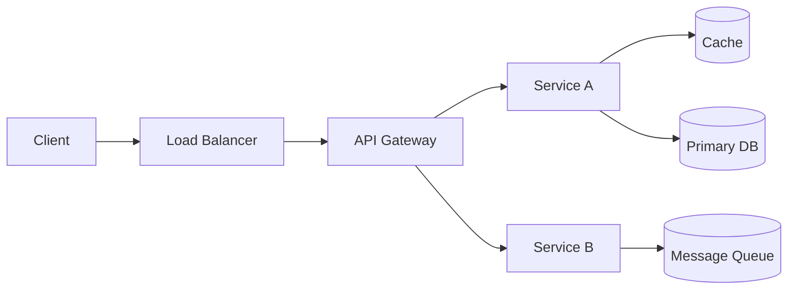

# High-Level Design and API Definition

<small>4 min read</small>

Continues [02 - Back-of-the-Envelope Estimation](02 - Back-of-the-Envelope Estimation.md).

## Start with the contract, not the boxes

The instinct almost everyone has to fight is reaching for the marker and drawing boxes first. The better order is: define the API surface — the handful of endpoints a client would actually call — *before* deciding what's behind them. An API is a contract: it forces you to state precisely what goes in and what comes out, which flushes out ambiguities requirement-gathering missed. If you can't write a clean signature for "load the timeline," you don't actually know what that feature does yet, and drawing boxes for it will just be guessing with extra steps.

Keep it small. Three or four endpoints covering the core actions from your requirements — not a full REST CRUD surface for every entity. For [Design Twitter](../Claude Notes/03-design-twitter.md) that's `POST /tweet`, `POST /follow`, `GET /timeline`; everything else is a variation on those.

```
POST /tweets              { text }              -> { tweet_id, created_at }
POST /users/{id}/follow   { target_user_id }     -> { success }
GET  /timeline            ?cursor=&limit=        -> { tweets: [...], next_cursor }
```

Two habits worth building into every signature you write:

- **Pagination via cursor, not offset**, for anything that can grow unbounded — `GET /timeline?cursor=abc123` instead of `?page=4`. An offset-based page 500 requires the database to scan and discard the first 499 pages' worth of rows; a cursor jumps straight there. This is a small detail that experienced interviewers notice specifically because it's cheap to get right and commonly gotten wrong.
- **Idempotency where retries are likely** — a `POST /tweets` that a flaky client retries shouldn't create two tweets. Either accept a client-supplied idempotency key or make the operation naturally idempotent. This is [Day 24](../system-design-notes/Day 24 - Idempotency Keys (LLD).md) applied at the API layer instead of the queue layer — same problem, one level up the stack.

## Then the boxes: the skeleton that's almost always right

Before any product-specific logic, most systems start from the same shape, and drawing it fast signals fluency rather than being generic:



Every piece here should be traceable to something you already know *why* it exists, not placed by habit:

- **Load balancer** distributes across replicas — [Day 25](../system-design-notes/Day 25 - Load Balancing and Reverse Proxy (HLD).md).
- **API Gateway** centralizes auth, rate limiting, and routing so individual services don't reimplement them — [Day 32](../system-design-notes/Day 32 - API Gateway and Service Discovery (HLD).md).
- **Cache** sits in front of the DB for the read-heavy path your estimation step already told you exists — [Day 13](../system-design-notes/Day 13 - Redis Internals (HLD).md).
- **Queue** decouples anything that shouldn't block the request-response cycle — a fan-out, a notification, a transcoding job — [Day 27](../system-design-notes/Day 27 - Message Queues Deep Dive (HLD).md).

The skill isn't drawing this skeleton — it's the next move: deciding, out loud, which pieces this specific problem actually needs. A system with low write volume and no async work doesn't need a queue, and adding one anyway because it "looks more like a real architecture" is a tell that you're pattern-matching rather than designing. Justify inclusion, don't default to it.

## Monolith vs. services — say why, don't just pick

Whichever way you go, name the reason: a monolith is faster to reason about and ship for a system whose components don't have wildly different scaling needs; services make sense once one piece (the fan-out workers in [Design Twitter](../Claude Notes/03-design-twitter.md), say) needs to scale independently from the rest. "I'd start with a small number of services split along the write path vs. read path, since your estimation showed those have very different load profiles" is a justified answer. "Microservices, because that's how big companies do it" is not — it's citing prestige instead of a constraint.

## Practice

---

**Given:** requirements and estimation are done for a URL shortener (high read:write ratio, ~90% reads, low write volume, latency-sensitive redirect path). Sketch the API and the high-level skeleton.

> [!question]- Try it before expanding
> What's the minimum endpoint set, and which piece of the standard skeleton does this problem *not* need?

> [!success]- Model answer
> - `POST /urls { long_url } -> { short_code }`, `GET /{short_code} -> 302 redirect`. That's the whole surface — no update or delete needed unless requirements said otherwise.
> - Given the read-heavy, latency-sensitive profile, a cache in front of the redirect lookup is essential — not optional — and belongs in the design from the first sketch, not added later as an afterthought.
> - This system very likely does **not** need a message queue: there's no async fan-out, no background job implied by the requirements. Including one anyway would be the "looks like architecture" mistake called out above. [02-url-shortener](../Claude Notes/02-url-shortener.md) covers the full design if you want the complete walkthrough.

---

## Where this hands off

The boxes above have database icons in them with no detail — that detail, and the reasoning behind *which* kind of database, is [04 - Data Model and Storage Choice](04 - Data Model and Storage Choice.md).


## Linked from

- [Back-of-the-Envelope Estimation](02%20-%20Back-of-the-Envelope%20Estimation.md)
- [Data Model and Storage Choice](04%20-%20Data%20Model%20and%20Storage%20Choice.md)
- [Trade-offs and Wrapping Up](06%20-%20Trade-offs%20and%20Wrapping%20Up.md)
