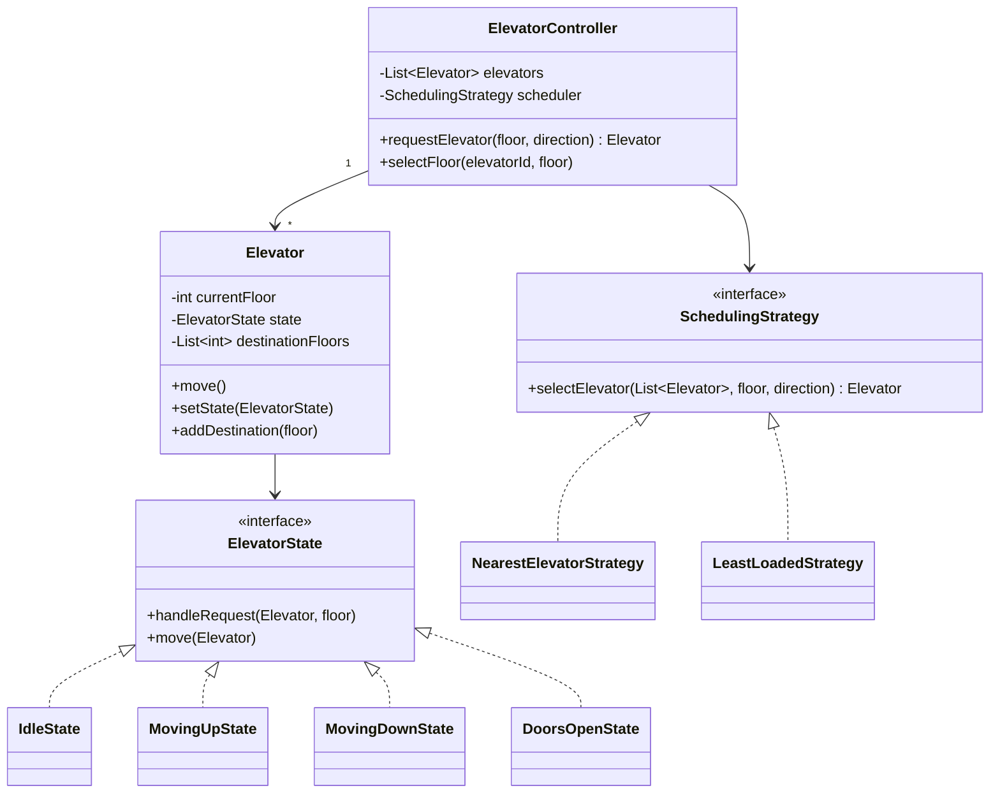

# Design an Elevator System

<small>7 min read</small>

**Real prompt:** "Design an elevator control system for a building with multiple elevators and multiple floors, handling both internal (inside-car) and external (hallway) requests efficiently."

Harder than [01 - Design a Parking Lot](01 - Design a Parking Lot.md) for two reasons: the elevator is a genuine state machine (State pattern, not just a data holder), and the scheduling problem (which elevator responds to which request) has real algorithmic content, not just OOD structure.

## 1. Clarifying Questions
- How many elevators? (Assume multiple — single-elevator is a simplification you can mention, but multi-elevator scheduling is the actual interesting problem.)
- Optimize for what — average wait time, or fairness across floors? (Assume average wait time as the default; note the trade-off if pushed.)
- Is a specific scheduling algorithm required, or is "a reasonable one, pluggable" acceptable? (Assume pluggable — this is the Strategy signal, same as pricing in Parking Lot.)

## 2. Requirements
**Functional**
- Internal request: a passenger inside a car presses a floor button
- External request: a hallway button press (up/down) at some floor
- The system assigns the request to one elevator and moves it toward completion

**Non-functional**
- New scheduling algorithms should be addable without modifying the elevator or controller core (OCP)
- Each elevator's behavior should be driven by its actual state, not scattered conditionals

## 3. Core Entities & Relationships

## 4. Deep Dive: Pattern Choices
- **[State](../04 - Behavioral Design Patterns.md) for the elevator's own behavior**: `Idle`, `MovingUp`, `MovingDown`, `DoorsOpen` each interpret "add a destination floor" differently — an `IdleState` transitions to `MovingUp`/`MovingDown` based on the requested floor relative to current position; a `MovingUpState` might queue the request or ignore it if it's in the wrong direction (see Deep Dive on SCAN below). Critically, **the elevator transitions itself** as a consequence of its own method calls — this is what makes it State, not Strategy (the exact distinction [04 - Behavioral Design Patterns](../04 - Behavioral Design Patterns.md)'s Vending Machine quiz question tests).
- **[Strategy](../04 - Behavioral Design Patterns.md) for elevator *selection*** (which of N elevators responds to a hallway call): `ElevatorController` depends on a `SchedulingStrategy` interface, not a hardcoded algorithm — this is the DIP-driven extension point for "now optimize for X instead of Y" follow-ups.
- **Why two different patterns for two different decisions in the same system**: the elevator's *internal* behavior (how it reacts to reaching a floor, opening doors) is State; the *system-level* decision of which elevator gets a new request is Strategy. Conflating these into one pattern is a common mistake — they're genuinely different questions ("what does this elevator do next" vs. "which elevator should handle this").

## 5. Deep Dive: The Scheduling Algorithm (the real algorithmic content)
- **Naive**: assign the nearest idle elevator. Simple, but ignores elevators already moving in a useful direction.
- **SCAN/LOOK algorithm** (the production-grade answer, same algorithm used in disk-arm scheduling — worth naming the connection): an elevator moving up continues serving all requests in its current direction before reversing, rather than reversing immediately for every new request — this is what prevents an elevator from oscillating inefficiently and is the concrete reason `MovingUpState` needs to distinguish "a new request in my current direction, above me" (queue it, keep going) from "a request in the opposite direction" (ignore for now, another elevator or a future reversal handles it).
- **This is the part of the problem where State and the scheduling algorithm intersect**: an elevator in `MovingUpState` receiving a new destination request runs SCAN-style logic to decide whether to accept it into its current run or defer — this logic naturally lives inside `MovingUpState.handleRequest()`, not in the controller, since it's specific to what "moving up" means for accepting new work.

## 6. Trade-offs to Voice Explicitly
| | Nearest-elevator scheduling | SCAN-based scheduling |
|---|---|---|
| Implementation complexity | Low | Higher — needs direction-aware request queuing |
| Average wait time under load | Worse — can send an elevator that then has to reverse | Better — exploits elevators already moving usefully |
| Fairness | Can starve far-away floors under heavy nearby demand | More consistent across floors |

- **State pattern vs. a `switch` on an enum `currentState` field**: the enum approach re-litigates "what does this state do" in every method (`move()`, `handleRequest()`, `openDoors()`) via repeated switches — exactly the OCP violation [01 - SOLID Principles](../01 - SOLID Principles.md) and [04 - Behavioral Design Patterns](../04 - Behavioral Design Patterns.md) both flag. State classes put each state's complete behavior in one place, and adding `MaintenanceState` later means one new class, not four edited switch statements.

## 7. Your Gaps to Close
- [ ] Be ready to explain SCAN/LOOK by name and connect it explicitly to disk-scheduling — interviewers specifically listen for whether you know this isn't an elevator-specific invention.
- [ ] Practice the "why is this State and not Strategy" answer cold — this problem is the single most common place that confusion gets tested, precisely because both patterns are legitimately present.
- [ ] Be ready for "what if an elevator breaks down mid-request" — this tests whether you'll reach for a new state (`OutOfServiceState`) cleanly, or whether your design requires deep changes to handle it.

## Related
[04 - Behavioral Design Patterns](../04 - Behavioral Design Patterns.md) · [01 - Design a Parking Lot](01 - Design a Parking Lot.md) · [03 - Design a Vending Machine](03 - Design a Vending Machine.md)

## Quiz
Write your own answer first — then expand.

> [!question]- Q1. An elevator in `MovingUpState` at floor 5 receives a new internal request for floor 3 (below its current position). What should happen, and which class decides?
> (think it through, then expand)

> [!success]- Answer: Q1
> Under SCAN-style logic, `MovingUpState` should NOT immediately reverse — it should continue serving requests above floor 5 first, and only after completing its upward run (or reaching its highest pending destination) should it transition to `MovingDownState` and then serve floor 3. This decision logic lives inside `MovingUpState.handleRequest()` specifically, because "how do I respond to a new request" is exactly what varies per state — `MovingDownState` would handle the same floor-3 request completely differently (accept it immediately, since it's in the current direction of travel).

> [!question]- Q2. Why can't the elevator-selection scheduling algorithm (which of N elevators responds) simply live inside each `Elevator`'s state classes?
> (think it through, then expand)

> [!success]- Answer: Q2
> Selecting which elevator responds to a hallway call requires comparing across ALL elevators (their positions, directions, loads) — information no single `Elevator` instance has or should have, since that would violate encapsulation and single responsibility ([01 - SOLID Principles](../01 - SOLID Principles.md)). This is inherently a system-level decision, which is why it belongs in `ElevatorController` via an injected `SchedulingStrategy`, not inside any individual elevator's state classes — the state classes only decide how *that one elevator* reacts to requests it's already been assigned or encounters along its path.

> [!question]- Q3. A reviewer suggests replacing the State pattern with a single `Elevator` class holding an `enum State currentState` field, checked via `if/switch` in each method, "to simplify the code." What's your response?
> (think it through, then expand)

> [!success]- Answer: Q3
> This would reintroduce the exact OCP violation State exists to prevent: every method that behaves differently per state (`move()`, `handleRequest()`, door logic) would need its own switch statement over the same enum, and adding a new state (e.g. `OutOfServiceState`) means finding and editing every one of those switches consistently — easy to miss one and introduce a subtle bug. The State pattern's version puts each state's complete behavior in one cohesive class, so adding a state is "add one new class implementing the interface," with zero risk of forgetting to update a scattered switch somewhere. The enum version is genuinely simpler for a two-state system; for four-plus states with real behavioral differences, State pattern's structure pays for itself.

## Next
[03 - Design a Vending Machine](03 - Design a Vending Machine.md) — the same State pattern, deliberately in a smaller, cleaner example, right after seeing it combined with a scheduling algorithm here.

## Linked from

- [Design a Parking Lot](01%20-%20Design%20a%20Parking%20Lot.md)
- [Design a Vending Machine](03%20-%20Design%20a%20Vending%20Machine.md)
