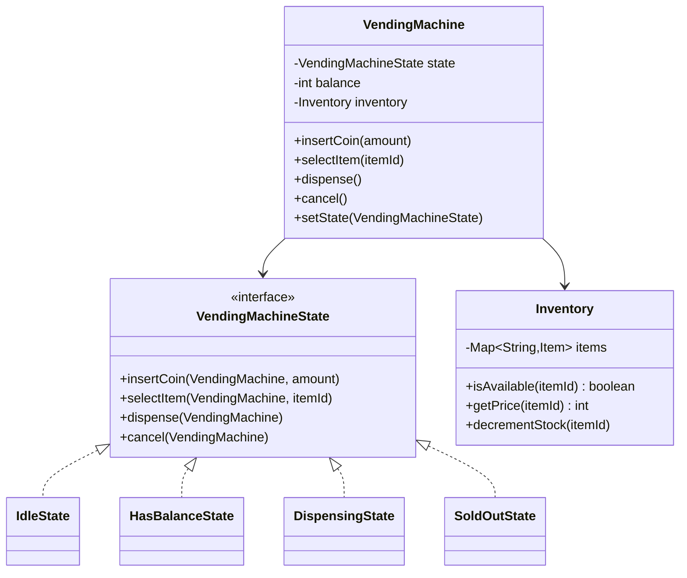

# Design a Vending Machine

<small>6 min read</small>

**Real prompt:** "Design a vending machine that accepts coins, lets a user select an item, dispenses it, and returns change."

The canonical State pattern problem — smaller and cleaner than [02 - Design an Elevator System](02 - Design an Elevator System.md), deliberately placed right after it so the same pattern is reinforced in a low-noise example before you see it combined with other complexity.

## 1. Clarifying Questions
- Multiple items at different prices, or one fixed price? (Assume multiple items, different prices — makes the "insufficient funds" and "change" logic real.)
- Coins only, or bills/cards too? (Assume coins only for the core design; mention payment-method extensibility as a follow-up.)
- Inventory tracking (out-of-stock items)? (Assume yes — it's a small addition that tests whether your state model degrades gracefully.)

## 2. Requirements
**Functional**
- Insert coins, accumulating balance
- Select an item: succeed if balance covers price and item is in stock, fail otherwise
- Dispense the item and return change (balance minus price) on success
- Return inserted coins if the user cancels

**Non-functional**
- New states (e.g. `OutOfServiceState`, `SoldOutState`) addable without touching existing state classes

## 3. Core Entities & Relationships

## 4. Deep Dive: Pattern Choice
- **State, unambiguously** — this is the textbook case. Each state fully owns how it responds to every action:
  - `IdleState.selectItem()` → "insert coins first," no transition.
  - `HasBalanceState.selectItem(itemId)` → checks `Inventory`; if affordable and in stock, transitions to `DispensingState`; if item is out of stock specifically, transitions to (or briefly reports via) `SoldOutState` messaging without losing the balance.
  - `DispensingState.dispense()` → performs the dispense, calculates change, transitions back to `IdleState`.
  - `HasBalanceState.cancel()` → returns the accumulated balance, transitions to `IdleState`. `IdleState.cancel()` is a no-op (nothing to cancel).
- **Why this example is cleaner than Elevator for learning State**: there's no secondary algorithmic problem (no SCAN-equivalent) competing for attention — every bit of complexity in this problem *is* state-transition logic, which is exactly why it's the pattern's canonical teaching example.
- **Inventory as a separate class, not folded into `VendingMachine` or the states**: this is [SRP](../01 - SOLID Principles.md) — stock-tracking is a distinct responsibility from "what should happen when the user presses select," and keeping it separate means states can query it without owning it.

## 5. Deep Dive: The Sold-Out Edge Case
- The trap most candidates fall into: treating "item selected but out of stock" as an error to throw, rather than a real state-relevant outcome. If a user has inserted balance and selects a sold-out item, the balance must NOT be lost — `HasBalanceState` should handle this by reporting unavailability and remaining in `HasBalanceState` (or a brief `SoldOutState` that returns to `HasBalanceState`), not by transitioning to an error state that discards the user's money.
- This is a good moment to notice: **not every "state" mentioned in a prompt needs its own class.** "Sold out" might be better modeled as a *response* from `HasBalanceState.selectItem()` (query Inventory, return a failure result) rather than a full state transition — over-modeling states for what's actually just a conditional response is a real design judgment call, not automatically "more correct" just because more classes exist.

## 6. Trade-offs to Voice Explicitly
| | Model "sold out" as a full state | Model it as a query + response within `HasBalanceState` |
|---|---|---|
| Complexity | Higher — another state class, more transitions to reason about | Lower — one method call, one conditional |
| Correct when | Sold-out has genuinely different *ongoing* behavior (e.g. machine displays a persistent "restocking" message across multiple interactions) | Sold-out is just a per-selection outcome with no lasting behavioral change |

- **Coin return mechanics on cancel**: real vending machines track exact coins inserted (to return the *same* coins, not just an equivalent value) — worth mentioning as a scope question, since "return $1.75" vs. "return these exact 3 coins" changes whether `VendingMachine` needs a coin list vs. just an integer balance.

## 7. Your Gaps to Close
- [ ] Practice stating the full state-transition table (state × action → new state) from memory — this is the fastest way to catch a missing transition before writing code.
- [ ] Be ready for "add support for card payment alongside coins" — this tests whether payment method is cleanly separable from the state machine (it should be: a `PaymentMethod` abstraction the states delegate to, not new states per payment type).
- [ ] Practice the sold-out-shouldn't-lose-balance edge case out loud — it's the single most common correctness bug in real attempts at this problem.

## Related
[04 - Behavioral Design Patterns](../04 - Behavioral Design Patterns.md) · [02 - Design an Elevator System](02 - Design an Elevator System.md) · [01 - SOLID Principles](../01 - SOLID Principles.md)

## Quiz
Write your own answer first — then expand.

> [!question]- Q1. A user in `HasBalanceState` selects an item that's in stock and affordable, but the machine's dispensing motor jams mid-dispense. What state should the machine be in, and what does this reveal about your original state model?
> (think it through, then expand)

> [!success]- Answer: Q1
> This reveals a missing state: something like `DispensingErrorState` or a failure branch within `DispensingState` that handles "dispense was attempted but didn't complete" — distinct from both successful dispensing (which transitions to `Idle`) and normal balance-holding. The correct behavior is almost certainly refunding the balance and requiring manual intervention (transitioning to an `OutOfServiceState` for that slot, or the whole machine) rather than silently returning to `IdleState` as if nothing happened, which would either strand the user's money or let the machine keep accepting selections for a broken mechanism. This is exactly the kind of "now handle failure" follow-up interviewers use to test whether your state model was actually complete or just covered the happy path.

> [!question]- Q2. Why shouldn't "insufficient balance" (user selects a $2 item with only $1 inserted) be modeled as a state transition?
> (think it through, then expand)

> [!success]- Answer: Q2
> Insufficient balance isn't a new mode of machine behavior with its own distinct transition rules — it's simply a failed precondition check within `HasBalanceState.selectItem()`, which should just report the shortfall (and possibly the amount still needed) and remain in `HasBalanceState`, since the user's existing balance and options are completely unchanged. Modeling it as a full state would be over-engineering: there's no genuinely different set of behaviors "InsufficientBalanceState" would need beyond what a conditional response already provides — the same restraint discussed in this note's sold-out deep dive.

> [!question]- Q3. The interviewer says: "What if we want to support promotional pricing — some items are 50% off on Tuesdays?" Where does this change live, and does it touch your State classes?
> (think it through, then expand)

> [!success]- Answer: Q3
> This is a pricing-calculation concern, not a state-transition concern — it should live in how `Inventory.getPrice(itemId)` computes price (e.g. delegating to a pricing component that checks the day and applies a discount), not inside any `VendingMachineState` class. None of the state classes should need to change: `HasBalanceState.selectItem()` already just asks `Inventory` for the current price and compares it to balance — it doesn't need to know *why* the price is what it is. This is a good check on whether your original design actually kept pricing logic decoupled from state-transition logic, or whether they'd gotten tangled together.

## Next
[04 - Design Splitwise (Expense Sharing)](04 - Design Splitwise (Expense Sharing).md) — the last applied problem in this set, and the one with genuine algorithmic content (debt-graph simplification) alongside the OOD structure.

## Linked from

- [Design an Elevator System](02%20-%20Design%20an%20Elevator%20System.md)
