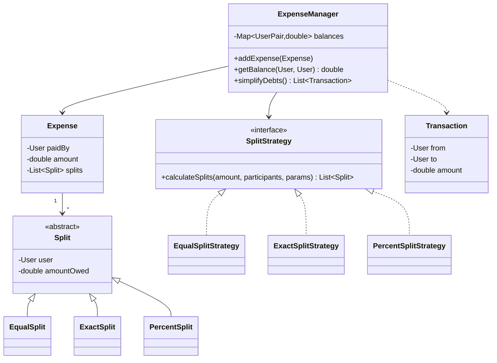

# Design Splitwise (Expense Sharing)

<small>8 min read</small>

**Real prompt:** "Design a system where a group of users can log shared expenses, split them in different ways (equally, by exact amounts, by percentage), and see a simplified view of who owes whom."

The last problem in this set, and the odd one out: every prior problem was almost purely structural (right classes, right patterns). This one has a genuine graph algorithm at its center — debt simplification — alongside the OOD structure, and interviewers use it specifically to see whether you can combine both skill types in one problem.

## 1. Clarifying Questions
- Split types needed: equal, exact amounts, percentage — all three, or a subset? (Assume all three — this is what makes Strategy load-bearing here, not optional.)
- Should the system minimize the *number* of transactions needed to settle all debts, or just show raw pairwise balances? (Assume minimization is in scope — this is the actual algorithmic ask, and the more interesting half of the problem.)
- Multi-currency? (Assume single currency — flag multi-currency as a real extension, not worth the complexity for the core design.)

## 2. Requirements
**Functional**
- Add an expense: payer, amount, participants, and a split type (equal/exact/percentage)
- Query current balance between any two users, or a user's total net balance
- Simplify group debts to the minimum number of settling transactions

**Non-functional**
- New split types addable without modifying the expense-recording logic (OCP)
- Balance calculation and debt simplification should be correct and efficient for realistic group sizes (tens of users, not millions)

## 3. Core Entities & Relationships


## 4. Deep Dive: Pattern Choice
- **[Strategy](../04 - Behavioral Design Patterns.md) for split calculation** — the near-identical shape to Parking Lot's pricing and Elevator's scheduling: `ExpenseManager` (or the `addExpense` flow) depends on a `SplitStrategy` interface, selected based on the split type requested. Adding a new split type (e.g. "by shares," like 2 shares for one person, 1 for another) is a new `SplitStrategy` implementation, no changes to `ExpenseManager`'s recording logic.
- **Validation belongs inside each strategy, not in a shared pre-check**: `ExactSplitStrategy` must validate that the exact amounts sum to the total expense; `PercentSplitStrategy` must validate percentages sum to 100. Putting this validation in `ExpenseManager` (checking "is this a valid split" generically) would require `ExpenseManager` to know the rules for every split type — exactly the kind of coupling Strategy exists to avoid. Each strategy validates its own inputs before producing `Split` objects.

## 5. Deep Dive: The Actual Algorithm — Debt Simplification
This is the part that distinguishes this problem from the rest of the set — a real graph/greedy algorithm, not just class design.
```
1. Compute each user's NET balance (total owed to them minus total they owe), a single number per user.
   Users with positive net balance are net creditors; negative are net debtors.
2. Greedy settlement:
   while any non-zero balances remain:
     find the user with the MAXIMUM net credit (creditor) and the user with the MAXIMUM net debit (debtor)
     settle = min(creditor's balance, abs(debtor's balance))
     record Transaction(debtor -> creditor, settle)
     reduce both balances by `settle`
```
- **Why this minimizes transaction count (informally)**: matching the largest creditor against the largest debtor at each step ensures at least one of the two balances hits exactly zero after each transaction, guaranteeing progress — this greedy approach is provably optimal or near-optimal for this specific problem shape (it's the same family of reasoning as greedy interval/matching algorithms), and is the standard accepted answer in interviews, even though proving strict optimality in the general case is a deeper rabbit hole than the interview needs.
- **Why not just show every pairwise balance directly?** With N users, pairwise balances can require up to N×(N-1)/2 potential settling transactions in the worst case; net-balance-based greedy settlement typically needs at most N-1 transactions — a real, demonstrable improvement worth stating with the actual reasoning, not just asserting "it's better."
- **Data structure for the greedy step**: a max-heap (or simply sorting) of net balances lets you repeatedly extract the largest creditor/debtor efficiently — worth naming the data structure choice explicitly, since "how would you implement step 2 efficiently" is a natural follow-up.

## 6. Trade-offs to Voice Explicitly
| | Store raw pairwise balances only | Compute net balance + greedy simplification |
|---|---|---|
| Number of settling transactions shown to users | Can be far more than necessary (redundant back-and-forth debts) | Minimized — typically at most N-1 |
| Computation cost | None extra at query time | O(N log N) for the greedy settlement pass |
| User experience | Confusing ("you owe Alice $10, Alice owes you $6" instead of a clean net view) | Clean, minimal, matches what Splitwise actually shows |

- **Storing raw balances vs. only net balances**: worth keeping the underlying per-expense, per-pair ledger (for audit/history — "why do I owe this amount") even though the *simplification* algorithm operates on net balances — don't discard the detailed history just because the summary view is net-based.

## 7. Your Gaps to Close
- [ ] Practice deriving the debt-simplification algorithm from first principles (net balances → greedy max-creditor/max-debtor matching) rather than memorizing it — interviewers can tell the difference when they change the scenario slightly.
- [ ] Be ready for "one user disputes an expense and it needs to be edited/deleted after the fact" — this tests whether your balance-tracking is derived/recomputable from the expense log (robust) or incrementally mutated in place with no way to correct drift (fragile).
- [ ] Practice explaining why validation lives inside each `SplitStrategy` rather than centrally — a frequent follow-up probe.

## Related
[04 - Behavioral Design Patterns](../04 - Behavioral Design Patterns.md) · [01 - SOLID Principles](../01 - SOLID Principles.md) · [01 - Design a Parking Lot](01 - Design a Parking Lot.md)

## Quiz
Write your own answer first — then expand.

> [!question]- Q1. A group has three users: Alice is owed $30 net, Bob owes $10 net, Carol owes $20 net. Walk through the greedy simplification algorithm's output.
> (think it through, then expand)

> [!success]- Answer: Q1
> Max creditor is Alice (+$30), max debtor is Carol (-$20). Settle min(30, 20) = $20: Carol pays Alice $20. Update balances: Alice now +$10, Carol now $0 (removed from further consideration). Remaining non-zero balances: Alice +$10, Bob -$10. Max creditor is Alice (+$10), max debtor is Bob (-$10). Settle min(10,10)=$10: Bob pays Alice $10. Both balances now zero. Result: 2 transactions (Carol→Alice $20, Bob→Alice $10) — the minimum possible for 3 users with non-zero net balances, matching the "at most N-1 transactions" property.

> [!question]- Q2. Why must `ExactSplitStrategy` validate that the provided exact amounts sum to the total expense, rather than trusting the caller and letting `ExpenseManager` catch inconsistencies later?
> (think it through, then expand)

> [!success]- Answer: Q2
> If validation is deferred or centralized in `ExpenseManager`, `ExpenseManager` would need to understand the validity rules for every split type (sum-to-total for exact splits, sum-to-100 for percentage splits, etc.) — reintroducing exactly the coupling Strategy was chosen to eliminate, and making `ExpenseManager` fragile to changes in any individual split type's rules. Each `SplitStrategy` owns its own invariants because it's the only component that actually knows what "valid" means for its specific split type; `ExpenseManager` should be able to trust that any `Split` list returned by a strategy is already valid, the same encapsulation argument as [SRP](../01 - SOLID Principles.md).

> [!question]- Q3. A user wants to delete an expense they entered by mistake, three weeks after entering it and after several other expenses have been added since. What does this require of how balances are stored, and why would a design that only tracks running net balances (no expense history) struggle here?
> (think it through, then expand)

> [!success]- Answer: Q3
> Deleting an expense requires either reversing its specific effect on the affected users' balances (subtracting out exactly what it contributed) or recomputing all balances from the full expense history with that one expense excluded. A design that only maintains a running net balance per user (incrementally updated, with no retained per-expense record) can't cleanly reverse a single historical expense's effect — you'd have no record of exactly what that expense contributed to each user's balance, especially once other expenses have been added on top. This is the same "derive from a durable log rather than mutate in place" instinct that shows up in the event-sourcing reasoning from the HLD track ([Day 40 - Event Sourcing and CQRS (HLD)](../../system-design-notes/Day 40 - Event Sourcing and CQRS (HLD).md)) — keeping the full expense log as the source of truth, with net balances as a derived/recomputable view, makes edits and deletions tractable in a way an incrementally-mutated-only balance can't support.

## Next
This closes the initial four-problem applied set. Per [README - Roadmap](../README - Roadmap.md), good next additions: Design a Library Management System (reinforces Factory + a reservation State machine), Design a Chess Game (reinforces Strategy for piece movement rules + Command for move history/undo), or Design a Movie Ticket Booking System (reinforces the same concurrent-seat-assignment concern flagged in [01 - Design a Parking Lot](01 - Design a Parking Lot.md)'s concurrency note, at higher stakes).
