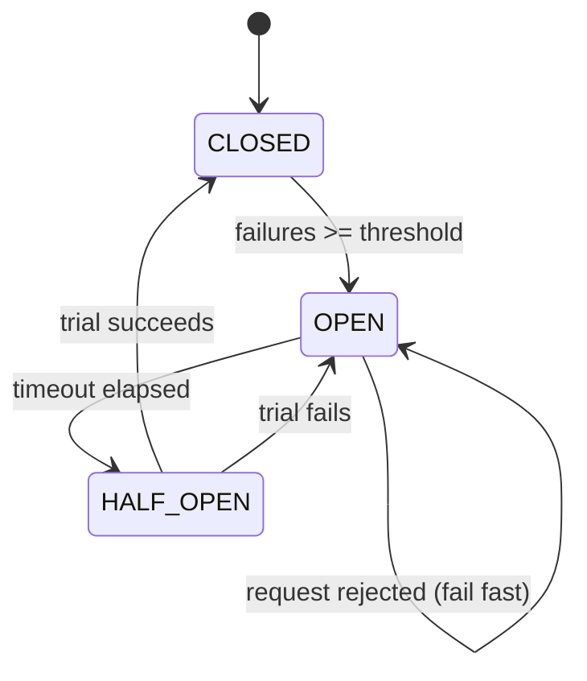

# Day 26 — Circuit Breaker (LLD)

## What we're learning today
When a downstream service starts failing, retrying it endlessly (or worse, piling up threads waiting on it) drags your entire system down. The Circuit Breaker pattern stops that cascade.

## Core concept
A state machine — **CLOSED** (normal, requests flow through) → **OPEN** (failing fast, requests rejected immediately without calling downstream) → **HALF_OPEN** (a trial request checks if downstream recovered) → back to CLOSED or OPEN.

## Visual diagram


## Explanation
```java
enum State { CLOSED, OPEN, HALF_OPEN }

class CircuitBreaker {
    private State state = State.CLOSED;
    private int failureCount = 0;
    private final int failureThreshold = 5;
    private long openedAt;
    private final long openTimeoutMs = 30_000;

    synchronized <T> T call(Supplier<T> downstreamCall, Supplier<T> fallback) {
        if (state == State.OPEN) {
            if (System.currentTimeMillis() - openedAt > openTimeoutMs) {
                state = State.HALF_OPEN; // allow one trial
            } else {
                return fallback.get(); // fail fast, don't even try downstream
            }
        }

        try {
            T result = downstreamCall.get();
            onSuccess();
            return result;
        } catch (Exception e) {
            onFailure();
            return fallback.get();
        }
    }

    private void onSuccess() {
        failureCount = 0;
        state = State.CLOSED;
    }

    private void onFailure() {
        failureCount++;
        if (state == State.HALF_OPEN || failureCount >= failureThreshold) {
            state = State.OPEN;
            openedAt = System.currentTimeMillis();
        }
    }
}
```
The **fallback** is as important as the breaker itself — returning cached data (cache-aside, Day 11), a default value, or a graceful error, instead of hanging the caller waiting on a dying service.

## Real-world examples
- **Netflix's Hystrix** (now largely succeeded by resilience4j) pioneered this pattern precisely because a single slow microservice in their fleet could exhaust thread pools across the entire call chain — "cascading failure."
- **Amazon retail:** product recommendation service failures don't take down checkout — the recommendations widget circuit-breaks to "show nothing" while checkout proceeds normally.

## Interview perspective
This tests resilience thinking beyond the happy path — a common gap at mid-level. Interviewers want you to proactively mention: what happens when a dependency in your architecture (payment gateway, recommendation service, notification service) goes down? Do you have a circuit breaker, and what's the fallback behavior for *that specific* dependency?

## Trade-offs
| | Without Circuit Breaker | With Circuit Breaker |
|---|---|---|
| Downstream failure impact | Threads pile up waiting, cascades upward | Fails fast, isolated |
| Recovery detection | Manual/no signal | Automatic via HALF_OPEN trial |
| Complexity | None | State management + tuning thresholds |

## Interview question
"Your circuit breaker just opened for the payment gateway. What's the correct fallback for a checkout flow — retry later, queue the order, or fail the request immediately? Does the answer change for a 'recommendations' service instead?"

> [!question]- Think it through, then expand
> What's actually different about what "failure" means for a payment versus a recommendation widget?

> [!success]- Answer
> For checkout/payment: fail the request visibly and tell the customer clearly (e.g. "payment couldn't be processed, try again shortly") — silently queuing a payment for later risks charging a card at an unexpected time or double-processing once the gateway recovers, and a payment is exactly the kind of operation that shouldn't proceed on uncertain footing. For a recommendations service: the fallback is the opposite instinct — degrade silently (show no recommendations, or a generic/cached fallback list) and let checkout proceed completely normally, since a missing "you might also like" widget is invisible to the business-critical path. The difference is whether the failing dependency is on the critical path at all — payment is, recommendations aren't.

## Key design principle
**Fail fast and isolate — a dying dependency should never be allowed to make everything upstream of it slow too.**

## 30-second challenge
Why does `onFailure()` immediately re-open the circuit on a HALF_OPEN failure, rather than requiring the failure threshold to be hit again from scratch?

## Tomorrow
Day 27 (HLD) — Message Queues deep dive: Kafka vs RabbitMQ vs SQS, partitions, consumer groups, and ordering guarantees.
