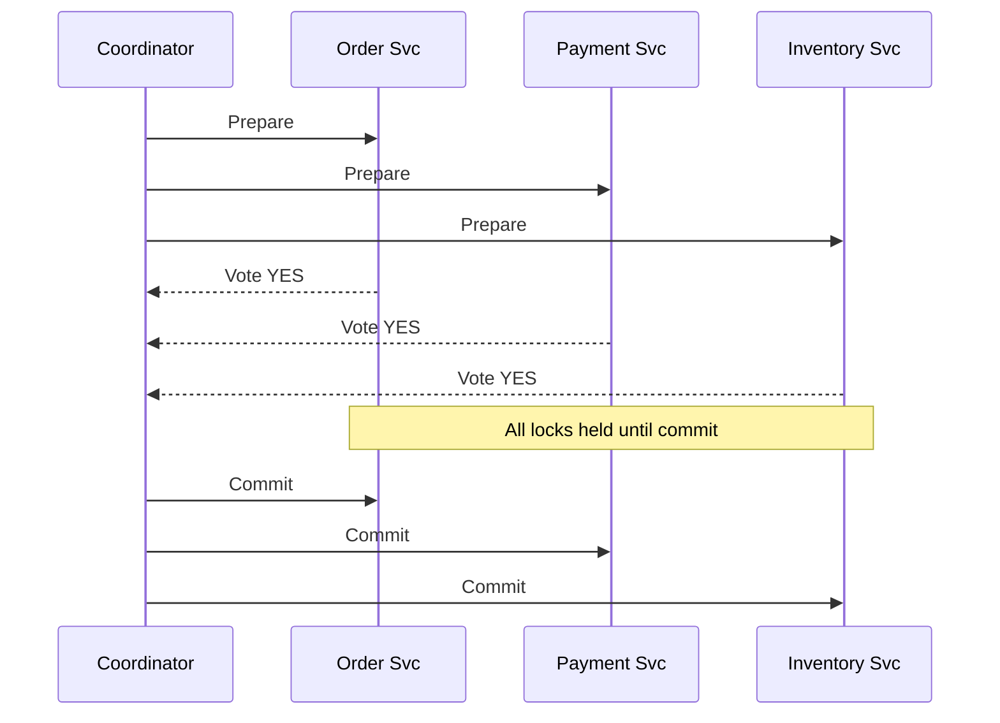
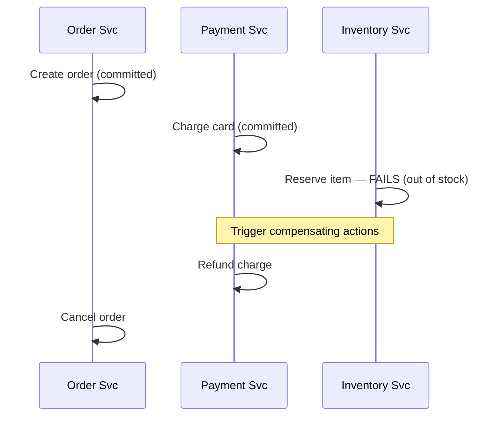

# Day 38 — Distributed Transactions: 2PC vs Saga (HLD)

<small>5 min read</small>

## What we're learning today
A single-database transaction gives you atomicity for free (ACID). Once "the order" and "the payment" and "the inventory" live in separate services with separate databases, atomicity has to be engineered explicitly. Today covers the two dominant approaches — and why the industry mostly moved away from the first one.

## Core concept
**Two-Phase Commit (2PC)** achieves atomicity across services by having a coordinator ask everyone to *prepare* (lock and stage the change), then ask everyone to *commit* only once all have confirmed they're prepared. **Saga** achieves the same business outcome differently: each service commits its own local transaction immediately, and if a later step fails, previously completed steps are undone via explicit **compensating actions**.

## Visual diagram

*2PC — locks held across the entire round trip.*

*Saga — each step commits immediately; failure triggers compensations in reverse.*

## Explanation
- **Why 2PC is rarely used in practice at scale:** every participant holds locks on its data from the moment it says "prepared" until the coordinator's final commit/abort message arrives — if the coordinator crashes or is slow *after* collecting all "yes" votes but *before* sending commit, every participant is stuck holding locks indefinitely, unable to proceed or safely abort on their own (this is the well-known "blocking problem" of 2PC). This directly conflicts with the availability goals most of Days 11–37 have been building toward.
- **Saga trades atomicity for availability, deliberately.** There's a window where the order exists and payment succeeded but inventory hasn't been confirmed — the system is briefly in an inconsistent-looking intermediate state. Saga accepts this and guarantees the system will eventually reach a consistent state (either all steps succeed, or completed steps get compensated) — this is an **eventual consistency** commitment, not an atomicity one. Same AP-leaning trade-off framing as Day 23, now applied to multi-service workflows instead of a single data store.
- **Compensating actions aren't a rollback in the database sense.** A DB rollback undoes an *uncommitted* change. A compensating action *reverses the effect* of an already-committed transaction (e.g. "refund the charge" instead of "undo the charge") — this only works if every step's effect is actually reversible; not all operations are (e.g. "sent an email" has no true undo, only a compensating follow-up like "send a correction email").
- **Two Saga coordination styles:** *choreography* (each service listens for events and reacts — no central coordinator, more decoupled, harder to trace) vs. *orchestration* (a central Saga orchestrator explicitly calls each step and triggers compensations on failure — easier to reason about and debug, but the orchestrator is now a component every step depends on).

## Real-world examples
- **E-commerce checkout (the canonical Saga example):** create order → charge payment → reserve inventory → arrange shipping. If inventory reservation fails, the Saga triggers refund + order cancellation — exactly the diagram above, and close to how real order-processing systems at scale are actually built.
- **XA transactions (2PC's real-world form):** supported by some traditional RDBMS/message-queue combos for cross-resource atomicity — used far less at internet scale specifically because of the blocking problem, but still relevant in traditional enterprise/financial systems with strong consistency requirements and lower throughput needs.
- **[05-design-job-scheduler](../Claude Notes/05-design-job-scheduler.md)'s honesty about "effectively-once,"** and [04-design-notification-system](../Claude Notes/04-design-notification-system.md)'s at-least-once + idempotency — both are small-scale cousins of the same underlying tension Saga resolves at the multi-service level: perfect all-or-nothing atomicity is expensive/unavailable-prone, so real systems choose eventual consistency plus an explicit recovery mechanism instead.

## Interview perspective
The signal isn't "do you know both names" — it's whether you can explain **why** 2PC's blocking problem makes it a poor fit for internet-scale, highly-available systems, and can walk through a compensating-action sequence for a concrete failure (not just say "we use Saga"). A strong answer also flags that **not every operation is cleanly compensable** — recognizing this limitation unprompted (e.g. "sending an email can't be un-sent, only followed up on") is a mark of real engineering judgment, not memorized pattern recall.

## Trade-offs
| | 2PC | Saga |
|---|---|---|
| Atomicity | True atomic commit/abort | No — eventual consistency, visible intermediate states |
| Availability | Poor — coordinator failure blocks all participants | Good — each step commits independently |
| Complexity | Conceptually simpler | Requires designing a compensating action for every step |
| Fit for microservices at scale | Poor (blocking problem) | Industry-standard approach |

## Interview question
"In the checkout Saga, payment succeeds but inventory reservation fails. The system now needs to refund the payment. What happens if the refund call itself fails?"

> [!question]- Think it through, then expand
> This is the same problem you've solved before, just one level up — what pattern applies?

> [!success]- Answer
> The compensating action (refund) needs the exact same reliability treatment as any other operation in this whole roadmap: retry with backoff (Day 33) until it succeeds, and the refund call itself should be idempotent (Day 24) so a retried refund doesn't double-refund. If it exhausts retries entirely, it needs to fall into a dead-letter/manual-intervention path (Day 27's DLQ concept) rather than silently failing — a Saga's compensation step is not exempt from the same failure-handling discipline as the forward steps; it's just as capable of failing and needs the same tools applied to it.

## Key design principle
**2PC buys atomicity by sacrificing availability during the commit window; Saga buys availability by sacrificing atomicity and requiring an explicit, potentially-failing compensation path for every step — there's no version of this trade-off that gets both for free.**

## 30-second challenge
Why is "orchestration" (a central Saga coordinator) generally easier to debug and reason about than "choreography" (services reacting to each other's events with no central coordinator) — and what does orchestration give up in exchange?

## Tomorrow
Day 39 (LLD) — build a Saga orchestrator: the explicit state machine tracking which steps completed, and the logic that decides which compensating actions to fire on a failure at any given step.
